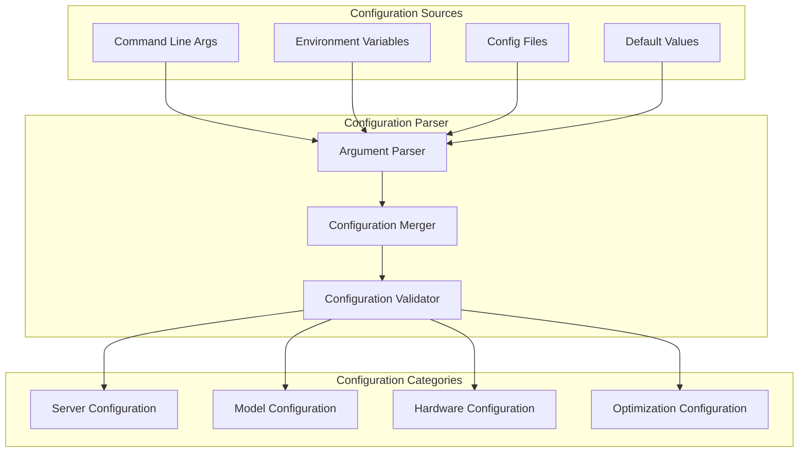

# Configuration System

**Part of**: [Architecture Documentation](index.md)
**Generated**: 2025-11-02
**Source commit**: 358ae35

---

## Configuration Architecture Overview

SGLang provides a comprehensive configuration system that handles everything from server deployment to model-specific parameters. The system supports multiple configuration sources and provides intelligent defaults while allowing extensive customization.



## Server Arguments Configuration

### Core Server Configuration

**Location**: `python/sglang/srt/server_args.py:89-156`

```python
@dataclass
class ServerArgs:
    """Core server configuration arguments"""

    # Model Configuration
    model_path: str
    tokenizer_path: Optional[str] = None
    trust_remote_code: bool = False
    dtype: str = "auto"
    quantization: Optional[str] = None

    # Server Configuration
    host: str = "0.0.0.0"
    port: int = 30000
    dp_size: int = 1
    tp_size: int = 1
    pp_size: int = 1

    # Memory Configuration
    mem_fraction_static: float = 0.9
    max_running_requests: int = 256
    max_total_tokens: int = None

    # Performance Configuration
    schedule_policy: str = "lpm"
    schedule_conservativeness: float = 1.0
    chunked_prefill_size: int = 8192

    # Cache Configuration
    enable_radix_cache: bool = True
    enable_hierarchical_cache: bool = False
    hicache_ratio: float = 2.0
    hicache_size: Optional[int] = None

    # Advanced Configuration
    disable_cuda_graph: bool = False
    disable_flashinfer: bool = False
    disable_flashattention: bool = False

    def __post_init__(self):
        """Post-initialization validation and setup"""
        self.validate_configuration()
        self.setup_derived_config()

    def validate_configuration(self):
        """Validate configuration parameters"""
        if self.mem_fraction_static <= 0 or self.mem_fraction_static > 1:
            raise ValueError("mem_fraction_static must be between 0 and 1")

        if self.max_running_requests <= 0:
            raise ValueError("max_running_requests must be positive")

        if self.chunked_prefill_size <= 0:
            raise ValueError("chunked_prefill_size must be positive")

    def setup_derived_config(self):
        """Setup derived configuration values"""
        # Calculate effective parallelism
        self.world_size = self.dp_size * self.tp_size * self.pp_size

        # Setup tokenizer path
        if self.tokenizer_path is None:
            self.tokenizer_path = self.model_path

        # Determine data type
        if self.dtype == "auto":
            self.dtype = self.auto_detect_dtype()

    def auto_detect_dtype(self) -> str:
        """Automatically detect optimal data type"""
        try:
            import torch
            if torch.cuda.is_available() and torch.cuda.get_device_capability() >= (8, 0):
                return "bfloat16"
            else:
                return "float16"
        except Exception:
            return "float32"
```

### Argument Parser Implementation

**Location**: `python/sglang/srt/server_args_config_parser.py:67-134`

```python
class ServerArgsConfigParser:
    def __init__(self):
        self.parser = self.setup_argument_parser()

    def setup_argument_parser(self) -> argparse.ArgumentParser:
        """Setup command-line argument parser"""
        parser = argparse.ArgumentParser(
            description="SGLang Server Configuration",
            formatter_class=argparse.ArgumentDefaultsHelpFormatter
        )

        # Model Arguments
        model_group = parser.add_argument_group("Model Configuration")
        model_group.add_argument(
            "--model-path",
            type=str,
            required=True,
            help="Path to the model weights"
        )
        model_group.add_argument(
            "--tokenizer-path",
            type=str,
            default=None,
            help="Path to the tokenizer (if different from model path)"
        )
        model_group.add_argument(
            "--trust-remote-code",
            action="store_true",
            help="Trust remote code when loading models"
        )
        model_group.add_argument(
            "--dtype",
            type=str,
            default="auto",
            choices=["auto", "float32", "float16", "bfloat16"],
            help="Data type for model weights"
        )
        model_group.add_argument(
            "--quantization",
            type=str,
            default=None,
            choices=["int8", "int4", "fp8", "awq", "gptq"],
            help="Quantization method"
        )

        # Server Arguments
        server_group = parser.add_argument_group("Server Configuration")
        server_group.add_argument(
            "--host",
            type=str,
            default="0.0.0.0",
            help="Host address to bind the server"
        )
        server_group.add_argument(
            "--port",
            type=int,
            default=30000,
            help="Port number for the server"
        )
        server_group.add_argument(
            "--dp-size",
            type=int,
            default=1,
            help="Data parallelism size"
        )
        server_group.add_argument(
            "--tp-size",
            type=int,
            default=1,
            help="Tensor parallelism size"
        )
        server_group.add_argument(
            "--pp-size",
            type=int,
            default=1,
            help="Pipeline parallelism size"
        )

        # Memory Arguments
        memory_group = parser.add_argument_group("Memory Configuration")
        memory_group.add_argument(
            "--mem-fraction-static",
            type=float,
            default=0.9,
            help="Fraction of GPU memory to allocate statically"
        )
        memory_group.add_argument(
            "--max-running-requests",
            type=int,
            default=256,
            help="Maximum number of concurrent running requests"
        )
        memory_group.add_argument(
            "--max-total-tokens",
            type=int,
            default=None,
            help="Maximum total number of tokens across all requests"
        )

        return parser

    def parse_args(self, args: Optional[List[str]] = None) -> ServerArgs:
        """Parse command-line arguments"""
        parsed_args = self.parser.parse_args(args)

        # Convert to ServerArgs dataclass
        server_args = ServerArgs(
            model_path=parsed_args.model_path,
            tokenizer_path=parsed_args.tokenizer_path,
            trust_remote_code=parsed_args.trust_remote_code,
            dtype=parsed_args.dtype,
            quantization=parsed_args.quantization,
            host=parsed_args.host,
            port=parsed_args.port,
            dp_size=parsed_args.dp_size,
            tp_size=parsed_args.tp_size,
            pp_size=parsed_args.pp_size,
            mem_fraction_static=parsed_args.mem_fraction_static,
            max_running_requests=parsed_args.max_running_requests,
            max_total_tokens=parsed_args.max_total_tokens
        )

        return server_args
```

## Model Configuration

### Model-Specific Configuration

**Location**: `python/sglang/srt/configs/model_config.py:89-145`

```python
@dataclass
class ModelConfig:
    """Model-specific configuration"""
    model_name: str
    model_type: str
    hidden_size: int
    num_layers: int
    num_attention_heads: int
    num_key_value_heads: Optional[int] = None
    intermediate_size: int
    vocab_size: int
    max_position_embeddings: int

    # Model-specific parameters
    rope_scaling: Optional[Dict] = None
    attention_bias: bool = False
    mlp_bias: bool = True
    tie_word_embeddings: bool = False

    # Generation parameters
    max_new_tokens: int = 2048
    temperature: float = 1.0
    top_p: float = 0.95
    top_k: int = 40

    @classmethod
    def from_pretrained(cls, model_path: str, trust_remote_code: bool = False) -> "ModelConfig":
        """Load model configuration from pretrained model"""
        try:
            from transformers import AutoConfig
            config = AutoConfig.from_pretrained(model_path, trust_remote_code=trust_remote_code)

            # Extract common parameters
            model_config = cls(
                model_name=config.name_or_path or model_path,
                model_type=config.model_type,
                hidden_size=config.hidden_size,
                num_layers=config.num_hidden_layers,
                num_attention_heads=config.num_attention_heads,
                num_key_value_heads=getattr(config, 'num_key_value_heads', None),
                intermediate_size=config.intermediate_size,
                vocab_size=config.vocab_size,
                max_position_embeddings=config.max_position_embeddings,
                rope_scaling=getattr(config, 'rope_scaling', None),
                attention_bias=getattr(config, 'attention_bias', False),
                mlp_bias=getattr(config, 'mlp_bias', True),
                tie_word_embeddings=getattr(config, 'tie_word_embeddings', False)
            )

            return model_config

        except Exception as e:
            raise ValueError(f"Failed to load model configuration: {e}")

    def get_model_architecture(self) -> str:
        """Get model architecture type"""
        if self.model_type in ["llama", "llama2", "llama3"]:
            return "llama"
        elif self.model_type in ["qwen", "qwen2"]:
            return "qwen"
        elif self.model_type in ["mistral", "mixtral"]:
            return "mistral"
        elif self.model_type in ["gemma"]:
            return "gemma"
        elif self.model_type in ["gpt2", "gpt_neox"]:
            return "gpt"
        else:
            return "generic"

    def get_attention_config(self) -> Dict[str, Any]:
        """Get attention-specific configuration"""
        return {
            "num_heads": self.num_attention_heads,
            "num_kv_heads": self.num_key_value_heads or self.num_attention_heads,
            "head_dim": self.hidden_size // self.num_attention_heads,
            "use_sliding_window": getattr(self, 'sliding_window', None) is not None,
            "rope_scaling": self.rope_scaling
        }
```

### Multimodal Model Configuration

```python
@dataclass
class MultimodalModelConfig(ModelConfig):
    """Extended configuration for multimodal models"""
    vision_config: Optional[Dict] = None
    audio_config: Optional[Dict] = None
    cross_attention_layers: List[int] = None

    # Vision-specific parameters
    image_size: Optional[int] = None
    patch_size: Optional[int] = None
    vision_hidden_size: Optional[int] = None

    # Cross-modal parameters
    cross_attention_dim: Optional[int] = None
    modal_fusion_type: str = "cross_attention"

    @classmethod
    def from_pretrained(cls, model_path: str, trust_remote_code: bool = False) -> "MultimodalModelConfig":
        """Load multimodal model configuration"""
        base_config = super().from_pretrained(model_path, trust_remote_code)

        # Load multimodal-specific configuration
        try:
            from transformers import AutoConfig
            config = AutoConfig.from_pretrained(model_path, trust_remote_code=trust_remote_code)

            multimodal_config = cls(
                **base_config.__dict__,
                vision_config=getattr(config, 'vision_config', None),
                audio_config=getattr(config, 'audio_config', None),
                cross_attention_layers=getattr(config, 'cross_attention_layers', None),
                image_size=getattr(config, 'vision_config', {}).get('image_size'),
                patch_size=getattr(config, 'vision_config', {}).get('patch_size'),
                vision_hidden_size=getattr(config, 'vision_config', {}).get('hidden_size'),
                cross_attention_dim=getattr(config, 'cross_attention_dim', None),
                modal_fusion_type=getattr(config, 'modal_fusion_type', 'cross_attention')
            )

            return multimodal_config

        except Exception as e:
            # Fallback to base configuration
            return cls(**base_config.__dict__)
```

## Hardware Configuration

### Device Configuration Detection

**Location**: `python/sglang/srt/configs/device_config.py:78-134`

```python
@dataclass
class DeviceConfig:
    """Hardware device configuration"""
    device_type: str  # "cuda", "cpu", "xpu", "tpu"
    device_id: int
    device_name: str
    total_memory: int
    compute_capability: Optional[str] = None

    # Performance characteristics
    max_threads_per_block: int = 1024
    max_blocks_per_grid: int = 65535
    warp_size: int = 32
    shared_memory_per_block: int = 48 * 1024

    # Optimization parameters
    enable_mixed_precision: bool = True
    enable_flash_attention: bool = True
    enable_cuda_graph: bool = True

    @classmethod
    def detect_device(cls, device_id: int = 0) -> "DeviceConfig":
        """Detect and configure device"""
        if torch.cuda.is_available():
            return cls._detect_cuda_device(device_id)
        elif hasattr(torch, 'xpu') and torch.xpu.is_available():
            return cls._detect_xpu_device(device_id)
        else:
            return cls._detect_cpu_device()

    @classmethod
    def _detect_cuda_device(cls, device_id: int) -> "DeviceConfig":
        """Detect CUDA device configuration"""
        device_props = torch.cuda.get_device_properties(device_id)
        major, minor = device_props.major, device_props.minor
        compute_capability = f"{major}.{minor}"

        # Determine optimal settings based on compute capability
        enable_mixed_precision = major >= 7  # Volta and later
        enable_flash_attention = (major > 8) or (major == 8 and minor >= 6)
        enable_cuda_graph = major >= 7

        return cls(
            device_type="cuda",
            device_id=device_id,
            device_name=device_props.name,
            total_memory=device_props.total_memory,
            compute_capability=compute_capability,
            max_threads_per_block=device_props.max_threads_per_block,
            max_blocks_per_grid=max(device_props.max_grid_dim),
            warp_size=device_props.warp_size,
            shared_memory_per_block=device_props.max_shared_memory_per_block,
            enable_mixed_precision=enable_mixed_precision,
            enable_flash_attention=enable_flash_attention,
            enable_cuda_graph=enable_cuda_graph
        )

    @classmethod
    def _detect_xpu_device(cls, device_id: int) -> "DeviceConfig":
        """Detect Intel XPU device configuration"""
        try:
            import intel_extension_for_pytorch as ipex
            device_props = ipex.xpu.get_device_properties(device_id)

            return cls(
                device_type="xpu",
                device_id=device_id,
                device_name=device_props.name,
                total_memory=device_props.total_memory,
                compute_capability="xpu",
                enable_mixed_precision=True,
                enable_flash_attention=False,  # XPU doesn't support FlashAttention
                enable_cuda_graph=False
            )
        except ImportError:
            return cls._detect_cpu_device()

    @classmethod
    def _detect_cpu_device(cls) -> "DeviceConfig":
        """Detect CPU device configuration"""
        import psutil

        return cls(
            device_type="cpu",
            device_id=0,
            device_name="CPU",
            total_memory=psutil.virtual_memory().total,
            compute_capability="cpu",
            enable_mixed_precision=False,
            enable_flash_attention=False,
            enable_cuda_graph=False
        )
```

### Memory Configuration

```python
@dataclass
class MemoryConfig:
    """Memory management configuration"""
    total_memory: int
    allocated_memory: int = 0
    free_memory: int = 0

    # Memory allocation strategy
    mem_fraction_static: float = 0.9
    mem_fraction_dynamic: float = 0.1
    max_memory_usage: Optional[int] = None

    # KV Cache configuration
    kv_cache_memory_fraction: float = 0.8
    max_num_tokens: Optional[int] = None
    max_num_sequences: Optional[int] = None

    # HiCache configuration
    enable_hierarchical_cache: bool = False
    hicache_ratio: float = 2.0
    hicache_size: Optional[int] = None

    def __post_init__(self):
        """Initialize memory configuration"""
        if self.max_memory_usage is None:
            self.max_memory_usage = int(self.total_memory * self.mem_fraction_static)

        self.free_memory = self.total_memory - self.allocated_memory

    def allocate_memory(self, size: int) -> bool:
        """Allocate memory block"""
        if self.allocated_memory + size <= self.max_memory_usage:
            self.allocated_memory += size
            self.free_memory = self.total_memory - self.allocated_memory
            return True
        return False

    def deallocate_memory(self, size: int):
        """Deallocate memory block"""
        self.allocated_memory = max(0, self.allocated_memory - size)
        self.free_memory = self.total_memory - self.allocated_memory

    def get_memory_pressure(self) -> float:
        """Get current memory pressure (0.0 to 1.0)"""
        return self.allocated_memory / self.max_memory_usage

    def can_allocate(self, size: int) -> bool:
        """Check if memory block can be allocated"""
        return self.allocated_memory + size <= self.max_memory_usage
```

## Environment Variables

### Environment Configuration

**Location**: `python/sglang/global_config.py:89-145`

```python
class GlobalConfig:
    """Global configuration from environment variables"""

    # Server environment variables
    SGLANG_HOST: str = "0.0.0.0"
    SGLANG_PORT: int = 30000
    SGLANG_LOG_LEVEL: str = "INFO"
    SGLANG_LOG_FILE: Optional[str] = None

    # Model environment variables
    SGLANG_MODEL_PATH: Optional[str] = None
    SGLANG_TOKENIZER_PATH: Optional[str] = None
    SGLANG_TRUST_REMOTE_CODE: bool = False

    # Memory environment variables
    SGLANG_MEM_FRACTION_STATIC: Optional[float] = None
    SGLANG_MAX_RUNNING_REQUESTS: Optional[int] = None
    SGLANG_MAX_TOTAL_TOKENS: Optional[int] = None

    # Cache environment variables
    SGLANG_ENABLE_RADIX_CACHE: Optional[bool] = None
    SGLANG_ENABLE_HIERARCHICAL_CACHE: Optional[bool] = None
    SGLANG_HICACHE_RATIO: Optional[float] = None

    # Hardware environment variables
    CUDA_VISIBLE_DEVICES: Optional[str] = None
    SGLANG_DEVICE_ID: int = 0
    SGLANG_DP_SIZE: Optional[int] = None
    SGLANG_TP_SIZE: Optional[int] = None
    SGLANG_PP_SIZE: Optional[int] = None

    # Advanced environment variables
    SGLANG_DISABLE_CUDA_GRAPH: Optional[bool] = None
    SGLANG_DISABLE_FLASHINFER: Optional[bool] = None
    SGLANG_DISABLE_FLASHATTENTION: Optional[bool] = None

    @classmethod
    def load_from_env(cls) -> "GlobalConfig":
        """Load configuration from environment variables"""
        config = cls()

        # Load server configuration
        config.SGLANG_HOST = os.getenv("SGLANG_HOST", config.SGLANG_HOST)
        config.SGLANG_PORT = int(os.getenv("SGLANG_PORT", config.SGLANG_PORT))
        config.SGLANG_LOG_LEVEL = os.getenv("SGLANG_LOG_LEVEL", config.SGLANG_LOG_LEVEL)
        config.SGLANG_LOG_FILE = os.getenv("SGLANG_LOG_FILE")

        # Load model configuration
        config.SGLANG_MODEL_PATH = os.getenv("SGLANG_MODEL_PATH")
        config.SGLANG_TOKENIZER_PATH = os.getenv("SGLANG_TOKENIZER_PATH")
        config.SGLANG_TRUST_REMOTE_CODE = os.getenv("SGLANG_TRUST_REMOTE_CODE", "false").lower() == "true"

        # Load memory configuration
        mem_fraction = os.getenv("SGLANG_MEM_FRACTION_STATIC")
        if mem_fraction is not None:
            config.SGLANG_MEM_FRACTION_STATIC = float(mem_fraction)

        max_requests = os.getenv("SGLANG_MAX_RUNNING_REQUESTS")
        if max_requests is not None:
            config.SGLANG_MAX_RUNNING_REQUESTS = int(max_requests)

        max_tokens = os.getenv("SGLANG_MAX_TOTAL_TOKENS")
        if max_tokens is not None:
            config.SGLANG_MAX_TOTAL_TOKENS = int(max_tokens)

        # Load cache configuration
        enable_radix = os.getenv("SGLANG_ENABLE_RADIX_CACHE")
        if enable_radix is not None:
            config.SGLANG_ENABLE_RADIX_CACHE = enable_radix.lower() == "true"

        enable_hierarchical = os.getenv("SGLANG_ENABLE_HIERARCHICAL_CACHE")
        if enable_hierarchical is not None:
            config.SGLANG_ENABLE_HIERARCHICAL_CACHE = enable_hierarchical.lower() == "true"

        hicache_ratio = os.getenv("SGLANG_HICACHE_RATIO")
        if hicache_ratio is not None:
            config.SGLANG_HICACHE_RATIO = float(hicache_ratio)

        return config

    def apply_to_server_args(self, server_args: ServerArgs) -> ServerArgs:
        """Apply environment configuration to server arguments"""
        # Override server arguments with environment variables
        if self.SGLANG_MODEL_PATH is not None:
            server_args.model_path = self.SGLANG_MODEL_PATH

        if self.SGLANG_TOKENIZER_PATH is not None:
            server_args.tokenizer_path = self.SGLANG_TOKENIZER_PATH

        if self.SGLANG_TRUST_REMOTE_CODE:
            server_args.trust_remote_code = True

        if self.SGLANG_MEM_FRACTION_STATIC is not None:
            server_args.mem_fraction_static = self.SGLANG_MEM_FRACTION_STATIC

        if self.SGLANG_MAX_RUNNING_REQUESTS is not None:
            server_args.max_running_requests = self.SGLANG_MAX_RUNNING_REQUESTS

        if self.SGLANG_MAX_TOTAL_TOKENS is not None:
            server_args.max_total_tokens = self.SGLANG_MAX_TOTAL_TOKENS

        # Apply cache configuration
        if self.SGLANG_ENABLE_RADIX_CACHE is not None:
            server_args.enable_radix_cache = self.SGLANG_ENABLE_RADIX_CACHE

        if self.SGLANG_ENABLE_HIERARCHICAL_CACHE is not None:
            server_args.enable_hierarchical_cache = self.SGLANG_ENABLE_HIERARCHICAL_CACHE

        if self.SGLANG_HICACHE_RATIO is not None:
            server_args.hicache_ratio = self.SGLANG_HICACHE_RATIO

        # Apply hardware configuration
        if self.CUDA_VISIBLE_DEVICES is not None:
            os.environ["CUDA_VISIBLE_DEVICES"] = self.CUDA_VISIBLE_DEVICES

        if self.SGLANG_DP_SIZE is not None:
            server_args.dp_size = self.SGLANG_DP_SIZE

        if self.SGLANG_TP_SIZE is not None:
            server_args.tp_size = self.SGLANG_TP_SIZE

        if self.SGLANG_PP_SIZE is not None:
            server_args.pp_size = self.SGLANG_PP_SIZE

        return server_args
```

## Configuration Validation

### Configuration Validator

**Location**: `python/sglang/srt/configs/config_validator.py:67-123`

```python
class ConfigValidator:
    """Configuration validation and optimization"""

    def __init__(self):
        self.validation_rules = self.load_validation_rules()

    def load_validation_rules(self) -> Dict[str, Callable]:
        """Load validation rules"""
        return {
            "memory_fraction": self.validate_memory_fraction,
            "parallelism": self.validate_parallelism,
            "model_path": self.validate_model_path,
            "device_config": self.validate_device_config,
            "cache_config": self.validate_cache_config
        }

    def validate_configuration(self, server_args: ServerArgs,
                             device_config: DeviceConfig,
                             memory_config: MemoryConfig) -> ValidationResult:
        """Validate complete configuration"""
        errors = []
        warnings = []
        suggestions = []

        # Validate each configuration aspect
        for rule_name, rule_func in self.validation_rules.items():
            try:
                result = rule_func(server_args, device_config, memory_config)
                errors.extend(result.errors)
                warnings.extend(result.warnings)
                suggestions.extend(result.suggestions)
            except Exception as e:
                errors.append(f"Validation error in {rule_name}: {e}")

        return ValidationResult(
            is_valid=len(errors) == 0,
            errors=errors,
            warnings=warnings,
            suggestions=suggestions
        )

    def validate_memory_fraction(self, server_args: ServerArgs,
                                device_config: DeviceConfig,
                                memory_config: MemoryConfig) -> ValidationResult:
        """Validate memory fraction configuration"""
        errors = []
        warnings = []
        suggestions = []

        # Check memory fraction range
        if not (0.1 <= server_args.mem_fraction_static <= 0.95):
            errors.append("mem_fraction_static must be between 0.1 and 0.95")

        # Check memory pressure
        memory_pressure = memory_config.get_memory_pressure()
        if memory_pressure > 0.9:
            warnings.append("High memory pressure detected. Consider reducing mem_fraction_static")

        # Suggest optimizations
        if device_config.device_type == "cuda" and device_config.enable_mixed_precision:
            suggestions.append("Mixed precision is enabled. Consider increasing batch size for better utilization")

        return ValidationResult(is_valid=len(errors) == 0, errors=errors, warnings=warnings, suggestions=suggestions)

    def validate_parallelism(self, server_args: ServerArgs,
                            device_config: DeviceConfig,
                            memory_config: MemoryConfig) -> ValidationResult:
        """Validate parallelism configuration"""
        errors = []
        warnings = []
        suggestions = []

        # Check parallelism product
        total_parallelism = server_args.dp_size * server_args.tp_size * server_args.pp_size
        if total_parallelism > 1:
            if device_config.device_type == "cpu":
                warnings.append("Parallelism is enabled but CPU device detected. Performance may be limited")

            if server_args.tp_size > 1 and server_args.pp_size > 1:
                warnings.append("Both tensor and pipeline parallelism are enabled. Consider using only one for better performance")

        # Suggest optimal configurations
        if device_config.total_memory < 16 * 1024**3:  # Less than 16GB
            suggestions.append("Limited GPU memory detected. Consider reducing model size or enabling quantization")

        return ValidationResult(is_valid=len(errors) == 0, errors=errors, warnings=warnings, suggestions=suggestions)

    def validate_model_path(self, server_args: ServerArgs,
                           device_config: DeviceConfig,
                           memory_config: MemoryConfig) -> ValidationResult:
        """Validate model path configuration"""
        errors = []
        warnings = []
        suggestions = []

        # Check if model path exists
        if not os.path.exists(server_args.model_path):
            errors.append(f"Model path does not exist: {server_args.model_path}")

        # Check model compatibility with device
        if device_config.device_type == "cpu" and not server_args.trust_remote_code:
            suggestions.append("Consider enabling trust_remote_code for better model compatibility")

        return ValidationResult(is_valid=len(errors) == 0, errors=errors, warnings=warnings, suggestions=suggestions)

    def optimize_configuration(self, server_args: ServerArgs,
                             device_config: DeviceConfig,
                             memory_config: MemoryConfig) -> ServerArgs:
        """Optimize configuration based on hardware"""
        optimized_args = copy.deepcopy(server_args)

        # Optimize memory configuration
        if device_config.device_type == "cuda":
            if memory_config.total_memory >= 40 * 1024**3:  # 40GB+
                optimized_args.mem_fraction_static = min(0.95, optimized_args.mem_fraction_static + 0.05)
            elif memory_config.total_memory <= 16 * 1024**3:  # 16GB or less
                optimized_args.mem_fraction_static = max(0.7, optimized_args.mem_fraction_static - 0.1)

        # Optimize batch size
        if device_config.device_type == "cuda":
            optimized_args.max_running_requests = min(512, optimized_args.max_running_requests * 2)
        else:
            optimized_args.max_running_requests = max(32, optimized_args.max_running_requests // 4)

        return optimized_args
```

SGLang's comprehensive configuration system ensures optimal performance across diverse deployment scenarios while providing flexibility for different use cases. The intelligent validation and optimization features help users achieve the best performance with minimal configuration effort.

[← Back to Index](index.md)