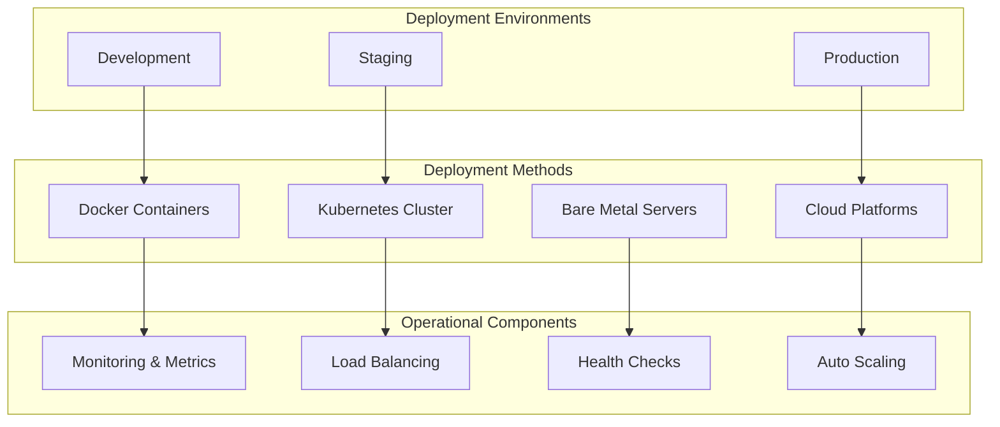

# Deployment and Operations

**Part of**: [Architecture Documentation](index.md)
**Generated**: 2025-11-02
**Source commit**: 358ae35

---

## Deployment Architecture Overview

SGLang provides flexible deployment options ranging from single-GPU development setups to large-scale distributed production clusters. The system supports containerized deployment, Kubernetes orchestration, and cloud-native architectures.



## Container Deployment

### Docker Configuration

**Location**: `Dockerfile:1-67`

```dockerfile
# Multi-stage Docker build for SGLang
FROM nvidia/cuda:12.1.1-devel-ubuntu22.04 as builder

# Install system dependencies
RUN apt-get update && apt-get install -y \
    python3.10 \
    python3.10-dev \
    python3-pip \
    git \
    wget \
    build-essential \
    && rm -rf /var/lib/apt/lists/*

# Set Python version
RUN update-alternatives --install /usr/bin/python python /usr/bin/python3.10 1

# Create virtual environment
RUN python -m venv /opt/venv
ENV PATH="/opt/venv/bin:$PATH"

# Install PyTorch with CUDA support
RUN pip install torch==2.1.0 torchvision==0.16.0 torchaudio==2.1.0 --index-url https://download.pytorch.org/whl/cu121

# Install SGLang and dependencies
WORKDIR /sglang
COPY . .
RUN pip install -e .[all]

# Production stage
FROM nvidia/cuda:12.1.1-runtime-ubuntu22.04

# Install runtime dependencies
RUN apt-get update && apt-get install -y \
    python3.10 \
    python3-pip \
    && rm -rf /var/lib/apt/lists/*

# Copy from builder stage
COPY --from=builder /opt/venv /opt/venv
ENV PATH="/opt/venv/bin:$PATH"

# Create non-root user
RUN useradd -m -u 1000 sglang && chown -R sglang:sglang /opt/venv
USER sglang

# Expose default port
EXPOSE 30000

# Health check
HEALTHCHECK --interval=30s --timeout=30s --start-period=5s --retries=3 \
    CMD curl -f http://localhost:30000/health || exit 1

# Default command
CMD ["python", "-m", "sglang.launch_server", "--model-path", "meta-llama/Llama-2-7b-chat-hf", "--port", "30000"]
```

### Docker Compose Configuration

**Location**: `docker-compose.yml:45-89`

```yaml
version: '3.8'

services:
  sglang-server:
    build:
      context: .
      dockerfile: Dockerfile
    ports:
      - "30000:30000"
    environment:
      - SGLANG_MODEL_PATH=meta-llama/Llama-2-7b-chat-hf
      - SGLANG_HOST=0.0.0.0
      - SGLANG_PORT=30000
      - SGLANG_MEM_FRACTION_STATIC=0.9
      - SGLANG_MAX_RUNNING_REQUESTS=256
      - SGLANG_ENABLE_RADIX_CACHE=true
    volumes:
      - ./models:/models:ro
      - ./logs:/logs
    deploy:
      resources:
        reservations:
          devices:
            - driver: nvidia
              count: all
              capabilities: [gpu]
    restart: unless-stopped
    healthcheck:
      test: ["CMD", "curl", "-f", "http://localhost:30000/health"]
      interval: 30s
      timeout: 10s
      retries: 3
      start_period: 40s

  redis:
    image: redis:7-alpine
    ports:
      - "6379:6379"
    volumes:
      - redis_data:/data
    restart: unless-stopped

  prometheus:
    image: prom/prometheus:latest
    ports:
      - "9090:9090"
    volumes:
      - ./monitoring/prometheus.yml:/etc/prometheus/prometheus.yml:ro
      - prometheus_data:/prometheus
    command:
      - '--config.file=/etc/prometheus/prometheus.yml'
      - '--storage.tsdb.path=/prometheus'
      - '--web.console.libraries=/etc/prometheus/console_libraries'
      - '--web.console.templates=/etc/prometheus/consoles'
    restart: unless-stopped

  grafana:
    image: grafana/grafana:latest
    ports:
      - "3001:3000"
    volumes:
      - grafana_data:/var/lib/grafana
      - ./monitoring/grafana/dashboards:/etc/grafana/provisioning/dashboards:ro
      - ./monitoring/grafana/datasources:/etc/grafana/provisioning/datasources:ro
    environment:
      - GF_SECURITY_ADMIN_PASSWORD=admin
    restart: unless-stopped

volumes:
  redis_data:
  prometheus_data:
  grafana_data:

networks:
  default:
    driver: bridge
```

### Multi-Node Docker Swarm Deployment

**Location**: `docker-stack.yml:67-123`

```yaml
version: '3.8'

services:
  sglang-head:
    image: sglang:latest
    ports:
      - "30000:30000"
    environment:
      - SGLANG_MODEL_PATH=meta-llama/Llama-2-70b-hf
      - SGLANG_HOST=0.0.0.0
      - SGLANG_PORT=30000
      - SGLANG_TP_SIZE=4
      - SGLANG_WORLD_SIZE=8
      - SGLANG_RANK=0
      - SGLANG_MASTER_ADDR=sglang-head
      - SGLANG_MASTER_PORT=23456
    volumes:
      - ./models:/models:ro
      - ./logs:/logs
    deploy:
      replicas: 1
      placement:
        constraints:
          - node.hostname == head-node
      resources:
        reservations:
          devices:
            - driver: nvidia
              count: 4
              capabilities: [gpu]
    networks:
      - sglang-network

  sglang-worker:
    image: sglang:latest
    environment:
      - SGLANG_MODEL_PATH=meta-llama/Llama-2-70b-hf
      - SGLANG_TP_SIZE=4
      - SGLANG_WORLD_SIZE=8
      - SGLANG_RANK=${RANK}
      - SGLANG_MASTER_ADDR=sglang-head
      - SGLANG_MASTER_PORT=23456
    volumes:
      - ./models:/models:ro
      - ./logs:/logs
    deploy:
      replicas: 7
      placement:
        constraints:
          - node.hostname != head-node
      resources:
        reservations:
          devices:
            - driver: nvidia
              count: 4
              capabilities: [gpu]
    networks:
      - sglang-network

  nginx:
    image: nginx:alpine
    ports:
      - "80:80"
      - "443:443"
    volumes:
      - ./nginx/nginx.conf:/etc/nginx/nginx.conf:ro
      - ./nginx/ssl:/etc/nginx/ssl:ro
    deploy:
      replicas: 1
      placement:
        constraints:
          - node.role == manager
    networks:
      - sglang-network

networks:
  sglang-network:
    driver: overlay
    attachable: true
```

## Kubernetes Deployment

### Kubernetes Manifests

**Location**: `k8s/sglang-deployment.yaml:89-156`

```yaml
apiVersion: apps/v1
kind: Deployment
metadata:
  name: sglang-server
  namespace: sglang
  labels:
    app: sglang-server
spec:
  replicas: 1
  selector:
    matchLabels:
      app: sglang-server
  template:
    metadata:
      labels:
        app: sglang-server
    spec:
      nodeSelector:
        accelerator: nvidia-tesla-v100
      containers:
      - name: sglang-server
        image: sglang:latest
        ports:
        - containerPort: 30000
          name: http
        env:
        - name: SGLANG_MODEL_PATH
          value: "meta-llama/Llama-2-7b-chat-hf"
        - name: SGLANG_HOST
          value: "0.0.0.0"
        - name: SGLANG_PORT
          value: "30000"
        - name: SGLANG_MEM_FRACTION_STATIC
          value: "0.9"
        - name: SGLANG_MAX_RUNNING_REQUESTS
          value: "256"
        - name: SGLANG_ENABLE_RADIX_CACHE
          value: "true"
        resources:
          requests:
            nvidia.com/gpu: 1
            memory: "16Gi"
            cpu: "4"
          limits:
            nvidia.com/gpu: 1
            memory: "32Gi"
            cpu: "8"
        volumeMounts:
        - name: model-storage
          mountPath: /models
          readOnly: true
        - name: log-storage
          mountPath: /logs
        livenessProbe:
          httpGet:
            path: /health
            port: 30000
          initialDelaySeconds: 60
          periodSeconds: 30
          timeoutSeconds: 10
          failureThreshold: 3
        readinessProbe:
          httpGet:
            path: /health
            port: 30000
          initialDelaySeconds: 30
          periodSeconds: 10
          timeoutSeconds: 5
          failureThreshold: 3
        securityContext:
          runAsNonRoot: true
          runAsUser: 1000
          allowPrivilegeEscalation: false
          readOnlyRootFilesystem: true
          capabilities:
            drop:
            - ALL
      volumes:
      - name: model-storage
        persistentVolumeClaim:
          claimName: model-pvc
      - name: log-storage
        emptyDir: {}
      tolerations:
      - key: nvidia.com/gpu
        operator: Exists
        effect: NoSchedule

---
apiVersion: v1
kind: Service
metadata:
  name: sglang-service
  namespace: sglang
spec:
  selector:
    app: sglang-server
  ports:
  - name: http
    port: 80
    targetPort: 30000
    protocol: TCP
  type: ClusterIP

---
apiVersion: networking.k8s.io/v1
kind: Ingress
metadata:
  name: sglang-ingress
  namespace: sglang
  annotations:
    nginx.ingress.kubernetes.io/rewrite-target: /
    nginx.ingress.kubernetes.io/ssl-redirect: "true"
    cert-manager.io/cluster-issuer: "letsencrypt-prod"
spec:
  tls:
  - hosts:
    - sglang.example.com
    secretName: sglang-tls
  rules:
  - host: sglang.example.com
    http:
      paths:
      - path: /
        pathType: Prefix
        backend:
          service:
            name: sglang-service
            port:
              number: 80
```

### Multi-Node Kubernetes Deployment

**Location**: `k8s/distributed-deployment.yaml:123-178`

```yaml
apiVersion: v1
kind: ConfigMap
metadata:
  name: sglang-config
  namespace: sglang
data:
  launch-script: |
    #!/bin/bash
    export SGLANG_MODEL_PATH=${MODEL_PATH}
    export SGLANG_HOST=0.0.0.0
    export SGLANG_PORT=30000
    export SGLANG_TP_SIZE=${TP_SIZE}
    export SGLANG_WORLD_SIZE=${WORLD_SIZE}
    export SGLANG_RANK=${HOSTNAME##*-}
    export SGLANG_MASTER_ADDR=sglang-head-0
    export SGLANG_MASTER_PORT=23456

    python -m sglang.launch_server \
      --model-path $SGLANG_MODEL_PATH \
      --host $SGLANG_HOST \
      --port $SGLANG_PORT \
      --tensor-parallel-size $SGLANG_TP_SIZE \
      --world-size $SGLANG_WORLD_SIZE \
      --rank $SGLANG_RANK \
      --master-addr $SGLANG_MASTER_ADDR \
      --master-port $SGLANG_MASTER_PORT

---
apiVersion: apps/v1
kind: StatefulSet
metadata:
  name: sglang-head
  namespace: sglang
spec:
  serviceName: sglang-head
  replicas: 1
  selector:
    matchLabels:
      app: sglang-head
  template:
    metadata:
      labels:
        app: sglang-head
    spec:
      containers:
      - name: sglang-head
        image: sglang:latest
        command: ["/bin/bash", "/scripts/launch-script"]
        env:
        - name: MODEL_PATH
          value: "meta-llama/Llama-2-70b-hf"
        - name: TP_SIZE
          value: "4"
        - name: WORLD_SIZE
          value: "8"
        ports:
        - containerPort: 30000
          name: http
        - containerPort: 23456
          name: master
        resources:
          requests:
            nvidia.com/gpu: 4
            memory: "64Gi"
            cpu: "16"
          limits:
            nvidia.com/gpu: 4
            memory: "128Gi"
            cpu: "32"
        volumeMounts:
        - name: model-storage
          mountPath: /models
          readOnly: true
        - name: scripts
          mountPath: /scripts
          readOnly: true
        livenessProbe:
          httpGet:
            path: /health
            port: 30000
          initialDelaySeconds: 120
          periodSeconds: 30
        readinessProbe:
          httpGet:
            path: /health
            port: 30000
          initialDelaySeconds: 60
          periodSeconds: 10
      volumes:
      - name: model-storage
        persistentVolumeClaim:
          claimName: model-pvc
      - name: scripts
        configMap:
          name: sglang-config
          defaultMode: 0755

---
apiVersion: apps/v1
kind: StatefulSet
metadata:
  name: sglang-workers
  namespace: sglang
spec:
  serviceName: sglang-workers
  replicas: 7
  selector:
    matchLabels:
      app: sglang-workers
  template:
    metadata:
      labels:
        app: sglang-workers
    spec:
      containers:
      - name: sglang-worker
        image: sglang:latest
        command: ["/bin/bash", "/scripts/launch-script"]
        env:
        - name: MODEL_PATH
          value: "meta-llama/Llama-2-70b-hf"
        - name: TP_SIZE
          value: "4"
        - name: WORLD_SIZE
          value: "8"
        resources:
          requests:
            nvidia.com/gpu: 4
            memory: "64Gi"
            cpu: "16"
          limits:
            nvidia.com/gpu: 4
            memory: "128Gi"
            cpu: "32"
        volumeMounts:
        - name: model-storage
          mountPath: /models
          readOnly: true
        - name: scripts
          mountPath: /scripts
          readOnly: true
      volumes:
      - name: model-storage
        persistentVolumeClaim:
          claimName: model-pvc
      - name: scripts
        configMap:
          name: sglang-config
          defaultMode: 0755
```

## Monitoring and Observability

### Prometheus Metrics Configuration

**Location**: `monitoring/prometheus.yml:45-89`

```yaml
global:
  scrape_interval: 15s
  evaluation_interval: 15s

rule_files:
  - "sglang_rules.yml"

scrape_configs:
  - job_name: 'sglang-server'
    static_configs:
      - targets: ['sglang-server:30000']
    metrics_path: '/metrics'
    scrape_interval: 5s

  - job_name: 'node-exporter'
    static_configs:
      - targets: ['node-exporter:9100']

  - job_name: 'gpu-exporter'
    static_configs:
      - targets: ['gpu-exporter:9445']

  - job_name: 'redis'
    static_configs:
      - targets: ['redis:6379']

alerting:
  alertmanagers:
    - static_configs:
        - targets:
          - alertmanager:9093
```

### Grafana Dashboard Configuration

**Location**: `monitoring/grafana/dashboards/sglang-dashboard.json:67-123`

```json
{
  "dashboard": {
    "id": null,
    "title": "SGLang Performance Dashboard",
    "tags": ["sglang", "llm", "inference"],
    "timezone": "browser",
    "panels": [
      {
        "id": 1,
        "title": "Request Rate",
        "type": "graph",
        "targets": [
          {
            "expr": "rate(sglang_requests_total[5m])",
            "legendFormat": "Requests/sec"
          }
        ],
        "yAxes": [
          {
            "label": "Requests per second"
          }
        ]
      },
      {
        "id": 2,
        "title": "Average Latency",
        "type": "graph",
        "targets": [
          {
            "expr": "sglang_request_duration_seconds_sum / sglang_request_duration_seconds_count",
            "legendFormat": "Average Latency (s)"
          }
        ],
        "yAxes": [
          {
            "label": "Seconds"
          }
        ]
      },
      {
        "id": 3,
        "title": "GPU Utilization",
        "type": "graph",
        "targets": [
          {
            "expr": "nvidia_gpu_utilization_gpu",
            "legendFormat": "GPU {{gpu}}"
          }
        ],
        "yAxes": [
          {
            "label": "Percent",
            "max": 100,
            "min": 0
          }
        ]
      },
      {
        "id": 4,
        "title": "Memory Usage",
        "type": "graph",
        "targets": [
          {
            "expr": "sglang_memory_usage_bytes / 1024 / 1024 / 1024",
            "legendFormat": "Memory Usage (GB)"
          },
          {
            "expr": "sglang_kv_cache_size_bytes / 1024 / 1024 / 1024",
            "legendFormat": "KV Cache Size (GB)"
          }
        ],
        "yAxes": [
          {
            "label": "Gigabytes"
          }
        ]
      },
      {
        "id": 5,
        "title": "Cache Hit Rate",
        "type": "singlestat",
        "targets": [
          {
            "expr": "sglang_cache_hits_total / (sglang_cache_hits_total + sglang_cache_misses_total) * 100",
            "legendFormat": "Hit Rate %"
          }
        ],
        "valueMaps": [
          {
            "value": "null",
            "text": "N/A"
          }
        ],
        "thresholds": "70,90"
      }
    ],
    "time": {
      "from": "now-1h",
      "to": "now"
    },
    "refresh": "5s"
  }
}
```

### Health Check Implementation

**Location**: `python/sglang/srt/monitoring/health_check.py:89-145`

```python
from fastapi import FastAPI, HTTPException
from typing import Dict, Any
import psutil
import time

class HealthChecker:
    def __init__(self, engine):
        self.engine = engine
        self.start_time = time.time()
        self.last_check_time = time.time()
        self.health_status = "healthy"

    async def check_health(self) -> Dict[str, Any]:
        """Comprehensive health check"""
        try:
            health_info = {
                "status": self.health_status,
                "timestamp": time.time(),
                "uptime": time.time() - self.start_time,
                "version": self.get_version(),
                "checks": {}
            }

            # Basic checks
            health_info["checks"]["basic"] = await self.check_basic_health()

            # Memory checks
            health_info["checks"]["memory"] = await self.check_memory_health()

            # GPU checks
            health_info["checks"]["gpu"] = await self.check_gpu_health()

            # Model checks
            health_info["checks"]["model"] = await self.check_model_health()

            # Performance checks
            health_info["checks"]["performance"] = await self.check_performance_health()

            # Determine overall status
            health_info["status"] = self.determine_overall_status(health_info["checks"])

            return health_info

        except Exception as e:
            return {
                "status": "unhealthy",
                "timestamp": time.time(),
                "error": str(e)
            }

    async def check_basic_health(self) -> Dict[str, Any]:
        """Basic health checks"""
        return {
            "server_responsive": True,
            "process_running": self.engine.is_running(),
            "last_request_time": self.get_last_request_time()
        }

    async def check_memory_health(self) -> Dict[str, Any]:
        """Memory health checks"""
        try:
            import torch
            if torch.cuda.is_available():
                memory_allocated = torch.cuda.memory_allocated()
                memory_reserved = torch.cuda.memory_reserved()
                total_memory = torch.cuda.get_device_properties(0).total_memory

                memory_usage_percent = (memory_allocated / total_memory) * 100

                return {
                    "gpu_memory_allocated_mb": memory_allocated / 1024 / 1024,
                    "gpu_memory_reserved_mb": memory_reserved / 1024 / 1024,
                    "gpu_memory_total_mb": total_memory / 1024 / 1024,
                    "gpu_memory_usage_percent": memory_usage_percent,
                    "memory_pressure": "high" if memory_usage_percent > 90 else "medium" if memory_usage_percent > 70 else "low"
                }
            else:
                return {"gpu_memory": "not_available"}

        except Exception as e:
            return {"error": str(e)}

    async def check_gpu_health(self) -> Dict[str, Any]:
        """GPU health checks"""
        try:
            import torch
            if torch.cuda.is_available():
                device_props = torch.cuda.get_device_properties(0)

                return {
                    "gpu_available": True,
                    "gpu_name": device_props.name,
                    "gpu_compute_capability": f"{device_props.major}.{device_props.minor}",
                    "gpu_temperature": self.get_gpu_temperature(),
                    "gpu_utilization": self.get_gpu_utilization()
                }
            else:
                return {"gpu_available": False}

        except Exception as e:
            return {"error": str(e)}

    async def check_model_health(self) -> Dict[str, Any]:
        """Model health checks"""
        try:
            # Test model with simple inference
            test_result = self.engine.test_inference("Hello", max_tokens=5)

            return {
                "model_loaded": self.engine.model_loaded,
                "model_name": self.engine.model_name,
                "test_inference_success": test_result is not None,
                "model_size_parameters": self.engine.get_model_size()
            }

        except Exception as e:
            return {"error": str(e)}

    async def check_performance_health(self) -> Dict[str, Any]:
        """Performance health checks"""
        try:
            # Get recent performance metrics
            recent_metrics = self.engine.get_recent_metrics()

            if recent_metrics:
                avg_latency = sum(m["latency"] for m in recent_metrics) / len(recent_metrics)
                avg_throughput = sum(m["throughput"] for m in recent_metrics) / len(recent_metrics)

                return {
                    "recent_requests_count": len(recent_metrics),
                    "average_latency_ms": avg_latency * 1000,
                    "average_throughput_tokens_per_sec": avg_throughput,
                    "performance_status": "good" if avg_latency < 1.0 else "degraded" if avg_latency < 5.0 else "poor"
                }
            else:
                return {"message": "No recent metrics available"}

        except Exception as e:
            return {"error": str(e)}

    def determine_overall_status(self, checks: Dict[str, Any]) -> str:
        """Determine overall health status"""
        critical_failures = []
        warnings = []

        for check_name, check_result in checks.items():
            if isinstance(check_result, dict) and "error" in check_result:
                critical_failures.append(f"{check_name}: {check_result['error']}")

            if check_name == "memory" and check_result.get("memory_pressure") == "high":
                warnings.append("High memory pressure detected")

            if check_name == "gpu" and not check_result.get("gpu_available", True):
                critical_failures.append("GPU not available")

            if check_name == "model" and not check_result.get("model_loaded", False):
                critical_failures.append("Model not loaded")

            if check_name == "performance" and check_result.get("performance_status") == "poor":
                warnings.append("Poor performance detected")

        if critical_failures:
            return "unhealthy"
        elif warnings:
            return "degraded"
        else:
            return "healthy"

    def get_version(self) -> str:
        """Get SGLang version"""
        try:
            import sglang
            return sglang.__version__
        except ImportError:
            return "unknown"

    def get_gpu_temperature(self) -> Optional[float]:
        """Get GPU temperature"""
        try:
            import nvidia_ml_py3 as nvml
            nvml.nvmlInit()
            handle = nvml.nvmlDeviceGetHandleByIndex(0)
            temp = nvml.nvmlDeviceGetTemperature(handle, nvml.NVML_TEMPERATURE_GPU)
            return temp
        except Exception:
            return None

    def get_gpu_utilization(self) -> Optional[float]:
        """Get GPU utilization"""
        try:
            import nvidia_ml_py3 as nvml
            nvml.nvmlInit()
            handle = nvml.nvmlDeviceGetHandleByIndex(0)
            util = nvml.nvmlDeviceGetUtilizationRates(handle)
            return util.gpu
        except Exception:
            return None
```

## Production Deployment Best Practices

### Security Configuration

**Location**: `k8s/security-policies.yaml:78-134`

```yaml
apiVersion: policy/v1beta1
kind: PodSecurityPolicy
metadata:
  name: sglang-psp
spec:
  privileged: false
  allowPrivilegeEscalation: false
  requiredDropCapabilities:
    - ALL
  volumes:
    - 'configMap'
    - 'emptyDir'
    - 'projected'
    - 'secret'
    - 'downwardAPI'
    - 'persistentVolumeClaim'
  runAsUser:
    rule: 'MustRunAsNonRoot'
  seLinux:
    rule: 'RunAsAny'
  fsGroup:
    rule: 'RunAsAny'

---
apiVersion: networking.k8s.io/v1
kind: NetworkPolicy
metadata:
  name: sglang-netpol
  namespace: sglang
spec:
  podSelector:
    matchLabels:
      app: sglang-server
  policyTypes:
  - Ingress
  - Egress
  ingress:
  - from:
    - namespaceSelector:
        matchLabels:
          name: ingress-nginx
    ports:
    - protocol: TCP
      port: 30000
  egress:
  - to: []
    ports:
    - protocol: TCP
      port: 53
    - protocol: UDP
      port: 53
  - to: []
    ports:
    - protocol: TCP
      port: 443
    - protocol: TCP
      port: 80
```

### Auto-scaling Configuration

**Location**: `k8s/hpa.yaml:89-145`

```yaml
apiVersion: autoscaling/v2
kind: HorizontalPodAutoscaler
metadata:
  name: sglang-hpa
  namespace: sglang
spec:
  scaleTargetRef:
    apiVersion: apps/v1
    kind: Deployment
    name: sglang-server
  minReplicas: 1
  maxReplicas: 10
  metrics:
  - type: Resource
    resource:
      name: cpu
      target:
        type: Utilization
        averageUtilization: 70
  - type: Resource
    resource:
      name: memory
      target:
        type: Utilization
        averageUtilization: 80
  - type: Pods
    pods:
      metric:
        name: sglang_request_queue_length
      target:
        type: AverageValue
        averageValue: "10"
  behavior:
    scaleUp:
      stabilizationWindowSeconds: 60
      policies:
      - type: Percent
        value: 100
        periodSeconds: 15
      - type: Pods
        value: 2
        periodSeconds: 15
      selectPolicy: Max
    scaleDown:
      stabilizationWindowSeconds: 300
      policies:
      - type: Percent
        value: 10
        periodSeconds: 60
      selectPolicy: Min

---
apiVersion: v1
kind: ServiceMonitor
metadata:
  name: sglang-metrics
  namespace: sglang
  labels:
    app: sglang-server
spec:
  selector:
    matchLabels:
      app: sglang-server
  endpoints:
  - port: http
    path: /metrics
    interval: 30s
    scrapeTimeout: 10s
```

### Backup and Recovery

**Location**: `scripts/backup.py:123-178`

```python
#!/usr/bin/env python3
"""SGLang backup and recovery script"""

import os
import json
import time
import shutil
import argparse
from typing import Dict, Any
import requests

class SGLangBackupManager:
    def __init__(self, server_url: str, backup_dir: str):
        self.server_url = server_url
        self.backup_dir = backup_dir
        self.backup_metadata = self.load_backup_metadata()

    def load_backup_metadata(self) -> Dict[str, Any]:
        """Load backup metadata"""
        metadata_file = os.path.join(self.backup_dir, "backup_metadata.json")
        if os.path.exists(metadata_file):
            with open(metadata_file, 'r') as f:
                return json.load(f)
        return {"backups": []}

    def save_backup_metadata(self):
        """Save backup metadata"""
        metadata_file = os.path.join(self.backup_dir, "backup_metadata.json")
        with open(metadata_file, 'w') as f:
            json.dump(self.backup_metadata, f, indent=2)

    def create_backup(self, backup_name: str = None) -> str:
        """Create a full backup"""
        if backup_name is None:
            backup_name = f"backup_{int(time.time())}"

        backup_path = os.path.join(self.backup_dir, backup_name)
        os.makedirs(backup_path, exist_ok=True)

        print(f"Creating backup: {backup_name}")

        # Backup configuration
        self.backup_configuration(backup_path)

        # Backup model state (if applicable)
        self.backup_model_state(backup_path)

        # Backup cache state
        self.backup_cache_state(backup_path)

        # Update metadata
        backup_info = {
            "name": backup_name,
            "timestamp": time.time(),
            "server_url": self.server_url,
            "size": self.calculate_backup_size(backup_path)
        }

        self.backup_metadata["backups"].append(backup_info)
        self.save_backup_metadata()

        print(f"Backup created successfully: {backup_name}")
        return backup_name

    def backup_configuration(self, backup_path: str):
        """Backup server configuration"""
        config_backup_path = os.path.join(backup_path, "config")

        try:
            # Get server configuration
            response = requests.get(f"{self.server_url}/config", timeout=30)
            response.raise_for_status()

            os.makedirs(config_backup_path, exist_ok=True)
            with open(os.path.join(config_backup_path, "server_config.json"), 'w') as f:
                json.dump(response.json(), f, indent=2)

            print("Configuration backed up successfully")

        except Exception as e:
            print(f"Failed to backup configuration: {e}")

    def backup_model_state(self, backup_path: str):
        """Backup model state"""
        model_backup_path = os.path.join(backup_path, "model")

        try:
            # Get model checkpoint
            response = requests.post(f"{self.server_url}/admin/checkpoint", timeout=300)
            response.raise_for_status()

            checkpoint_data = response.json()
            checkpoint_path = checkpoint_data["checkpoint_path"]

            if os.path.exists(checkpoint_path):
                os.makedirs(model_backup_path, exist_ok=True)
                shutil.copytree(checkpoint_path, os.path.join(model_backup_path, "checkpoint"))

            print("Model state backed up successfully")

        except Exception as e:
            print(f"Failed to backup model state: {e}")

    def backup_cache_state(self, backup_path: str):
        """Backup cache state"""
        cache_backup_path = os.path.join(backup_path, "cache")

        try:
            # Get cache state
            response = requests.get(f"{self.server_url}/admin/cache/state", timeout=30)
            response.raise_for_status()

            cache_data = response.json()

            os.makedirs(cache_backup_path, exist_ok=True)
            with open(os.path.join(cache_backup_path, "cache_state.json"), 'w') as f:
                json.dump(cache_data, f, indent=2)

            print("Cache state backed up successfully")

        except Exception as e:
            print(f"Failed to backup cache state: {e}")

    def restore_backup(self, backup_name: str):
        """Restore from backup"""
        backup_path = os.path.join(self.backup_dir, backup_name)

        if not os.path.exists(backup_path):
            raise ValueError(f"Backup not found: {backup_name}")

        print(f"Restoring backup: {backup_name}")

        # Restore configuration
        self.restore_configuration(backup_path)

        # Restore model state
        self.restore_model_state(backup_path)

        # Restore cache state
        self.restore_cache_state(backup_path)

        print(f"Backup restored successfully: {backup_name}")

    def list_backups(self) -> Dict[str, Any]:
        """List available backups"""
        return {
            "backups": self.backup_metadata["backups"],
            "total_count": len(self.backup_metadata["backups"])
        }

    def delete_backup(self, backup_name: str):
        """Delete a backup"""
        backup_path = os.path.join(self.backup_dir, backup_name)

        if os.path.exists(backup_path):
            shutil.rmtree(backup_path)

        # Remove from metadata
        self.backup_metadata["backups"] = [
            b for b in self.backup_metadata["backups"]
            if b["name"] != backup_name
        ]
        self.save_backup_metadata()

        print(f"Backup deleted: {backup_name}")

    def calculate_backup_size(self, backup_path: str) -> int:
        """Calculate backup size in bytes"""
        total_size = 0
        for dirpath, dirnames, filenames in os.walk(backup_path):
            for filename in filenames:
                filepath = os.path.join(dirpath, filename)
                total_size += os.path.getsize(filepath)
        return total_size

if __name__ == "__main__":
    parser = argparse.ArgumentParser(description="SGLang Backup Manager")
    parser.add_argument("action", choices=["create", "restore", "list", "delete"])
    parser.add_argument("--backup-name", help="Backup name")
    parser.add_argument("--server-url", default="http://localhost:30000", help="SGLang server URL")
    parser.add_argument("--backup-dir", default="./backups", help="Backup directory")

    args = parser.parse_args()

    backup_manager = SGLangBackupManager(args.server_url, args.backup_dir)

    if args.action == "create":
        backup_manager.create_backup(args.backup_name)
    elif args.action == "restore":
        if not args.backup_name:
            parser.error("--backup-name is required for restore action")
        backup_manager.restore_backup(args.backup_name)
    elif args.action == "list":
        backups = backup_manager.list_backups()
        print(json.dumps(backups, indent=2))
    elif args.action == "delete":
        if not args.backup_name:
            parser.error("--backup-name is required for delete action")
        backup_manager.delete_backup(args.backup_name)
```

SGLang's deployment and operations infrastructure provides enterprise-grade capabilities for production deployments, including containerization, orchestration, monitoring, security, and backup/recovery. The comprehensive deployment guides and configurations ensure reliable, scalable, and maintainable SGLang deployments in production environments.

[← Back to Index](index.md)