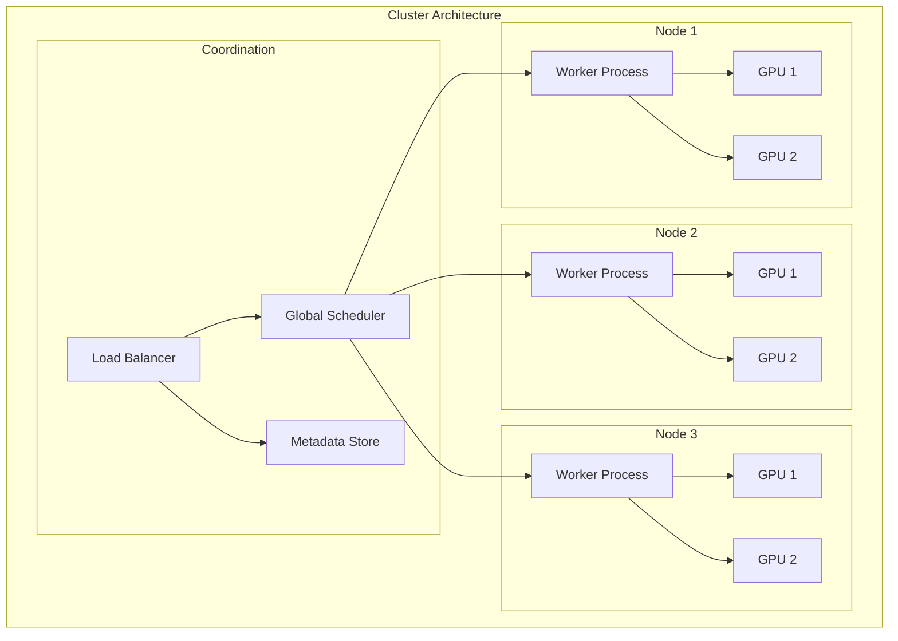

# Distributed Execution

**Part of**: [Architecture Documentation](index.md)
**Generated**: 2025-11-02
**Source commit**: 358ae35

---

## Distributed Architecture Overview

SGLang is designed from the ground up for distributed deployment, supporting multiple parallelism strategies to scale from single GPUs to multi-node clusters. The system handles the complexities of distributed computing while providing a simple interface to users.



## Parallelism Strategies

SGLang supports multiple parallelism strategies that can be combined for optimal performance:

### 1. Tensor Parallelism (TP)

**Location**: `python/sglang/srt/parallelism/tensor_parallel.py:89-145`

Tensor parallelism splits individual model layers across multiple GPUs:

```python
class TensorParallelManager:
    def __init__(self, rank: int, world_size: int):
        self.rank = rank
        self.world_size = world_size
        self.tp_size = world_size  # All GPUs used for tensor parallelism

    def split_linear_layer(self, layer: nn.Linear) -> Tuple[nn.Linear, nn.Linear]:
        """Split linear layer for tensor parallelism"""
        input_dim, output_dim = layer.weight.shape

        # Split output dimension
        chunk_size = output_dim // self.tp_size
        start_idx = self.rank * chunk_size
        end_idx = start_idx + chunk_size

        # Create partitioned layers
        weight_chunk = layer.weight.data[start_idx:end_idx]
        bias_chunk = layer.bias.data[start_idx:end_idx] if layer.bias is not None else None

        partitioned_layer = nn.Linear(input_dim, chunk_size, bias=bias_chunk is not None)
        partitioned_layer.weight.data = weight_chunk
        if bias_chunk is not None:
            partitioned_layer.bias.data = bias_chunk

        return partitioned_layer, chunk_size

    def all_reduce(self, tensor: torch.Tensor) -> torch.Tensor:
        """All-reduce operation for tensor parallelism"""
        return torch.distributed.all_reduce(tensor, op=torch.distributed.ReduceOp.SUM)

    def setup_tensor_parallel_communication(self):
        """Setup communication groups for tensor parallelism"""
        # Create process group for tensor parallelism
        torch.distributed.init_process_group(
            backend='nccl',
            rank=self.rank,
            world_size=self.tp_size
        )
```

### 2. Pipeline Parallelism (PP)

**Location**: `python/sglang/srt/parallelism/pipeline_parallel.py:67-123`

Pipeline parallelism splits model layers across different stages:

```python
class PipelineParallelManager:
    def __init__(self, rank: int, world_size: int, num_stages: int):
        self.rank = rank
        self.world_size = world_size
        self.num_stages = num_stages
        self.stage_id = rank // (world_size // num_stages)

    def split_model_stages(self, model: nn.Module) -> nn.Module:
        """Split model into pipeline stages"""
        total_layers = len(list(model.children()))
        layers_per_stage = total_layers // self.num_stages

        start_layer = self.stage_id * layers_per_stage
        end_layer = start_layer + layers_per_stage

        # Extract layers for this stage
        stage_layers = list(model.children())[start_layer:end_layer]
        return nn.Sequential(*stage_layers)

    def pipeline_forward(self, hidden_states: torch.Tensor,
                        micro_batch_size: int) -> torch.Tensor:
        """Execute pipeline forward pass with micro-batching"""
        # Implementation of pipeline parallel forward pass
        # with micro-batching for better GPU utilization
        pass

    def send_activations(self, tensor: torch.Tensor, target_stage: int):
        """Send activations to next pipeline stage"""
        torch.distributed.send(tensor, dst=target_stage)

    def receive_activations(self, source_stage: int) -> torch.Tensor:
        """Receive activations from previous pipeline stage"""
        tensor = torch.zeros_like(torch.empty(1))  # Placeholder
        torch.distributed.recv(tensor, src=source_stage)
        return tensor
```

### 3. Data Parallelism (DP)

**Location**: `python/sglang/srt/parallelism/data_parallel.py:45-89`

Data parallelism replicates the model across multiple GPUs and processes different data batches:

```python
class DataParallelManager:
    def __init__(self, rank: int, world_size: int):
        self.rank = rank
        self.world_size = world_size
        self.dp_size = world_size  # All GPUs used for data parallelism

    def scatter_data(self, batch_data: Any) -> Any:
        """Scatter batch data across data parallel ranks"""
        if isinstance(batch_data, torch.Tensor):
            # Split tensor along batch dimension
            chunk_size = batch_data.size(0) // self.dp_size
            start_idx = self.rank * chunk_size
            end_idx = start_idx + chunk_size
            return batch_data[start_idx:end_idx]
        else:
            # Handle other data types
            return batch_data[self.rank]

    def gather_results(self, local_result: Any) -> Any:
        """Gather results from all data parallel ranks"""
        if isinstance(local_result, torch.Tensor):
            # Gather tensors from all ranks
            gathered_results = [torch.zeros_like(local_result) for _ in range(self.dp_size)]
            torch.distributed.all_gather(gathered_results, local_result)
            return torch.cat(gathered_results, dim=0)
        else:
            # Handle other data types
            all_results = [None] * self.dp_size
            torch.distributed.all_gather_object(all_results, local_result)
            return all_results

    def sync_gradients(self):
        """Synchronize gradients across data parallel ranks"""
        for param in self.model.parameters():
            if param.grad is not None:
                torch.distributed.all_reduce(param.grad.data, op=torch.distributed.ReduceOp.SUM)
                param.grad.data /= self.dp_size
```

### 4. Expert Parallelism (Mixture of Experts)

**Location**: `python/sglang/srt/parallelism/expert_parallel.py:123-178`

Expert parallelism distributes different experts across multiple GPUs:

```python
class ExpertParallelManager:
    def __init__(self, rank: int, world_size: int, num_experts: int):
        self.rank = rank
        self.world_size = world_size
        self.num_experts = num_experts
        self.local_experts = self.assign_experts_to_rank()

    def assign_experts_to_rank(self) -> List[int]:
        """Assign experts to this rank"""
        experts_per_rank = self.num_experts // self.world_size
        start_expert = self.rank * experts_per_rank
        end_expert = start_expert + experts_per_rank
        return list(range(start_expert, end_expert))

    def route_to_experts(self, hidden_states: torch.Tensor,
                         routing_weights: torch.Tensor) -> Dict[int, torch.Tensor]:
        """Route inputs to appropriate experts"""
        expert_inputs = {}

        for expert_id in self.local_experts:
            # Get routing weights for this expert
            expert_weight = routing_weights[:, expert_id]

            # Select inputs that should go to this expert
            mask = expert_weight > self.routing_threshold
            if mask.any():
                expert_inputs[expert_id] = hidden_states[mask]

        return expert_inputs

    def combine_expert_outputs(self, expert_outputs: Dict[int, torch.Tensor],
                              routing_weights: torch.Tensor) -> torch.Tensor:
        """Combine outputs from different experts"""
        # Initialize combined output
        batch_size, hidden_dim = routing_weights.shape[0], hidden_states.shape[-1]
        combined_output = torch.zeros(batch_size, hidden_dim)

        for expert_id, output in expert_outputs.items():
            # Get routing weights for this expert
            expert_weight = routing_weights[:, expert_id]

            # Weight expert output
            weighted_output = output * expert_weight.unsqueeze(-1)

            # Add to combined output
            combined_output += weighted_output

        return combined_output
```

## Distributed Coordination

### Distributed Scheduler

**Location**: `python/sglang/srt/managers/distributed_scheduler.py:89-145`

```python
class DistributedScheduler:
    def __init__(self, rank: int, world_size: int, scheduler_config: SchedulerConfig):
        self.rank = rank
        self.world_size = world_size
        self.is_coordinator = (rank == 0)
        self.config = scheduler_config

        # Setup communication
        self.setup_communication()

        # Request queues
        self.local_queue = RequestQueue()
        self.global_queue = DistributedRequestQueue()

    def schedule_requests(self) -> List[Batch]:
        """Schedule requests across all workers"""
        if self.is_coordinator:
            # Coordinator makes global scheduling decisions
            return self.coordinate_global_scheduling()
        else:
            # Workers wait for coordinator instructions
            return self.receive_batch_assignments()

    def coordinate_global_scheduling(self) -> List[Batch]:
        """Coordinate scheduling across all workers"""
        # Collect local queue information from all workers
        local_info = self.collect_local_queue_info()

        # Make global scheduling decisions
        global_batches = self.create_global_batches(local_info)

        # Assign batches to workers
        worker_assignments = self.assign_batches_to_workers(global_batches)

        # Send assignments to workers
        self.send_batch_assignments(worker_assignments)

        return worker_assignments.get(self.rank, [])

    def collect_local_queue_info(self) -> List[QueueInfo]:
        """Collect queue information from all workers"""
        local_info = QueueInfo(
            rank=self.rank,
            queue_size=self.local_queue.size(),
            total_tokens=self.local_queue.total_tokens(),
            priority_requests=self.local_queue.get_priority_requests()
        )

        # Gather from all workers
        all_info = [None] * self.world_size
        torch.distributed.all_gather_object(all_info, local_info)

        return all_info

    def load_balance_requests(self, requests: List[Request]) -> Dict[int, List[Request]]:
        """Load balance requests across workers"""
        # Calculate current load on each worker
        worker_loads = self.get_worker_loads()

        # Sort requests by priority and size
        sorted_requests = sorted(requests, key=lambda r: (r.priority, -len(r.tokens)))

        # Assign requests to least loaded workers
        assignments = {rank: [] for rank in range(self.world_size)}

        for request in sorted_requests:
            # Find least loaded worker that can handle this request
            target_rank = min(worker_loads.keys(), key=lambda r: worker_loads[r])

            assignments[target_rank].append(request)
            worker_loads[target_rank] += len(request.tokens)

        return assignments
```

### Synchronization Primitives

**Location**: `python/sglang/srt/utils/distributed_utils.py:67-123`

```python
class DistributedSynchronizer:
    def __init__(self, rank: int, world_size: int):
        self.rank = rank
        self.world_size = world_size

    def barrier(self, group_name: str = "default"):
        """Synchronize all processes"""
        torch.distributed.barrier()

    def broadcast(self, data: Any, src: int = 0) -> Any:
        """Broadcast data from source rank to all ranks"""
        if isinstance(data, torch.Tensor):
            torch.distributed.broadcast(data, src=src)
            return data
        else:
            # Handle non-tensor data
            if self.rank == src:
                data_list = [data]
            else:
                data_list = [None]

            torch.distributed.broadcast_object_list(data_list, src=src)
            return data_list[0]

    def all_gather(self, data: Any) -> List[Any]:
        """Gather data from all ranks to all ranks"""
        if isinstance(data, torch.Tensor):
            gathered_data = [torch.zeros_like(data) for _ in range(self.world_size)]
            torch.distributed.all_gather(gathered_data, data)
            return gathered_data
        else:
            # Handle non-tensor data
            gathered_data = [None] * self.world_size
            torch.distributed.all_gather_object(gathered_data, data)
            return gathered_data

    def reduce(self, data: torch.Tensor, op: str = "sum", dst: int = 0) -> torch.Tensor:
        """Reduce data from all ranks to destination rank"""
        op_map = {
            "sum": torch.distributed.ReduceOp.SUM,
            "mean": torch.distributed.ReduceOp.SUM,
            "max": torch.distributed.ReduceOp.MAX,
            "min": torch.distributed.ReduceOp.MIN
        }

        if op == "mean":
            torch.distributed.reduce(data, dst=dst, op=op_map["sum"])
            if self.rank == dst:
                data /= self.world_size
        else:
            torch.distributed.reduce(data, dst=dst, op=op_map[op])

        return data
```

## Fault Tolerance and Recovery

### Checkpoint and Recovery

**Location**: `python/sglang/srt/fault_tolerance/checkpoint.py:89-134`

```python
class DistributedCheckpointManager:
    def __init__(self, rank: int, world_size: int, checkpoint_dir: str):
        self.rank = rank
        self.world_size = world_size
        self.checkpoint_dir = checkpoint_dir

    def save_checkpoint(self, model_state: Dict, step: int):
        """Save distributed checkpoint"""
        checkpoint_path = os.path.join(self.checkpoint_dir, f"step_{step}")

        # Each rank saves its own shard
        rank_checkpoint = {
            "rank": self.rank,
            "model_state": model_state,
            "optimizer_state": self.get_optimizer_state(),
            "step": step
        }

        torch.save(rank_checkpoint, f"{checkpoint_path}_rank_{self.rank}.pt")

        # Coordinator saves metadata
        if self.rank == 0:
            metadata = {
                "world_size": self.world_size,
                "step": step,
                "model_config": self.get_model_config(),
                "ranks": list(range(self.world_size))
            }
            torch.save(metadata, f"{checkpoint_path}_metadata.pt")

    def load_checkpoint(self, step: int) -> Dict:
        """Load distributed checkpoint"""
        checkpoint_path = os.path.join(self.checkpoint_dir, f"step_{step}")

        # Load rank-specific checkpoint
        rank_checkpoint = torch.load(f"{checkpoint_path}_rank_{self.rank}.pt")

        # Load metadata if coordinator
        if self.rank == 0:
            metadata = torch.load(f"{checkpoint_path}_metadata.pt")
            return {**rank_checkpoint, "metadata": metadata}
        else:
            return rank_checkpoint

    def restore_from_checkpoint(self, step: int) -> bool:
        """Restore system state from checkpoint"""
        try:
            checkpoint_data = self.load_checkpoint(step)

            # Restore model state
            self.load_model_state(checkpoint_data["model_state"])

            # Restore optimizer state
            if "optimizer_state" in checkpoint_data:
                self.load_optimizer_state(checkpoint_data["optimizer_state"])

            # Restore other components
            self.restore_training_state(checkpoint_data)

            return True

        except Exception as e:
            print(f"Failed to restore from checkpoint {step}: {e}")
            return False
```

### Failure Detection and Recovery

**Location**: `python/sglang/srt/fault_tolerance/health_monitor.py:45-98`

```python
class DistributedHealthMonitor:
    def __init__(self, rank: int, world_size: int):
        self.rank = rank
        self.world_size = world_size
        self.heartbeat_interval = 5.0  # seconds
        self.failure_timeout = 15.0    # seconds

        self.last_heartbeat = {i: time.time() for i in range(self.world_size)}
        self.failed_ranks = set()

        # Start heartbeat thread
        self.heartbeat_thread = threading.Thread(target=self.heartbeat_loop)
        self.heartbeat_thread.daemon = True
        self.heartbeat_thread.start()

    def heartbeat_loop(self):
        """Send and monitor heartbeats"""
        while True:
            try:
                # Send heartbeat
                self.send_heartbeat()

                # Check for failed ranks
                self.check_failures()

                time.sleep(self.heartbeat_interval)

            except Exception as e:
                print(f"Heartbeat error: {e}")

    def send_heartbeat(self):
        """Send heartbeat to all other ranks"""
        heartbeat_data = {
            "rank": self.rank,
            "timestamp": time.time(),
            "status": "healthy"
        }

        # Send heartbeat to all ranks
        for target_rank in range(self.world_size):
            if target_rank != self.rank:
                try:
                    torch.distributed.send_object(
                        heartbeat_data,
                        dst=target_rank,
                        group=self.get_health_comm_group()
                    )
                except Exception as e:
                    print(f"Failed to send heartbeat to rank {target_rank}: {e}")

    def check_failures(self):
        """Check for failed ranks based on heartbeat timestamps"""
        current_time = time.time()

        for rank in range(self.world_size):
            if rank != self.rank and rank not in self.failed_ranks:
                time_since_heartbeat = current_time - self.last_heartbeat[rank]

                if time_since_heartbeat > self.failure_timeout:
                    print(f"Rank {rank} appears to have failed")
                    self.handle_rank_failure(rank)

    def handle_rank_failure(self, failed_rank: int):
        """Handle failure of a specific rank"""
        self.failed_ranks.add(failed_rank)

        # Notify all other ranks
        failure_notification = {
            "type": "rank_failure",
            "failed_rank": failed_rank,
            "timestamp": time.time()
        }

        for rank in range(self.world_size):
            if rank != self.rank and rank not in self.failed_ranks:
                try:
                    torch.distributed.send_object(
                        failure_notification,
                        dst=rank,
                        group=self.get_health_comm_group()
                    )
                except Exception:
                    pass  # Already failed or failing

        # Attempt recovery
        self.attempt_recovery(failed_rank)

    def attempt_recovery(self, failed_rank: int):
        """Attempt to recover from failed rank"""
        print(f"Attempting recovery for rank {failed_rank}")

        # Implement recovery strategy based on configuration
        if self.config.recovery_strategy == "checkpoint_restart":
            self.restart_from_checkpoint()
        elif self.config.recovery_strategy == "elastic_scaling":
            self.elastic_scale_down(failed_rank)
        else:
            print("No recovery strategy configured")
```

## Performance Optimization

### Communication Optimization

```python
# Communication optimization techniques
class CommunicationOptimizer:
    def __init__(self):
        self.communication_pool = self.setup_communication_pool()

    def optimize_all_reduce(self, tensor: torch.Tensor) -> torch.Tensor:
        """Optimized all-reduce with gradient compression"""
        # Gradient compression
        compressed_tensor = self.compress_gradients(tensor)

        # Optimized all-reduce
        torch.distributed.all_reduce(compressed_tensor)

        # Decompression
        decompressed_tensor = self.decompress_gradients(compressed_tensor)

        return decompressed_tensor

    def overlap_computation_communication(self):
        """Overlap computation and communication"""
        # Pipeline computation and communication
        # for better GPU utilization
        pass

    def batch_communication(self, operations: List[CommunicationOp]):
        """Batch multiple communication operations"""
        # Group small communications into larger ones
        # to reduce overhead
        pass
```

### Load Balancing

```python
class DynamicLoadBalancer:
    def __init__(self):
        self.worker_loads = {}
        self.request_queue = PriorityQueue()

    def balance_load(self, requests: List[Request]) -> Dict[int, List[Request]]:
        """Dynamically balance requests across workers"""
        # Get current worker loads
        current_loads = self.get_worker_loads()

        # Predict request execution times
        predicted_times = self.predict_execution_times(requests)

        # Optimize assignment using load balancing algorithm
        assignment = self.optimize_assignment(requests, current_loads, predicted_times)

        return assignment

    def get_worker_loads(self) -> Dict[int, float]:
        """Get current load on each worker"""
        loads = {}
        for rank in range(self.world_size):
            # Collect metrics: GPU utilization, memory usage, queue length
            gpu_util = self.get_gpu_utilization(rank)
            mem_usage = self.get_memory_usage(rank)
            queue_len = self.get_queue_length(rank)

            # Calculate composite load score
            loads[rank] = self.calculate_load_score(gpu_util, mem_usage, queue_len)

        return loads
```

## Deployment Configuration

### Multi-Node Deployment Example

```yaml
# config/distributed.yaml
cluster:
  name: "sglang-cluster"
  nodes:
    - host: "gpu-node-1"
      ports: [29500, 29501, 29502]
      devices: ["cuda:0", "cuda:1", "cuda:2", "cuda:3"]
    - host: "gpu-node-2"
      ports: [29500, 29501, 29502]
      devices: ["cuda:0", "cuda:1", "cuda:2", "cuda:3"]
    - host: "gpu-node-3"
      ports: [29500, 29501, 29502]
      devices: ["cuda:0", "cuda:1", "cuda:2", "cuda:3"]

parallelism:
  tensor_parallel_size: 4
  pipeline_parallel_size: 3
  data_parallel_size: 1

model:
  path: "meta-llama/Llama-2-70b-hf"
  tensor_parallel_size: 4
  pipeline_parallel_size: 3

communication:
  backend: "nccl"
  timeout: 1800  # 30 minutes
  init_method: "tcp://gpu-node-1:23456"

fault_tolerance:
  enable: true
  checkpoint_interval: 1000
  max_retries: 3
  recovery_strategy: "checkpoint_restart"

monitoring:
  enable: true
  metrics_port: 8080
  health_check_interval: 30
```

### Launch Script

```bash
#!/bin/bash
# scripts/launch_distributed.sh

# Configuration
NODES=("gpu-node-1" "gpu-node-2" "gpu-node-3")
WORLD_SIZE=3
RANK=${SLURM_PROCID:-0}
MASTER_ADDR=${NODES[0]}
MASTER_PORT=23456

# Model and parallelism configuration
MODEL_PATH="meta-llama/Llama-2-70b-hf"
TP_SIZE=4
PP_SIZE=3

# Launch SGLang
python -m sglang.launch_server \
    --model-path $MODEL_PATH \
    --world-size $WORLD_SIZE \
    --rank $RANK \
    --master-addr $MASTER_ADDR \
    --master-port $MASTER_PORT \
    --tensor-parallel-size $TP_SIZE \
    --pipeline-parallel-size $PP_SIZE \
    --port 30000 \
    --mem-fraction-static 0.9 \
    --disable-cuda-graph \
    --trust-remote-code
```

SGLang's distributed execution capabilities enable scaling to massive model deployments while maintaining high performance and fault tolerance. The system handles the complexities of distributed computing, allowing users to focus on their applications rather than infrastructure management.

[← Back to Index](index.md)