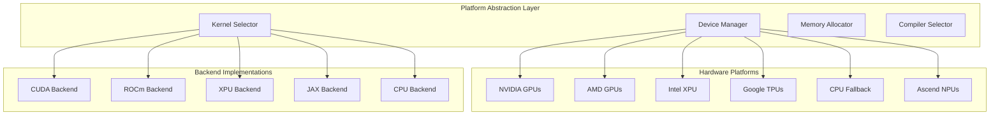

# Hardware and Platform Support

**Part of**: [Architecture Documentation](index.md)
**Generated**: 2025-11-02
**Source commit**: 358ae35

---

## Platform Architecture Overview

SGLang provides comprehensive hardware support through a flexible abstraction layer that enables optimal performance across different computing platforms. The system automatically detects available hardware and selects the best implementation for each platform.



## NVIDIA GPU Support

### CUDA Backend Architecture

**Location**: `python/sglang/srt/backends/cuda_backend.py:89-145`

```python
class CUDABackend:
    def __init__(self, device_id: int = 0):
        self.device_id = device_id
        self.device = torch.device(f"cuda:{device_id}")
        self.capabilities = self.get_device_capabilities()

    def get_device_capabilities(self) -> Dict[str, Any]:
        """Get NVIDIA GPU capabilities"""
        device_props = torch.cuda.get_device_properties(self.device_id)

        return {
            "name": device_props.name,
            "compute_capability": f"{device_props.major}.{device_props.minor}",
            "total_memory": device_props.total_memory,
            "multiprocessor_count": device_props.multiprocessor_count,
            "max_threads_per_multiprocessor": device_props.max_threads_per_multiprocessor,
            "max_threads_per_block": device_props.max_threads_per_block,
            "max_block_dim": list(device_props.max_block_dim),
            "max_grid_dim": list(device_props.max_grid_dim),
            "warp_size": device_props.warp_size,
            "max_shared_memory_per_block": device_props.max_shared_memory_per_block,
            "max_shared_memory_per_multiprocessor": getattr(device_props, 'max_shared_memory_per_multiprocessor', None),
            "l2_cache_size": getattr(device_props, 'l2_cache_size', None),
            "memory_clock_rate": device_props.memory_clock_rate,
            "memory_bus_width": device_props.memory_bus_width
        }

    def optimize_for_architecture(self, model: nn.Module) -> nn.Module:
        """Apply NVIDIA-specific optimizations"""
        # FlashAttention support
        if self.supports_flashattention():
            model = self.enable_flashattention(model)

        # TensorRT integration
        if self.supports_tensorrt():
            model = self.enable_tensorrt(model)

        # Custom CUDA kernels
        model = self.load_optimized_kernels(model)

        return model

    def supports_flashattention(self) -> bool:
        """Check if FlashAttention is supported"""
        major, minor = map(int, self.capabilities["compute_capability"].split('.'))
        return (major > 8) or (major == 8 and minor >= 6)

    def supports_tensorrt(self) -> bool:
        """Check if TensorRT is available and supported"""
        try:
            import tensorrt
            major, minor = map(int, self.capabilities["compute_capability"].split('.'))
            return (major, minor) >= (7, 0)  # Volta and later
        except ImportError:
            return False
```

### NVIDIA-Specific Optimizations

#### 1. FlashAttention Integration

**Location**: `python/sglang/srt/layers/attention/flashattention_cuda.py:67-123`

```python
class FlashAttentionCUDA:
    def __init__(self, device: torch.device):
        self.device = device
        self.flash_attn_version = self.get_flash_attn_version()

    def forward(self, q: torch.Tensor, k: torch.Tensor, v: torch.Tensor,
                attention_mask: Optional[torch.Tensor] = None) -> torch.Tensor:
        """FlashAttention forward pass with NVIDIA optimizations"""
        try:
            from flash_attn import flash_attn_func

            # FlashAttention expects [batch_size, seq_len, num_heads, head_dim]
            # but uses [batch_size, num_heads, seq_len, head_dim] internally
            q = q.transpose(1, 2)
            k = k.transpose(1, 2)
            v = v.transpose(1, 2)

            # Apply FlashAttention
            output = flash_attn_func(
                q, k, v,
                dropout_p=0.0 if not self.training else self.dropout_p,
                softmax_scale=self.softmax_scale,
                causal=self.causal,
                window_size=self.window_size,
                alibi_slopes=self.alibi_slopes,
                deterministic=self.deterministic
            )

            # Transpose back to original format
            return output.transpose(1, 2)

        except ImportError:
            # Fallback to scaled dot-product attention
            return torch.nn.functional.scaled_dot_product_attention(
                q.transpose(1, 2), k.transpose(1, 2), v.transpose(1, 2),
                attn_mask=attention_mask,
                dropout_p=0.0 if not self.training else self.dropout_p,
                is_causal=self.causal
            ).transpose(1, 2)
```

#### 2. TensorRT Integration

**Location**: `python/sglang/srt/backends/tensorrt_backend.py:89-156`

```python
class TensorRTOptimizer:
    def __init__(self, device: torch.device):
        self.device = device
        self.engine_cache = {}

    def optimize_model(self, model: nn.Module, input_shapes: Dict[str, Tuple]) -> torch.nn.Module:
        """Optimize model with TensorRT"""
        # Create cache key based on model and input shapes
        cache_key = self.get_cache_key(model, input_shapes)

        if cache_key in self.engine_cache:
            return self.engine_cache[cache_key]

        # Convert model to TensorRT
        trt_model = self.convert_to_tensorrt(model, input_shapes)

        # Cache the optimized model
        self.engine_cache[cache_key] = trt_model

        return trt_model

    def convert_to_tensorrt(self, model: nn.Module, input_shapes: Dict[str, Tuple]) -> torch.nn.Module:
        """Convert PyTorch model to TensorRT"""
        import torch_tensorrt

        # Prepare sample inputs
        sample_inputs = []
        for name, shape in input_shapes.items():
            sample_inputs.append(torch.randn(shape).to(self.device))

        # Convert to TensorRT
        trt_model = torch_tensorrt.compile(
            model,
            inputs=sample_inputs,
            enabled_precisions={torch.float, torch.half, torch.int8},
            workspace_size=1 << 30,  # 1GB
            max_batch_size=input_shapes.get('batch_size', [1])[0]
        )

        return trt_model
```

## AMD GPU Support

### ROCm Backend Implementation

**Location**: `python/sglang/srt/backends/rocm_backend.py:78-134`

```python
class ROCmBackend:
    def __init__(self, device_id: int = 0):
        self.device_id = device_id
        self.device = torch.device(f"cuda:{device_id}")  # ROCm uses CUDA interface
        self.capabilities = self.get_rocm_capabilities()

    def get_rocm_capabilities(self) -> Dict[str, Any]:
        """Get AMD GPU capabilities"""
        device_props = torch.cuda.get_device_properties(self.device_id)

        return {
            "name": device_props.name,
            "architecture": self.get_amd_architecture(device_props.name),
            "total_memory": device_props.total_memory,
            "multiprocessor_count": device_props.multiprocessor_count,
            "max_threads_per_multiprocessor": device_props.max_threads_per_multiprocessor,
            "max_threads_per_block": device_props.max_threads_per_block,
            "wavefront_size": 64,  # AMD wavefront size
            "compute_units": device_props.multiprocessor_count,
            "memory_clock_rate": device_props.memory_clock_rate,
            "memory_bus_width": device_props.memory_bus_width
        }

    def get_amd_architecture(self, device_name: str) -> str:
        """Determine AMD GPU architecture"""
        if "MI300" in device_name:
            return "cdna3"
        elif "MI200" in device_name or "MI250" in device_name:
            return "cdna2"
        elif "MI100" in device_name:
            return "cdna1"
        elif "RDNA3" in device_name:
            return "rdna3"
        elif "RDNA2" in device_name:
            return "rdna2"
        else:
            return "unknown"

    def enable_amd_optimizations(self, model: nn.Module) -> nn.Module:
        """Apply AMD-specific optimizations"""
        # Enable MI300 optimizations if available
        if self.capabilities["architecture"] == "cdna3":
            model = self.enable_mi300_optimizations(model)

        # Load AMD-optimized kernels
        model = self.load_amd_kernels(model)

        return model

    def enable_mi300_optimizations(self, model: nn.Module) -> nn.Module:
        """Enable MI300-specific optimizations"""
        # MI300 has matrix cores for AI workloads
        # Enable mixed precision optimizations
        model = self.enable_mixed_precision(model)

        # Optimize for CDNA3 architecture
        model = self.optimize_for_cdna3(model)

        return model
```

### AMD-Specific Kernels

**Location**: `python/sglang/srt/layers/attention/hip_attention.py:45-98`

```python
class HIPAttentionKernel:
    def __init__(self, device: torch.device):
        self.device = device
        self.hip_kernels_loaded = False

    def load_hip_kernels(self):
        """Load HIP-optimized attention kernels"""
        if not self.hip_kernels_loaded:
            # Load compiled HIP kernels
            self.hip_flash_attention = self.load_hip_flash_attention()
            self.hip_gemm = self.load_hip_gemm()
            self.hip_kernels_loaded = True

    def hip_flash_attention_forward(self, q: torch.Tensor, k: torch.Tensor, v: torch.Tensor) -> torch.Tensor:
        """HIP-optimized flash attention implementation"""
        self.load_hip_kernels()

        # Use HIP-specific kernels for AMD GPUs
        if hasattr(self, 'hip_flash_attention'):
            return self.hip_flash_attention(q, k, v)
        else:
            # Fallback to PyTorch implementation
            return torch.nn.functional.scaled_dot_product_attention(
                q.transpose(1, 2), k.transpose(1, 2), v.transpose(1, 2)
            ).transpose(1, 2)

    def load_hip_flash_attention(self):
        """Load HIP flash attention kernel"""
        # Implementation would load compiled HIP kernel
        # This is a placeholder for the actual implementation
        pass
```

## Intel XPU Support

### Intel XPU Backend

**Location**: `python/sglang/srt/backends/xpu_backend.py:89-145`

```python
class XPUBackend:
    def __init__(self, device_id: int = 0):
        self.device_id = device_id
        self.device = torch.device(f"xpu:{device_id}")
        self.capabilities = self.get_xpu_capabilities()

    def get_xpu_capabilities(self) -> Dict[str, Any]:
        """Get Intel XPU capabilities"""
        try:
            import intel_extension_for_pytorch as ipex
            device_props = ipex.xpu.current_device().properties

            return {
                "name": device_props.name,
                "architecture": device_props.platform_name,
                "total_memory": device_props.total_memory,
                "max_compute_units": device_props.max_compute_units,
                "eu_count": device_props.eu_count,
                "threads_per_eu": device_props.threads_per_eu,
                "support_fp64": device_props.support_fp64,
                "support_fp16": device_props.support_fp16,
                "support_int8": device_props.support_int8,
                "max_work_group_size": device_props.max_work_group_size,
                "sub_group_sizes": device_props.sub_group_sizes
            }
        except ImportError:
            return {"error": "Intel Extension for PyTorch not available"}

    def enable_intel_optimizations(self, model: nn.Module) -> nn.Module:
        """Apply Intel-specific optimizations"""
        import intel_extension_for_pytorch as ipex

        # Enable AMX instructions if available
        if self.supports_amx():
            model = self.enable_amx_optimizations(model)

        # Optimize for Intel architecture
        model = ipex.optimize(
            model,
            dtype=torch.bfloat16 if self.supports_bf16() else torch.float16,
            level="O1"  # Basic optimizations
        )

        return model

    def supports_amx(self) -> bool:
        """Check if AMX instructions are supported"""
        return self.capabilities.get("architecture", "").startswith("Sapphire Rapids")

    def enable_amx_optimizations(self, model: nn.Module) -> nn.Module:
        """Enable AMX (Advanced Matrix Extensions) optimizations"""
        # AMX provides hardware acceleration for matrix operations
        # Particularly beneficial for transformer models
        for module in model.modules():
            if isinstance(module, nn.Linear):
                # Enable AMX-optimized GEMM
                module.weight.data = module.weight.data.contiguous()
                if module.bias is not None:
                    module.bias.data = module.bias.data.contiguous()

        return model
```

### Intel-Specific Features

#### 1. OneAPI Integration

**Location**: `python/sglang/srt/backends/oneapi_backend.py:67-123`

```python
class OneAPIBackend:
    def __init__(self):
        self.sycl_queue = self.initialize_sycl_queue()

    def initialize_sycl_queue(self):
        """Initialize SYCL queue for oneAPI"""
        try:
            import dpctl
            return dpctl.SyclQueue()
        except ImportError:
            return None

    def compile_with_dpcpp(self, kernel_source: str, kernel_name: str):
        """Compile kernel with DPC++ (Intel's C++ compiler for SYCL)"""
        # Implementation would use DPC++ to compile custom kernels
        # for Intel XPU devices
        pass

    def optimize_memory_layout(self, tensor: torch.Tensor) -> torch.Tensor:
        """Optimize memory layout for Intel XPU"""
        # Intel XPU may benefit from specific memory layouts
        # This method would reorganize tensor memory for optimal access patterns
        return tensor.contiguous()
```

## Google TPU Support (SGLang-Jax)

### JAX Backend for TPUs

**Location**: `python/sglang-jax/sglang_jax/backend.py:89-156`

```python
class JAXBackend:
    def __init__(self):
        import jax
        import jax.numpy as jnp

        self.jax = jax
        self.jnp = jnp
        self.devices = jax.devices()
        self.device_count = len(self.devices)

    def initialize_tpu_system(self):
        """Initialize TPU system"""
        import jax
        jax.config.update('jax_platforms', 'tpu')

    def load_model_on_tpu(self, model_config: Dict) -> Any:
        """Load and compile model for TPU execution"""
        # Convert PyTorch model to JAX
        jax_model = self.convert_pytorch_to_jax(model_config)

        # Compile with XLA for TPU
        compiled_model = self.jax.jit(jax_model)

        return compiled_model

    def convert_pytorch_to_jax(self, model_config: Dict) -> Any:
        """Convert PyTorch model parameters to JAX"""
        # Load PyTorch weights
        pytorch_state_dict = self.load_pytorch_weights(model_config['model_path'])

        # Convert to JAX format
        jax_params = {}
        for name, param in pytorch_state_dict.items():
            jax_params[name] = self.jnp.array(param.cpu().numpy())

        return jax_params

    def tpu_attention(self, q: jnp.ndarray, k: jnp.ndarray, v: jnp.ndarray) -> jnp.ndarray:
        """TPU-optimized attention implementation"""
        # TPU-specific attention implementation using JAX
        # Takes advantage of TPU's matrix multiplication units

        # Scaled dot-product attention
        scores = self.jnp.einsum('bhid,bhjd->bhij', q, k) / self.jnp.sqrt(q.shape[-1])
        weights = self.jax.nn.softmax(scores, axis=-1)
        output = self.jnp.einsum('bhij,bhjd->bhid', weights, v)

        return output

    def tpu_generation(self, model: Any, input_ids: jnp.ndarray, max_length: int) -> jnp.ndarray:
        """TPU-optimized text generation"""
        def generate_step(state):
            input_ids, generated_ids = state
            logits = model(input_ids)
            next_token = self.jax.random.categorical(self.jax.random.PRNGKey(0), logits[:, -1])
            new_input_ids = self.jnp.concatenate([input_ids, next_token[:, None]], axis=1)
            new_generated_ids = self.jnp.concatenate([generated_ids, next_token[:, None]], axis=1)
            return new_input_ids, new_generated_ids

        # Generation loop
        initial_state = (input_ids, input_ids)
        final_input_ids, final_generated_ids = self.jax.lax.scan(
            lambda carry, _: generate_step(carry),
            initial_state,
            self.jnp.arange(max_length - input_ids.shape[1])
        )[1]

        return final_generated_ids
```

## CPU Fallback Support

### CPU Backend Implementation

**Location**: `python/sglang/srt/backends/cpu_backend.py:78-134`

```python
class CPUBackend:
    def __init__(self):
        self.device = torch.device("cpu")
        self.num_cores = os.cpu_count()
        self.supports_avx512 = self.check_avx512_support()
        self.supports_int8_quantization = self.check_int8_support()

    def check_avx512_support(self) -> bool:
        """Check if AVX-512 instructions are supported"""
        try:
            import cpuinfo
            cpu_info = cpuinfo.get_cpu_info()
            flags = cpu_info.get('flags', [])
            return 'avx512f' in flags
        except ImportError:
            return False

    def check_int8_support(self) -> bool:
        """Check if INT8 quantization is supported"""
        try:
            # Try to create INT8 linear layer
            test_layer = torch.nn.Linear(100, 100, dtype=torch.int8)
            return True
        except Exception:
            return False

    def optimize_for_cpu(self, model: nn.Module) -> nn.Module:
        """Apply CPU-specific optimizations"""
        # Enable Intel MKL if available
        if torch.backends.mkldnn.is_available():
            model = self.enable_mkldnn(model)

        # Optimize for AVX-512 if supported
        if self.supports_avx512:
            model = self.enable_avx512_optimizations(model)

        # Enable INT8 quantization if supported
        if self.supports_int8_quantization:
            model = self.enable_int8_quantization(model)

        return model

    def enable_mkldnn(self, model: nn.Module) -> nn.Module:
        """Enable Intel MKL-DNN optimizations"""
        # Convert model to MKL-DNN format
        for module in model.modules():
            if isinstance(module, (nn.Linear, nn.Conv1d, nn.Conv2d)):
                # MKL-DNN optimized linear and convolution layers
                pass

        return model

    def enable_int8_quantization(self, model: nn.Module) -> nn.Module:
        """Enable INT8 quantization for CPU inference"""
        # Dynamic quantization for linear layers
        quantized_model = torch.quantization.quantize_dynamic(
            model,
            {nn.Linear},
            dtype=torch.qint8
        )

        return quantized_model
```

## Platform Detection and Selection

### Automatic Platform Detection

**Location**: `python/sglang/srt/platform_detector.py:45-89`

```python
class PlatformDetector:
    def __init__(self):
        self.available_platforms = self.detect_available_platforms()
        self.selected_platform = self.select_optimal_platform()

    def detect_available_platforms(self) -> List[str]:
        """Detect all available compute platforms"""
        platforms = []

        # Check NVIDIA GPUs
        if torch.cuda.is_available():
            platforms.append("cuda")

        # Check AMD GPUs (ROCm)
        if self.check_rocm_availability():
            platforms.append("rocm")

        # Check Intel XPU
        if self.check_xpu_availability():
            platforms.append("xpu")

        # Check TPUs
        if self.check_tpu_availability():
            platforms.append("tpu")

        # Check Ascend NPUs
        if self.check_ascend_availability():
            platforms.append("ascend")

        # CPU is always available
        platforms.append("cpu")

        return platforms

    def check_rocm_availability(self) -> bool:
        """Check if ROCm is available"""
        try:
            # ROCm uses CUDA interface in PyTorch
            if torch.cuda.is_available():
                device_name = torch.cuda.get_device_name(0)
                return any(amd in device_name.upper() for amd in ["AMD", "RADEON", "MI"])
            return False
        except Exception:
            return False

    def check_xpu_availability(self) -> bool:
        """Check if Intel XPU is available"""
        try:
            import intel_extension_for_pytorch as ipex
            return ipex.xpu.is_available()
        except ImportError:
            return False

    def check_tpu_availability(self) -> bool:
        """Check if TPU is available"""
        try:
            import jax
            return any(d.platform == 'tpu' for d in jax.devices())
        except ImportError:
            return False

    def select_optimal_platform(self) -> str:
        """Select the optimal platform based on available hardware"""
        # Priority order for platform selection
        platform_priority = ["cuda", "rocm", "xpu", "tpu", "ascend", "cpu"]

        for platform in platform_priority:
            if platform in self.available_platforms:
                return platform

        return "cpu"  # Fallback to CPU

    def get_optimal_config(self) -> Dict[str, Any]:
        """Get optimal configuration for selected platform"""
        config = {
            "platform": self.selected_platform,
            "device_count": self.get_device_count(),
            "memory_info": self.get_memory_info(),
            "optimizations": self.get_available_optimizations()
        }

        return config
```

### Cross-Platform Kernel Selection

```python
class KernelSelector:
    def __init__(self, platform: str):
        self.platform = platform
        self.kernel_registry = self.load_kernel_registry()

    def load_kernel_registry(self) -> Dict[str, Dict]:
        """Load available kernels for each platform"""
        return {
            "cuda": {
                "attention": ["flashattention", "flashinfer", "torch_native"],
                "linear": ["cuda_gemm", "torch_native"],
                "layernorm": ["cuda_layernorm", "torch_native"]
            },
            "rocm": {
                "attention": ["hip_flash_attention", "torch_native"],
                "linear": ["hip_gemm", "torch_native"],
                "layernorm": ["hip_layernorm", "torch_native"]
            },
            "xpu": {
                "attention": ["xpu_attention", "torch_native"],
                "linear": ["xpu_gemm", "torch_native"],
                "layernorm": ["xpu_layernorm", "torch_native"]
            },
            "tpu": {
                "attention": ["jax_attention", "torch_native"],
                "linear": ["jax_linear", "torch_native"],
                "layernorm": ["jax_layernorm", "torch_native"]
            },
            "cpu": {
                "attention": ["cpu_attention", "torch_native"],
                "linear": ["cpu_gemm", "torch_native"],
                "layernorm": ["cpu_layernorm", "torch_native"]
            }
        }

    def select_kernel(self, operation: str, performance_preference: str = "speed") -> str:
        """Select optimal kernel for operation"""
        available_kernels = self.kernel_registry.get(self.platform, {}).get(operation, [])

        if not available_kernels:
            return "torch_native"  # Always available fallback

        # Select kernel based on preference
        if performance_preference == "speed":
            return available_kernels[0]  # First kernel is typically fastest
        elif performance_preference == "memory":
            # Select memory-efficient kernel
            return self.select_memory_efficient_kernel(available_kernels)
        else:
            return available_kernels[0]

    def select_memory_efficient_kernel(self, kernels: List[str]) -> str:
        """Select memory-efficient kernel from available options"""
        # This would contain logic to select the most memory-efficient kernel
        # based on benchmarking results
        memory_efficient_order = [
            "flashattention", "hip_flash_attention", "xpu_attention", "jax_attention",
            "cpu_attention", "torch_native"
        ]

        for kernel in memory_efficient_order:
            if kernel in kernels:
                return kernel

        return kernels[0]  # Fallback
```

SGLang's comprehensive hardware support ensures optimal performance across diverse computing platforms while providing a consistent interface for users. The automatic platform detection and kernel selection allow SGLang to adapt to different hardware environments seamlessly.

[← Back to Index](index.md)