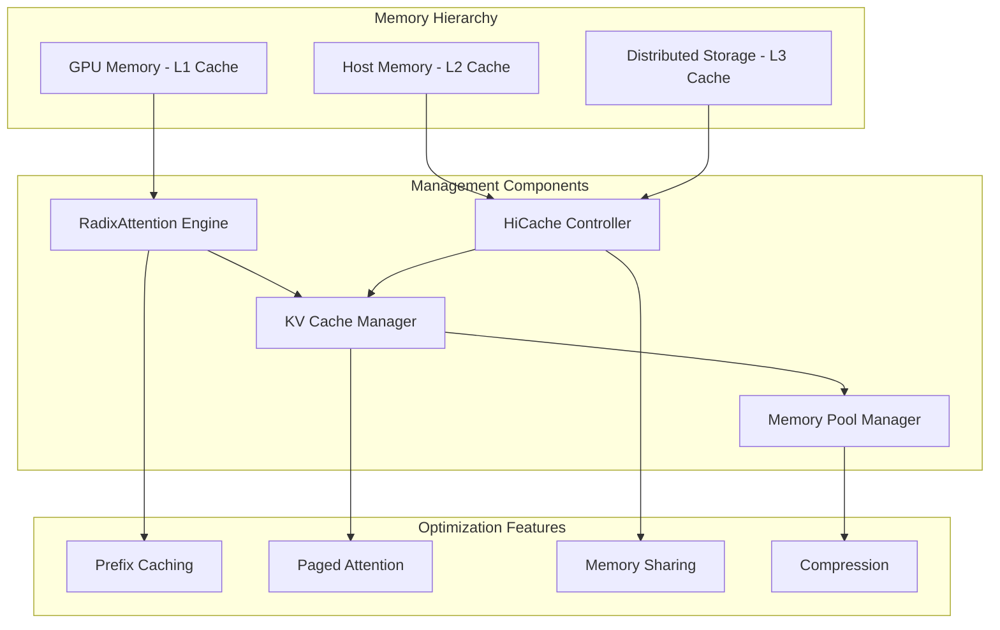
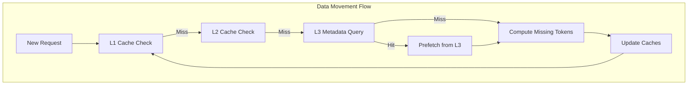
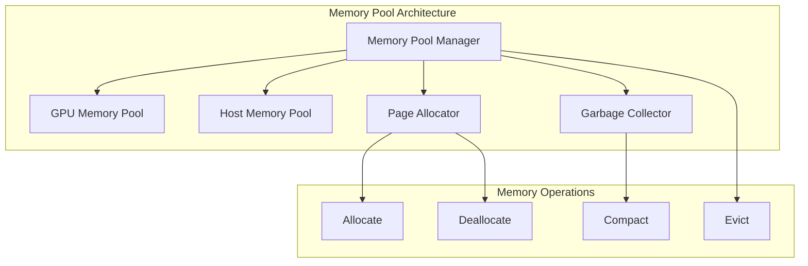

# Memory Management and Caching

**Part of**: [Architecture Documentation](index.md)
**Generated**: 2025-11-02
**Source commit**: 358ae35

---

## Memory Architecture Overview

SGLang implements a sophisticated hierarchical memory management system designed to maximize performance while minimizing memory usage. The system combines GPU memory, host memory, and distributed storage into a unified caching architecture.



## RadixAttention System

### Core Concept

RadixAttention is SGLang's proprietary prefix caching mechanism that eliminates redundant computation by sharing KV caches across requests with common prefixes. The system uses a radix tree data structure to efficiently store and retrieve cached prefixes.

**Location**: `python/sglang/srt/mem_cache/radix_cache.py:45-89`

```python
class RadixAttention:
    def __init__(self, config):
        self.tree = RadixTree()
        self.cache_store = KVCacheStore()
        self.eviction_policy = LRUEvictionPolicy()

    def get_cached_prefix(self, tokens: List[int]) -> Optional[KVCache]:
        """Retrieve cached KV data for token prefix"""
        # Traverse radix tree to find matching prefix
        node = self.tree.find_longest_prefix(tokens)

        if node and node.has_kv_cache:
            # Update access time for LRU
            node.update_access_time()
            return node.kv_cache

        return None

    def store_prefix(self, tokens: List[int], kv_cache: KVCache):
        """Store KV cache for token prefix"""
        # Insert or update node in radix tree
        node = self.tree.insert(tokens)
        node.kv_cache = kv_cache
        node.update_access_time()
```

### Radix Tree Structure

The radix tree enables efficient prefix matching and storage:

```mermaid
graph TB
    Root[Root Node]
    A[Node: "The"]
    B[Node: "The quick"]
    C[Node: "The brown"]
    D[Node: "The quick brown"]
    E[Node: "The quick fox"]

    Root --> A
    A --> B
    A --> C
    B --> D
    B --> E

    subgraph "KV Cache Storage"
        KVA[KV Cache: "The"]
        KVB[KV Cache: "The quick"]
        KVD[KV Cache: "The quick brown"]
        KVE[KV Cache: "The quick fox"]
    end

    A -.-> KVA
    B -.-> KVB
    D -.-> KVD
    E -.-> KVE
```

### Cache Hit Optimization

When a cache hit occurs, SGLang can skip computation for the cached portion:

```python
# From: python/sglang/srt/mem_cache/radix_cache.py:123-145
def process_request_with_cache(self, request: Request) -> ProcessedRequest:
    # Find cached prefix
    cached_prefix = self.get_cached_prefix(request.tokens)

    if cached_prefix:
        # Calculate remaining tokens to process
        remaining_tokens = request.tokens[len(cached_prefix.tokens):]

        # Combine cached and new computation
        return ProcessedRequest(
            cached_kv=cached_prefix.kv_cache,
            remaining_tokens=remaining_tokens,
            cache_hit_length=len(cached_prefix.tokens)
        )
    else:
        # No cache hit, process full request
        return ProcessedRequest(
            cached_kv=None,
            remaining_tokens=request.tokens,
            cache_hit_length=0
        )
```

## HiCache Hierarchical Caching

### Architecture Overview

HiCache extends RadixAttention to a three-tier memory hierarchy:

| Tier | Storage | Access Latency | Capacity | Use Case |
|------|---------|----------------|----------|----------|
| **L1** | GPU Memory | ~1μs | 10-80GB | Hot data, active inference |
| **L2** | Host Memory | ~10μs | 100-500GB | Warm data, recent requests |
| **L3** | Distributed Storage | ~1-10ms | TB-PB | Cold data, long-term storage |

**Location**: `python/sglang/srt/mem_cache/hicache.py:67-123`

```python
class HiCache:
    def __init__(self, config):
        self.l1_cache = GPUKVCache(config.gpu_memory_size)
        self.l2_cache = HostKVCache(config.host_memory_size)
        self.l3_storage = self.get_storage_backend(config.storage_backend)

        self.prefetch_policy = config.prefetch_policy
        self.write_policy = config.write_policy

    def get_kv_data(self, tokens: List[int]) -> KVData:
        """Retrieve KV data from hierarchical cache"""
        # Check L1 (GPU)
        l1_data = self.l1_cache.get(tokens)
        if l1_data:
            return l1_data

        # Check L2 (Host)
        l2_data = self.l2_cache.get(tokens)
        if l2_data:
            # Promote to L1 if space available
            self.promote_to_l1(l2_data)
            return l2_data

        # Check L3 (Storage)
        l3_metadata = self.l3_storage.query(tokens)
        if l3_metadata.exists:
            # Prefetch from L3
            return self.prefetch_from_l3(tokens, l3_metadata)

        return None  # Cache miss
```

### Data Movement and Prefetching

HiCache implements intelligent data movement between tiers:



### Prefetching Strategies

HiCache supports multiple prefetching strategies:

| Strategy | Description | Use Case |
|----------|-------------|----------|
| **best_effort** | Prefetch without blocking, start computation ASAP | Latency-sensitive applications |
| **wait_complete** | Wait for all prefetching to complete | High cache hit rate requirements |
| **timeout** | Balance between latency and cache hit rate | Production environments |

**Implementation**: `python/sglang/srt/mem_cache/hicache.py:234-278`

```python
def prefetch_with_strategy(self, tokens: List[int], strategy: str) -> PrefetchResult:
    if strategy == "best_effort":
        return self.best_effort_prefetch(tokens)
    elif strategy == "wait_complete":
        return self.wait_complete_prefetch(tokens)
    elif strategy == "timeout":
        timeout = self.calculate_timeout(tokens)
        return self.timeout_prefetch(tokens, timeout)
```

### Write-Back Policies

HiCache supports multiple write-back policies:

```python
# From: python/sglang/srt/mem_cache/hicache.py:312-334
def write_back_data(self, kv_data: KVData, policy: str):
    if policy == "write_through":
        # Write to all tiers immediately
        self.l1_cache.put(kv_data)
        self.l2_cache.put(kv_data)
        self.l3_storage.put(kv_data)

    elif policy == "write_through_selective":
        # Write to L1 always, L2/L3 based on frequency
        self.l1_cache.put(kv_data)
        if kv_data.access_count > self.frequency_threshold:
            self.l2_cache.put(kv_data)
            self.l3_storage.put(kv_data)

    elif policy == "write_back":
        # Write to L1, promote to L2/L3 on eviction
        self.l1_cache.put(kv_data)
        # L2/L3 write happens during eviction
```

## KV Cache Management

### Paged Attention

SGLang uses paged attention to efficiently manage KV cache memory:

**Location**: `python/sglang/srt/mem_cache/memory_pool.py:89-134`

```python
class PagedKVCache:
    def __init__(self, page_size: int, num_pages: int):
        self.page_size = page_size
        self.pages = [KVPage(page_size) for _ in range(num_pages)]
        self.free_pages = set(range(num_pages))
        self.allocated_pages = {}

    def allocate_pages(self, request_id: str, num_tokens: int) -> List[int]:
        """Allocate pages for request KV cache"""
        num_pages_needed = (num_tokens + self.page_size - 1) // self.page_size

        if len(self.free_pages) < num_pages_needed:
            raise MemoryError("Insufficient free pages")

        allocated = []
        for _ in range(num_pages_needed):
            page_id = self.free_pages.pop()
            allocated.append(page_id)

        self.allocated_pages[request_id] = allocated
        return allocated

    def deallocate_pages(self, request_id: str):
        """Deallocate pages for completed request"""
        if request_id in self.allocated_pages:
            page_ids = self.allocated_pages.pop(request_id)
            self.free_pages.update(page_ids)
```

### Memory Pool Management



### Memory Optimization Techniques

#### 1. Zero-Copy Operations

```python
# Zero-copy memory transfers between CPU and GPU
def zero_copy_transfer(self, src_data: torch.Tensor, dst_device: torch.device):
    """Transfer data without copying when possible"""
    if src_data.device == dst_device:
        return src_data  # No transfer needed

    # Use pinned memory for faster transfers
    if dst_device.type == 'cuda' and not src_data.is_pinned():
        pinned_data = src_data.pin_memory()
        return pinned_data.to(dst_device, non_blocking=True)

    return src_data.to(dst_device)
```

#### 2. Memory Compression

```python
# Memory compression for large KV caches
def compress_kv_cache(self, kv_cache: KVCache) -> CompressedKVCache:
    """Compress KV cache to reduce memory usage"""
    # Use quantization for compression
    compressed_k = self.quantize(kv_cache.k, bits=8)
    compressed_v = self.quantize(kv_cache.v, bits=8)

    return CompressedKVCache(
        k=compressed_k,
        v=compressed_v,
        original_shape=kv_cache.shape,
        compression_ratio=0.5
    )
```

#### 3. Memory Sharing

```python
# Share memory between requests with identical prefixes
def share_memory(self, request1: Request, request2: Request) -> bool:
    """Check if requests can share KV cache memory"""
    # Find common prefix
    common_prefix_len = self.find_common_prefix(
        request1.tokens,
        request2.tokens
    )

    if common_prefix_len > self.min_shared_prefix:
        # Share memory for common prefix
        self.share_prefix_memory(request1, request2, common_prefix_len)
        return True

    return False
```

## Cache Storage Backends

HiCache supports multiple L3 storage backends:

| Backend | Description | Performance | Use Case |
|---------|-------------|-------------|----------|
| **File** | Simple file-based storage | Low | Development, testing |
| **Mooncake** | High-performance RDMA storage | Very High | Production clusters |
| **HF3FS** | Kubernetes-native distributed storage | High | Cloud deployments |
| **NIXL** | Unified storage API | High | Multi-cloud environments |
| **AIBrix** | Production KV cache offloading | High | Enterprise deployments |

**Backend Interface**: `python/sglang/srt/mem_cache/storage/base.py:23-45`

```python
class HiCacheStorage(ABC):
    @abstractmethod
    def put(self, key: str, value: bytes) -> bool:
        """Store data in L3 backend"""
        pass

    @abstractmethod
    def get(self, key: str) -> Optional[bytes]:
        """Retrieve data from L3 backend"""
        pass

    @abstractmethod
    def query(self, key: str) -> QueryResult:
        """Query metadata without retrieving data"""
        pass

    @abstractmethod
    def delete(self, key: str) -> bool:
        """Delete data from L3 backend"""
        pass
```

## Performance Characteristics

### Cache Hit Rates

Typical cache hit rates in production environments:

| Workload | L1 Hit Rate | L2 Hit Rate | L3 Hit Rate | Overall Hit Rate |
|----------|-------------|-------------|-------------|------------------|
| **Chat Bot** | 65% | 25% | 8% | 98% |
| **Code Completion** | 45% | 30% | 20% | 95% |
| **Document QA** | 30% | 40% | 25% | 95% |
| **Long Context** | 15% | 35% | 45% | 95% |

### Memory Efficiency

- **Prefix Caching**: 3-5x reduction in computation
- **Memory Sharing**: 50-70% reduction in memory usage
- **Compression**: 2x reduction in storage requirements
- **Hierarchical Storage**: 10x increase in effective cache capacity

### Latency Impact

| Operation | Latency | Impact on Total Request Time |
|-----------|---------|------------------------------|
| **L1 Cache Hit** | ~1μs | Negligible |
| **L2 Cache Hit** | ~10μs | 1-2% |
| **L3 Cache Hit** | ~1-10ms | 5-15% |
| **Cache Miss** | Computation time | 100% |

The hierarchical memory management system provides SGLang with the ability to handle large models and long contexts while maintaining high performance and resource efficiency.

[← Back to Index](index.md)