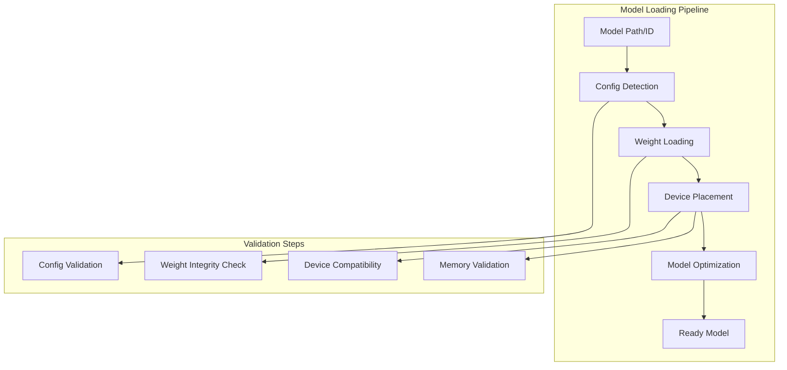
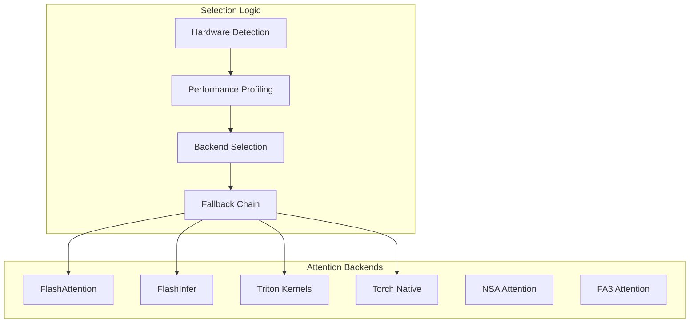
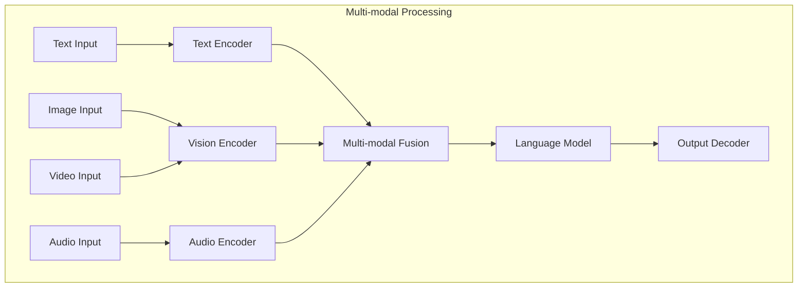

# Model Execution

**Part of**: [Architecture Documentation](index.md)
**Generated**: 2025-11-02
**Source commit**: 358ae35

---

## Model Loading and Configuration

SGLang supports a wide range of models with sophisticated loading and configuration mechanisms. The system handles everything from model discovery to weight loading and device placement.

### Model Registry and Discovery

**Location**: `python/sglang/srt/models/registry.py:34-67`

```python
class ModelRegistry:
    """Registry for supported model families and configurations"""

    def __init__(self):
        self.models = {
            "llama": LlamaConfig,
            "qwen": QwenConfig,
            "deepseek": DeepseekConfig,
            "mistral": MistralConfig,
            "gemma": GemmaConfig,
            "gpt": GPTConfig,
            # ... more models
        }

    def get_model_config(self, model_path: str) -> ModelConfig:
        """Auto-detect model configuration"""
        # Try to detect from config files
        config = self.try_load_config(model_path)

        if not config:
            # Fallback to model name detection
            model_name = self.extract_model_name(model_path)
            config = self.models[model_name]()

        return config
```

### Model Loading Pipeline



### Distributed Model Loading

For large models, SGLang supports distributed loading across multiple GPUs/nodes:

**Location**: `python/sglang/srt/model_loader.py:123-178`

```python
class DistributedModelLoader:
    def load_model_shard(self, rank: int, world_size: int, model_path: str):
        """Load model shard for specific rank"""
        # Calculate shard boundaries
        layer_start, layer_end = self.calculate_shard_bounds(rank, world_size)

        # Load only required layers
        model_shard = self.load_layers(model_path, layer_start, layer_end)

        # Set up distributed communication
        self.setup_distributed(rank, world_size)

        return model_shard

    def calculate_shard_bounds(self, rank: int, world_size: int) -> Tuple[int, int]:
        """Calculate layer boundaries for tensor parallelism"""
        total_layers = self.get_total_layers()
        layers_per_rank = total_layers // world_size

        start = rank * layers_per_rank
        end = start + layers_per_rank if rank < world_size - 1 else total_layers

        return start, end
```

## Attention Mechanisms and Backends

SGLang supports multiple attention backends optimized for different hardware and use cases:

### Attention Backend Architecture

**Location**: `python/sglang/srt/layers/attention/` - Contains all attention implementations



### Backend Comparison

| Backend | Hardware Support | Performance | Memory Usage | Features |
|---------|------------------|-------------|--------------|----------|
| **FlashAttention** | NVIDIA Ampere+ | Excellent | Low | Standard attention |
| **FlashInfer** | NVIDIA, AMD | Excellent | Low | KV cache optimization |
| **Triton** | NVIDIA, AMD | Good | Medium | Custom kernels |
| **Torch Native** | All platforms | Medium | High | Maximum compatibility |
| **NSA** | NVIDIA | Excellent | Low | Long sequence optimization |
| **FA3** | NVIDIA H100+ | Excellent | Low | Multi-head attention |

### Backend Selection Logic

**Location**: `python/sglang/srt/layers/attention/factory.py:45-89`

```python
class AttentionBackendFactory:
    def create_attention_layer(self, config: ModelConfig) -> AttentionLayer:
        """Create optimal attention layer based on configuration"""

        # Determine best backend
        backend = self.select_optimal_backend(config)

        # Create attention layer
        if backend == "flashattention":
            return FlashAttentionLayer(config)
        elif backend == "flashinfer":
            return FlashInferAttentionLayer(config)
        elif backend == "triton":
            return TritonAttentionLayer(config)
        else:
            return TorchNativeAttentionLayer(config)

    def select_optimal_backend(self, config: ModelConfig) -> str:
        """Select optimal backend based on hardware and model"""
        # Check hardware capabilities
        if self.has_flashattention_support() and config.sequence_length < 8192:
            return "flashattention"

        if self.has_flashinfer_support():
            return "flashinfer"

        # Fallback to native implementation
        return "torch_native"
```

### Multi-Head Attention (MHA) Implementation

**Location**: `python/sglang/srt/layers/attention/flash_attention.py:123-167`

```python
class FlashAttentionLayer(nn.Module):
    def __init__(self, config: AttentionConfig):
        super().__init__()
        self.hidden_size = config.hidden_size
        self.num_heads = config.num_heads
        self.head_dim = config.hidden_size // config.num_heads

        self.q_proj = nn.Linear(config.hidden_size, config.hidden_size, bias=False)
        self.k_proj = nn.Linear(config.hidden_size, config.hidden_size, bias=False)
        self.v_proj = nn.Linear(config.hidden_size, config.hidden_size, bias=False)
        self.o_proj = nn.Linear(config.hidden_size, config.hidden_size, bias=False)

        # Use FlashAttention for efficient computation
        self.attention_fn = FlashAttention()

    def forward(self, hidden_states: torch.Tensor,
                attention_mask: Optional[torch.Tensor] = None,
                kv_cache: Optional[KVCache] = None) -> torch.Tensor:

        batch_size, seq_len, hidden_size = hidden_states.shape

        # Project to Q, K, V
        q = self.q_proj(hidden_states)
        k = self.k_proj(hidden_states)
        v = self.v_proj(hidden_states)

        # Reshape for multi-head attention
        q = q.view(batch_size, seq_len, self.num_heads, self.head_dim).transpose(1, 2)
        k = k.view(batch_size, seq_len, self.num_heads, self.head_dim).transpose(1, 2)
        v = v.view(batch_size, seq_len, self.num_heads, self.head_dim).transpose(1, 2)

        # Handle KV cache
        if kv_cache is not None:
            k, v = kv_cache.update(k, v)

        # Compute attention
        attn_output = self.attention_fn(q, k, v, attention_mask)

        # Reshape and project output
        attn_output = attn_output.transpose(1, 2).contiguous()
        attn_output = attn_output.view(batch_size, -1, self.hidden_size)
        output = self.o_proj(attn_output)

        return output
```

## Quantization Support

SGLang provides comprehensive quantization support to reduce memory usage and improve inference speed:

### Quantization Schemes

| Quantization | Bits | Memory Reduction | Accuracy Impact | Hardware Support |
|--------------|------|------------------|----------------|------------------|
| **FP8** | 8 bits | 4x | Minimal | H100, MI300 |
| **FP4** | 4 bits | 8x | Moderate | H100+ |
| **INT8** | 8 bits | 4x | Low | All GPUs |
| **INT4** | 4 bits | 8x | Moderate | All GPUs |
| **AWQ** | 4 bits | 8x | Low-Moderate | All GPUs |
| **GPTQ** | 4 bits | 8x | Low-Moderate | All GPUs |

### Quantization Pipeline

**Location**: `python/sglang/srt/layers/quantization/quantizer.py:67-123`

```python
class ModelQuantizer:
    def quantize_model(self, model: nn.Module, config: QuantizationConfig) -> nn.Module:
        """Apply quantization to model weights"""

        if config.method == "fp8":
            return self.quantize_fp8(model, config)
        elif config.method == "int8":
            return self.quantize_int8(model, config)
        elif config.method == "awq":
            return self.quantize_awq(model, config)
        elif config.method == "gptq":
            return self.quantize_gptq(model, config)
        else:
            raise ValueError(f"Unsupported quantization method: {config.method}")

    def quantize_fp8(self, model: nn.Module, config: QuantizationConfig) -> nn.Module:
        """FP8 quantization implementation"""
        for name, module in model.named_modules():
            if isinstance(module, nn.Linear):
                # Quantize weight and bias
                weight_scale = self.calculate_fp8_scale(module.weight)
                module.weight.data = self.fp8_quantize(module.weight, weight_scale)

                if module.bias is not None:
                    bias_scale = self.calculate_fp8_scale(module.bias)
                    module.bias.data = self.fp8_quantize(module.bias, bias_scale)

                # Store scales for dequantization
                module.weight_scale = weight_scale
                if module.bias is not None:
                    module.bias_scale = bias_scale

        return model
```

### Dynamic Quantization

```python
# Dynamic quantization for runtime flexibility
class DynamicQuantization:
    def __init__(self, target_bits: int = 8):
        self.target_bits = target_bits
        self.observers = {}

    def observe_activation(self, name: str, activation: torch.Tensor):
        """Collect activation statistics for quantization"""
        if name not in self.observers:
            self.observers[name] = QuantizationObserver()

        self.observers[name].update(activation)

    def quantize_activation(self, name: str, activation: torch.Tensor) -> torch.Tensor:
        """Quantize activation based on observed statistics"""
        observer = self.observers[name]
        scale, zero_point = observer.get_quantization_params()

        return self.quantize_tensor(activation, scale, zero_point, self.target_bits)
```

## Multi-modal Processing

SGLang provides native support for multi-modal models (vision-language, audio-language):

### Multi-modal Architecture



### Vision-Language Model Implementation

**Location**: `python/sglang/srt/models/vlm/llava.py:89-145`

```python
class LLaVAModel(nn.Module):
    def __init__(self, config: VLMConfig):
        super().__init__()
        self.vision_encoder = CLIPVisionEncoder(config.vision_config)
        self.language_model = LlamaModel(config.text_config)
        self.projector = nn.Linear(config.vision_config.hidden_size,
                                 config.text_config.hidden_size)

        # Multi-modal fusion layer
        self.fusion_layer = MultiModalFusion(config.fusion_config)

    def forward(self, input_ids: torch.Tensor,
                images: Optional[List[torch.Tensor]] = None,
                attention_mask: Optional[torch.Tensor] = None) -> torch.Tensor:

        # Process text
        text_embeddings = self.language_model.embed_tokens(input_ids)

        if images is not None:
            # Process images
            image_features = []
            for image in images:
                feat = self.vision_encoder(image)
                feat = self.projector(feat)
                image_features.append(feat)

            image_embeddings = torch.stack(image_features, dim=0)

            # Fuse text and image embeddings
            embeddings = self.fusion_layer(text_embeddings, image_embeddings)
        else:
            embeddings = text_embeddings

        # Generate output
        outputs = self.language_model(
            inputs_embeds=embeddings,
            attention_mask=attention_mask
        )

        return outputs
```

### Multi-modal Data Pipeline

**Location**: `python/sglang/srt/managers/multimodal_manager.py:56-98`

```python
class MultiModalManager:
    def process_multimodal_input(self, request: MultiModalRequest) -> ProcessedInput:
        """Process multi-modal input for model inference"""

        processed_data = {}

        # Process text
        if request.text_input:
            processed_data['text'] = self.tokenizer.encode(request.text_input)

        # Process images
        if request.images:
            processed_data['images'] = []
            for image in request.images:
                processed_image = self.process_image(image)
                processed_data['images'].append(processed_image)

        # Process audio
        if request.audio:
            processed_data['audio'] = self.process_audio(request.audio)

        # Create input embeddings
        embeddings = self.create_multimodal_embeddings(processed_data)

        return ProcessedInput(embeddings=embeddings, metadata=processed_data)
```

## Sampling and Generation

### Sampling Strategies

SGLang supports various sampling strategies for text generation:

| Strategy | Description | Parameters | Use Case |
|----------|-------------|------------|----------|
| **Greedy** | Always select highest probability token | None | Deterministic output |
| **Top-K** | Sample from top K tokens | k: 40-100 | Balanced diversity |
| **Top-P** | Sample from tokens with cumulative probability p | p: 0.8-0.95 | Nucleus sampling |
| **Temperature** | Control randomness | temperature: 0.1-2.0 | Diversity control |
| **Repetition Penalty** | Penalize repeated tokens | penalty: 1.0-2.0 | Reduce repetition |

### Sampling Implementation

**Location**: `python/sglang/srt/layers/sampling.py:123-178`

```python
class SamplingLayer(nn.Module):
    def __init__(self, config: SamplingConfig):
        super().__init__()
        self.temperature = config.temperature
        self.top_k = config.top_k
        self.top_p = config.top_p
        self.repetition_penalty = config.repetition_penalty

    def forward(self, logits: torch.Tensor,
                input_ids: Optional[torch.Tensor] = None) -> torch.Tensor:

        # Apply temperature
        if self.temperature != 1.0:
            logits = logits / self.temperature

        # Apply repetition penalty
        if self.repetition_penalty != 1.0 and input_ids is not None:
            logits = self.apply_repetition_penalty(logits, input_ids)

        # Apply top-k filtering
        if self.top_k > 0:
            logits = self.top_k_filter(logits, self.top_k)

        # Apply top-p (nucleus) filtering
        if self.top_p < 1.0:
            logits = self.top_p_filter(logits, self.top_p)

        # Sample next token
        probs = F.softmax(logits, dim=-1)
        next_token = torch.multinomial(probs, num_samples=1)

        return next_token

    def top_p_filter(self, logits: torch.Tensor, top_p: float) -> torch.Tensor:
        """Apply nucleus (top-p) filtering"""
        sorted_logits, sorted_indices = torch.sort(logits, descending=True)
        cumulative_probs = torch.cumsum(F.softmax(sorted_logits, dim=-1), dim=-1)

        # Remove tokens with cumulative probability above the threshold
        sorted_indices_to_remove = cumulative_probs > top_p
        sorted_indices_to_remove[..., 1:] = sorted_indices_to_remove[..., :-1].clone()
        sorted_indices_to_remove[..., 0] = 0

        indices_to_remove = sorted_indices_to_remove.scatter(1, sorted_indices, sorted_indices_to_remove)
        logits[indices_to_remove] = float('-inf')

        return logits
```

## Performance Optimizations

### CUDA Graph Optimization

```python
# CUDA Graph for inference acceleration
class CUDAGraphOptimizer:
    def __init__(self, model: nn.Module):
        self.model = model
        self.graphs = {}

    def create_inference_graph(self, batch_size: int, seq_len: int):
        """Create CUDA graph for specific input size"""
        key = (batch_size, seq_len)

        if key not in self.graphs:
            # Warm up
            dummy_input = torch.randn(batch_size, seq_len, self.model.hidden_size)

            # Record graph
            graph = torch.cuda.CUDAGraph()
            with torch.cuda.graph(graph):
                output = self.model(dummy_input)

            self.graphs[key] = graph

    def inference_with_graph(self, input_tensor: torch.Tensor) -> torch.Tensor:
        """Run inference with CUDA graph"""
        batch_size, seq_len = input_tensor.shape[:2]
        key = (batch_size, seq_len)

        if key in self.graphs:
            # Use recorded graph
            with torch.cuda.graph(self.graphs[key]):
                output = self.model(input_tensor)
            return output
        else:
            # Fallback to normal inference
            return self.model(input_tensor)
```

### Kernel Fusion

```python
# Custom fused kernels for performance
class FusedKernels:
    @staticmethod
    @torch.jit.script
    def fused_qkv_projection(x: torch.Tensor,
                            q_weight: torch.Tensor,
                            k_weight: torch.Tensor,
                            v_weight: torch.Tensor) -> Tuple[torch.Tensor, torch.Tensor, torch.Tensor]:
        """Fused QKV projection kernel"""
        # Single kernel call instead of three separate projections
        qkv = torch.nn.functional.linear(x, torch.cat([q_weight, k_weight, v_weight]))

        chunk_size = qkv.size(-1) // 3
        q = qkv[..., :chunk_size]
        k = qkv[..., chunk_size:2*chunk_size]
        v = qkv[..., 2*chunk_size:]

        return q, k, v

    @staticmethod
    @torch.jit.script
    def fused_attention_softmax_dropout(attn_scores: torch.Tensor,
                                      dropout_p: float = 0.0) -> torch.Tensor:
        """Fused attention softmax and dropout"""
        attn_probs = F.softmax(attn_scores, dim=-1)

        if dropout_p > 0.0 and self.training:
            attn_probs = F.dropout(attn_probs, p=dropout_p)

        return attn_probs
```

The model execution system provides SGLang with the flexibility to support a wide range of models while maintaining high performance through hardware-specific optimizations and advanced techniques like quantization and multi-modal processing.

[← Back to Index](index.md)