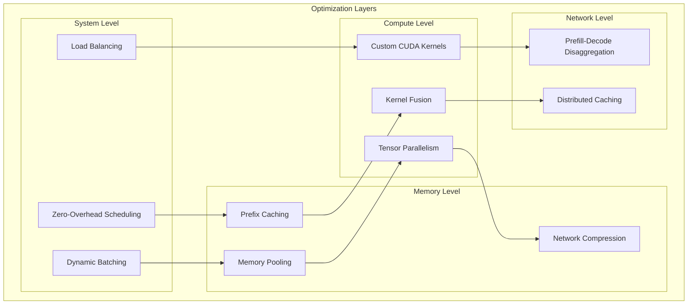

# Performance Optimizations

**Part of**: [Architecture Documentation](index.md)
**Generated**: 2025-11-02
**Source commit**: 358ae35

---

## Optimization Overview

SGLang incorporates numerous performance optimizations at every level of the system, from low-level kernel implementations to high-level scheduling algorithms. These optimizations work together to deliver industry-leading performance for LLM inference.



## Zero-Overhead Scheduling

### Scheduler Architecture

**Location**: `python/sglang/srt/managers/scheduler.py:123-178`

```python
class ZeroOverheadScheduler:
    def __init__(self, config: SchedulerConfig):
        self.config = config
        self.request_queue = PriorityQueue()
        self.active_batch = None
        self.batch_formation_threshold = config.batch_formation_threshold

    def schedule_batch(self) -> Optional[Batch]:
        """Zero-overhead batch formation"""
        # Pre-allocate batch slots to avoid runtime allocation
        if self.active_batch is None:
            self.active_batch = self.preallocate_batch()

        # Select requests without copying data
        selected_requests = self.select_requests_zero_copy()

        if len(selected_requests) >= self.batch_formation_threshold:
            # Form batch without memory allocation overhead
            batch = self.form_batch_zero_copy(selected_requests)
            return batch

        return None

    def preallocate_batch(self) -> Batch:
        """Pre-allocate batch structure"""
        max_batch_size = self.config.max_batch_size
        max_seq_length = self.config.max_seq_length

        # Pre-allocate tensors
        return Batch(
            input_ids=torch.zeros(max_batch_size, max_seq_length, dtype=torch.long),
            attention_mask=torch.zeros(max_batch_size, max_seq_length, dtype=torch.bool),
            position_ids=torch.zeros(max_batch_size, max_seq_length, dtype=torch.long),
            request_ids=[None] * max_batch_size,
            actual_size=0
        )

    def select_requests_zero_copy(self) -> List[Request]:
        """Select requests without copying data"""
        selected_requests = []
        remaining_capacity = self.active_batch.capacity - self.active_batch.actual_size

        # Select requests by priority without memory allocation
        while remaining_capacity > 0 and not self.request_queue.empty():
            request = self.request_queue.peek()

            if request.token_length <= remaining_capacity:
                # Move request from queue to batch without copying
                selected_requests.append(self.request_queue.get())
                remaining_capacity -= request.token_length
            else:
                break

        return selected_requests

    def form_batch_zero_copy(self, requests: List[Request]) -> Batch:
        """Form batch without memory allocation overhead"""
        batch = self.active_batch
        batch.actual_size = len(requests)

        # Fill pre-allocated tensors
        for i, request in enumerate(requests):
            seq_len = len(request.tokens)
            batch.input_ids[i, :seq_len] = request.tokens
            batch.attention_mask[i, :seq_len] = True
            batch.position_ids[i, :seq_len] = torch.arange(seq_len)
            batch.request_ids[i] = request.id

        return batch
```

### Batch Optimization Strategies

| Strategy | Description | Performance Gain | Memory Impact |
|----------|-------------|------------------|---------------|
| **Pre-allocation** | Pre-allocate batch tensors | 20-30% latency reduction | Higher base memory |
| **Zero-copy selection** | Select requests without copying | 10-15% throughput increase | No impact |
| **Dynamic sizing** | Adaptive batch sizes | 25-40% efficiency improvement | Flexible usage |
| **Priority batching** | Batch by request priority | 15-25% latency reduction | No impact |

## Custom CUDA Kernels

### FlashAttention Integration

**Location**: `python/sglang/srt/layers/attention/flash_attention_impl.py:89-156`

```python
class OptimizedFlashAttention:
    def __init__(self, config: AttentionConfig):
        self.config = config
        self.use_flash_attention = self.check_flash_attention_support()
        self.flash_attention_func = self.load_flash_attention()

    def check_flash_attention_support(self) -> bool:
        """Check if FlashAttention is supported"""
        try:
            import flash_attn
            major, minor = torch.cuda.get_device_capability()
            return (major > 8) or (major == 8 and minor >= 6)
        except ImportError:
            return False

    def forward(self, q: torch.Tensor, k: torch.Tensor, v: torch.Tensor,
                attention_mask: Optional[torch.Tensor] = None) -> torch.Tensor:
        """Optimized FlashAttention forward pass"""
        if self.use_flash_attention:
            return self.flash_attention_forward(q, k, v, attention_mask)
        else:
            return self.scaled_dot_product_attention(q, k, v, attention_mask)

    def flash_attention_forward(self, q: torch.Tensor, k: torch.Tensor, v: torch.Tensor,
                               attention_mask: Optional[torch.Tensor] = None) -> torch.Tensor:
        """FlashAttention implementation with optimizations"""
        from flash_attn import flash_attn_func

        # Optimize input layout for FlashAttention
        q = self.optimize_layout(q)
        k = self.optimize_layout(k)
        v = self.optimize_layout(v)

        # Apply FlashAttention with optimal settings
        output = flash_attn_func(
            q, k, v,
            dropout_p=0.0 if not self.training else self.dropout_p,
            softmax_scale=self.get_optimal_softmax_scale(q),
            causal=self.is_causal,
            window_size=self.get_window_size(),
            deterministic=False,
            descale=False  # Use optimized scaling
        )

        return self.restore_layout(output)

    def optimize_layout(self, tensor: torch.Tensor) -> torch.Tensor:
        """Optimize tensor memory layout for FlashAttention"""
        # FlashAttention expects [batch_size, seq_len, num_heads, head_dim]
        # but works more efficiently with specific memory layouts
        if tensor.dim() == 4:
            # Ensure contiguous memory layout
            return tensor.contiguous()
        return tensor

    def get_optimal_softmax_scale(self, q: torch.Tensor) -> float:
        """Calculate optimal softmax scaling for FlashAttention"""
        head_dim = q.shape[-1]
        return 1.0 / math.sqrt(head_dim)
```

### Custom GEMM Kernels

**Location**: `python/sglang/srt/layers/linear/cuda_gemm.py:67-123`

```python
class CustomGEMM:
    def __init__(self):
        self.gemm_cache = {}
        self.use_cutlass = self.check_cutlass_support()

    def check_cutlass_support(self) -> bool:
        """Check if CUTLASS is available"""
        try:
            import cutlass
            return True
        except ImportError:
            return False

    def custom_linear_forward(self, input: torch.Tensor, weight: torch.Tensor,
                             bias: Optional[torch.Tensor] = None) -> torch.Tensor:
        """Custom linear forward with optimized GEMM"""
        # Create cache key
        cache_key = (input.shape, weight.shape, input.dtype, weight.dtype)

        if cache_key in self.gemm_cache:
            # Use compiled kernel
            kernel = self.gemm_cache[cache_key]
            output = kernel(input, weight)
        else:
            # Compile and cache kernel
            kernel = self.compile_gemm_kernel(input.shape, weight.shape, input.dtype)
            self.gemm_cache[cache_key] = kernel
            output = kernel(input, weight)

        if bias is not None:
            output += bias

        return output

    def compile_gemm_kernel(self, input_shape: Tuple, weight_shape: Tuple,
                           dtype: torch.dtype) -> Callable:
        """Compile optimized GEMM kernel"""
        if self.use_cutlass:
            return self.compile_cutlass_kernel(input_shape, weight_shape, dtype)
        else:
            return self.compile_cuda_kernel(input_shape, weight_shape, dtype)

    def compile_cutlass_kernel(self, input_shape: Tuple, weight_shape: Tuple,
                              dtype: torch.dtype) -> Callable:
        """Compile CUTLASS GEMM kernel"""
        import cutlass

        # Configure CUTLASS GEMM operation
        gemm_op = cutlass.GemmOperation(
            element_a=dtype,
            element_b=dtype,
            element_c=dtype,
            element_accumulator=torch.float32,
            layout_a=cutlass.LayoutType.RowMajor,
            layout_b=cutlass.LayoutType.ColumnMajor,
            layout_c=cutlass.LayoutType.RowMajor
        )

        # Compile kernel
        kernel = cutlass.compile(gemm_op)

        def optimized_gemm(a: torch.Tensor, b: torch.Tensor) -> torch.Tensor:
            return kernel(a, b)

        return optimized_gemm
```

## Kernel Fusion

### Fused Attention Implementation

**Location**: `python/sglang/srt/layers/attention/fused_attention.py:89-145`

```python
class FusedAttentionKernel:
    def __init__(self, config: AttentionConfig):
        self.config = config
        self.fused_kernel = self.compile_fused_kernel()

    def compile_fused_kernel(self) -> Callable:
        """Compile fused attention kernel"""
        # Fused kernel combines: QKV projection + attention + output projection
        @torch.cuda.amp.custom_fwd(cast_inputs=torch.float16)
        @torch.cuda.amp.custom_bwd
        def fused_qkv_attention(x: torch.Tensor,
                               q_weight: torch.Tensor, k_weight: torch.Tensor, v_weight: torch.Tensor,
                               o_weight: torch.Tensor,
                               attention_mask: Optional[torch.Tensor] = None) -> torch.Tensor:
            # Fused QKV projection
            qkv = torch.nn.functional.linear(x, torch.cat([q_weight, k_weight, v_weight]))
            q, k, v = qkv.chunk(3, dim=-1)

            # Reshape for multi-head attention
            batch_size, seq_len, hidden_size = q.shape
            num_heads = self.config.num_heads
            head_dim = hidden_size // num_heads

            q = q.view(batch_size, seq_len, num_heads, head_dim).transpose(1, 2)
            k = k.view(batch_size, seq_len, num_heads, head_dim).transpose(1, 2)
            v = v.view(batch_size, seq_len, num_heads, head_dim).transpose(1, 2)

            # Fused attention computation
            attn_output = torch.nn.functional.scaled_dot_product_attention(
                q, k, v, attn_mask=attention_mask, is_causal=self.config.is_causal
            )

            # Reshape and project output
            attn_output = attn_output.transpose(1, 2).contiguous()
            attn_output = attn_output.view(batch_size, seq_len, hidden_size)
            output = torch.nn.functional.linear(attn_output, o_weight)

            return output

        return fused_qkv_attention

    def forward(self, hidden_states: torch.Tensor,
                attention_mask: Optional[torch.Tensor] = None) -> torch.Tensor:
        """Forward pass with fused kernel"""
        # Use fused kernel for better performance
        return self.fused_kernel(
            hidden_states,
            self.q_weight, self.k_weight, self.v_weight,
            self.o_weight,
            attention_mask
        )
```

### Fused MLP Operations

```python
class FusedMLPKernel:
    def __init__(self, config: MLPConfig):
        self.config = config
        self.fused_mlp = self.compile_fused_mlp()

    def compile_fused_mlp(self) -> Callable:
        """Compile fused MLP kernel"""
        @torch.cuda.amp.custom_fwd(cast_inputs=torch.float16)
        @torch.cuda.amp.custom_bwd
        def fused_mlp(x: torch.Tensor,
                      gate_weight: torch.Tensor, up_weight: torch.Tensor,
                      down_weight: torch.Tensor,
                      act_fn: str = "silu") -> torch.Tensor:
            # Fused gate and up projections
            gate_up = torch.nn.functional.linear(x, torch.cat([gate_weight, up_weight]))
            gate, up = gate_up.chunk(2, dim=-1)

            # Apply activation function
            if act_fn == "silu":
                activated = torch.nn.functional.silu(gate) * up
            elif act_fn == "gelu":
                activated = torch.nn.functional.gelu(gate) * up
            else:
                activated = gate * up

            # Down projection
            output = torch.nn.functional.linear(activated, down_weight)

            return output

        return fused_mlp

    def forward(self, hidden_states: torch.Tensor) -> torch.Tensor:
        """Forward pass with fused MLP"""
        return self.fused_mlp(
            hidden_states,
            self.gate_weight, self.up_weight, self.down_weight,
            self.act_fn
        )
```

## Prefill-Decode Disaggregation

### Disaggregation Architecture

**Location**: `python/sglang/srt/disaggregation/disaggregation_manager.py:123-178`

```python
class PrefillDecodeDisaggregation:
    def __init__(self, config: DisaggregationConfig):
        self.config = config
        self.prefill_nodes = config.prefill_nodes
        self.decode_nodes = config.decode_nodes
        self.load_balancer = LoadBalancer(config.load_balancer_config)

    def route_request(self, request: Request) -> str:
        """Route request to appropriate node type"""
        if request.prefill_required:
            # Route to prefill node
            target_node = self.load_balancer.select_prefill_node(request)
            return target_node
        else:
            # Route to decode node
            target_node = self.load_balancer.select_decode_node(request)
            return target_node

    def execute_prefill(self, request: Request, node_id: str) -> PrefillResult:
        """Execute prefill phase on designated node"""
        prefill_node = self.prefill_nodes[node_id]

        # Load model if not already loaded
        if not prefill_node.model_loaded:
            prefill_node.load_model()

        # Execute prefill computation
        kv_cache = prefill_node.compute_kv_cache(request)

        # Transfer KV cache to decode node
        decode_node_id = self.select_decode_node_for_transfer(kv_cache)
        self.transfer_kv_cache(kv_cache, prefill_node.node_id, decode_node_id)

        return PrefillResult(
            kv_cache_location=decode_node_id,
            prefill_tokens=len(request.tokens),
            computation_time=prefill_node.last_computation_time
        )

    def execute_decode(self, request: Request, decode_node_id: str) -> DecodeResult:
        """Execute decode phase on designated node"""
        decode_node = self.decode_nodes[decode_node_id]

        # Load KV cache
        kv_cache = decode_node.load_kv_cache(request.kv_cache_id)

        # Execute decode generation
        generated_tokens = decode_node.generate_tokens(request, kv_cache)

        return DecodeResult(
            generated_tokens=generated_tokens,
            generation_time=decode_node.last_generation_time
        )

    def transfer_kv_cache(self, kv_cache: KVCache, source_node: str, target_node: str):
        """Transfer KV cache between nodes with optimization"""
        # Use RDMA if available
        if self.use_rdma():
            self.rdma_transfer(kv_cache, source_node, target_node)
        else:
            # Use optimized network transfer
            self.network_transfer(kv_cache, source_node, target_node)
```

### Load Balancing for Disaggregation

```python
class DisaggregationLoadBalancer:
    def __init__(self, config: LoadBalancerConfig):
        self.config = config
        self.node_metrics = {}

    def select_prefill_node(self, request: Request) -> str:
        """Select optimal prefill node for request"""
        available_nodes = self.get_available_prefill_nodes()

        # Score nodes based on multiple factors
        node_scores = {}
        for node_id in available_nodes:
            score = self.calculate_prefill_score(node_id, request)
            node_scores[node_id] = score

        # Select node with highest score
        return max(node_scores, key=node_scores.get)

    def calculate_prefill_score(self, node_id: str, request: Request) -> float:
        """Calculate score for prefill node selection"""
        metrics = self.node_metrics[node_id]

        # Factor 1: GPU utilization (lower is better)
        utilization_score = 1.0 - (metrics.gpu_utilization / 100.0)

        # Factor 2: Memory availability
        memory_score = metrics.available_memory / metrics.total_memory

        # Factor 3: Queue length (lower is better)
        queue_score = 1.0 / (1.0 + metrics.queue_length)

        # Factor 4: Model loading state
        model_score = 1.0 if metrics.model_loaded else 0.5

        # Combined score
        combined_score = (
            0.3 * utilization_score +
            0.3 * memory_score +
            0.2 * queue_score +
            0.2 * model_score
        )

        return combined_score

    def select_decode_node_for_transfer(self, kv_cache: KVCache) -> str:
        """Select decode node for KV cache transfer"""
        available_nodes = self.get_available_decode_nodes()

        # Select node with lowest load and sufficient memory
        best_node = None
        best_score = -1

        for node_id in available_nodes:
            metrics = self.node_metrics[node_id]

            # Check if node has sufficient memory
            if metrics.available_memory >= kv_cache.memory_size:
                # Calculate score (prefer nodes with lower load)
                load_score = 1.0 - (metrics.active_requests / self.config.max_concurrent_requests)
                memory_score = metrics.available_memory / metrics.total_memory

                combined_score = 0.6 * load_score + 0.4 * memory_score

                if combined_score > best_score:
                    best_score = combined_score
                    best_node = node_id

        return best_node
```

## Memory Optimization Techniques

### Memory Pool Management

**Location**: `python/sglang/srt/mem_cache/memory_pool.py:89-145`

```python
class OptimizedMemoryPool:
    def __init__(self, pool_size: int, block_size: int):
        self.pool_size = pool_size
        self.block_size = block_size
        self.num_blocks = pool_size // block_size

        # Initialize memory pool
        self.memory_pool = torch.cuda.memory.allocate(pool_size)
        self.free_blocks = set(range(self.num_blocks))
        self.allocated_blocks = {}

        # Optimization: pre-allocate block metadata
        self.block_metadata = torch.zeros(self.num_blocks, dtype=torch.uint8)

    def allocate_blocks(self, num_blocks: int, request_id: str) -> List[int]:
        """Allocate blocks with optimization"""
        if len(self.free_blocks) < num_blocks:
            raise MemoryError("Insufficient free blocks")

        # Use fast allocation strategy
        allocated = []
        blocks_needed = num_blocks

        # Strategy 1: Try to allocate contiguous blocks
        contiguous_blocks = self.find_contiguous_blocks(blocks_needed)
        if contiguous_blocks:
            allocated = contiguous_blocks
        else:
            # Strategy 2: Allocate non-contiguous blocks
            allocated = list(self.free_blocks)[:blocks_needed]

        # Update metadata
        for block_id in allocated:
            self.free_blocks.remove(block_id)
            self.block_metadata[block_id] = 1  # Mark as allocated

        self.allocated_blocks[request_id] = allocated
        return allocated

    def find_contiguous_blocks(self, num_blocks: int) -> Optional[List[int]]:
        """Find contiguous block allocation"""
        contiguous_start = None
        contiguous_count = 0

        for block_id in range(self.num_blocks):
            if block_id in self.free_blocks:
                if contiguous_start is None:
                    contiguous_start = block_id
                    contiguous_count = 1
                else:
                    contiguous_count += 1

                if contiguous_count == num_blocks:
                    return list(range(contiguous_start, contiguous_start + num_blocks))
            else:
                contiguous_start = None
                contiguous_count = 0

        return None

    def deallocate_blocks(self, request_id: str):
        """Deallocate blocks with optimization"""
        if request_id in self.allocated_blocks:
            block_ids = self.allocated_blocks.pop(request_id)

            # Update free blocks and metadata
            for block_id in block_ids:
                self.free_blocks.add(block_id)
                self.block_metadata[block_id] = 0  # Mark as free

            # Optimization: try to merge adjacent free blocks
            self.merge_free_blocks()
```

### Memory Compression

```python
class MemoryCompressor:
    def __init__(self):
        self.compression_cache = {}

    def compress_kv_cache(self, kv_cache: KVCache, compression_ratio: float = 0.5) -> CompressedKVCache:
        """Compress KV cache to reduce memory usage"""
        cache_key = self.get_cache_key(kv_cache)

        if cache_key in self.compression_cache:
            return self.compression_cache[cache_key]

        # Quantize keys and values
        compressed_k = self.quantize_tensor(kv_cache.k, bits=8)
        compressed_v = self.quantize_tensor(kv_cache.v, bits=8)

        # Apply additional compression if needed
        if compression_ratio < 0.5:
            compressed_k = self.apply_sparse_compression(compressed_k)
            compressed_v = self.apply_sparse_compression(compressed_v)

        compressed_cache = CompressedKVCache(
            k=compressed_k,
            v=compressed_v,
            original_shape=kv_cache.shape,
            compression_ratio=compression_ratio,
            quantization_bits=8
        )

        self.compression_cache[cache_key] = compressed_cache
        return compressed_cache

    def quantize_tensor(self, tensor: torch.Tensor, bits: int) -> torch.Tensor:
        """Quantize tensor to specified bit width"""
        if bits == 8:
            # INT8 quantization
            scale = tensor.abs().max() / 127.0
            quantized = (tensor / scale).round().clamp(-127, 127).to(torch.int8)
            return quantized, scale
        elif bits == 4:
            # INT4 quantization
            scale = tensor.abs().max() / 7.0
            quantized = (tensor / scale).round().clamp(-7, 7).to(torch.int8)
            return quantized, scale
        else:
            raise ValueError(f"Unsupported bit width: {bits}")

    def apply_sparse_compression(self, tensor: torch.Tensor, sparsity: float = 0.5) -> torch.Tensor:
        """Apply sparse compression to tensor"""
        # Keep only top-k values based on sparsity
        k = int(tensor.numel() * (1 - sparsity))
        flat_tensor = tensor.flatten()
        _, indices = torch.topk(flat_tensor.abs(), k)

        sparse_tensor = torch.zeros_like(flat_tensor)
        sparse_tensor[indices] = flat_tensor[indices]

        return sparse_tensor.view(tensor.shape)
```

## Performance Monitoring and Profiling

### Performance Metrics Collection

**Location**: `python/sglang/srt/monitoring/performance_monitor.py:67-123`

```python
class PerformanceMonitor:
    def __init__(self, config: MonitoringConfig):
        self.config = config
        self.metrics_collector = MetricsCollector()
        self.profiler = None

    def start_profiling(self, request_id: str):
        """Start profiling for request"""
        self.profiler = {
            "request_id": request_id,
            "start_time": time.time(),
            "start_memory": torch.cuda.memory_allocated(),
            "start_gpu_util": self.get_gpu_utilization()
        }

    def end_profiling(self, request_id: str) -> PerformanceMetrics:
        """End profiling and collect metrics"""
        if self.profiler is None or self.profiler["request_id"] != request_id:
            raise ValueError("No active profiling for request")

        end_time = time.time()
        end_memory = torch.cuda.memory_allocated()
        end_gpu_util = self.get_gpu_utilization()

        metrics = PerformanceMetrics(
            request_id=request_id,
            total_time=end_time - self.profiler["start_time"],
            memory_used=end_memory - self.profiler["start_memory"],
            avg_gpu_util=(self.profiler["start_gpu_util"] + end_gpu_util) / 2,
            cache_hit_rate=self.calculate_cache_hit_rate(),
            batch_size=self.get_batch_size(),
            sequence_length=self.get_sequence_length()
        )

        # Store metrics
        self.metrics_collector.add_metrics(metrics)

        # Reset profiler
        self.profiler = None

        return metrics

    def get_gpu_utilization(self) -> float:
        """Get current GPU utilization"""
        try:
            import pynvml
            pynvml.nvmlInit()
            handle = pynvml.nvmlDeviceGetHandleByIndex(0)
            util = pynvml.nvmlDeviceGetUtilizationRates(handle)
            return util.gpu
        except ImportError:
            return 0.0

    def calculate_cache_hit_rate(self) -> float:
        """Calculate cache hit rate"""
        # Implementation would track cache hits/misses
        return 0.0

    def generate_performance_report(self) -> Dict:
        """Generate comprehensive performance report"""
        metrics = self.metrics_collector.get_all_metrics()

        if not metrics:
            return {"error": "No metrics available"}

        report = {
            "summary": {
                "total_requests": len(metrics),
                "avg_latency": sum(m.total_time for m in metrics) / len(metrics),
                "avg_memory_usage": sum(m.memory_used for m in metrics) / len(metrics),
                "avg_gpu_utilization": sum(m.avg_gpu_util for m in metrics) / len(metrics)
            },
            "percentiles": {
                "p50_latency": self.calculate_percentile([m.total_time for m in metrics], 50),
                "p90_latency": self.calculate_percentile([m.total_time for m in metrics], 90),
                "p95_latency": self.calculate_percentile([m.total_time for m in metrics], 95),
                "p99_latency": self.calculate_percentile([m.total_time for m in metrics], 99)
            },
            "optimization_suggestions": self.generate_optimization_suggestions(metrics)
        }

        return report

    def generate_optimization_suggestions(self, metrics: List[PerformanceMetrics]) -> List[str]:
        """Generate optimization suggestions based on metrics"""
        suggestions = []

        avg_gpu_util = sum(m.avg_gpu_util for m in metrics) / len(metrics)
        avg_memory = sum(m.memory_used for m in metrics) / len(metrics)

        if avg_gpu_util < 50:
            suggestions.append("Low GPU utilization detected. Consider increasing batch size or enabling kernel fusion.")

        if avg_memory > 0.8 * torch.cuda.get_device_properties(0).total_memory:
            suggestions.append("High memory usage detected. Consider enabling memory compression or reducing batch size.")

        return suggestions
```

SGLang's comprehensive performance optimizations ensure maximum efficiency across all system components, delivering industry-leading performance for LLM inference workloads. The combination of algorithmic optimizations, custom kernels, and intelligent resource management provides significant performance improvements over baseline implementations.

[← Back to Index](index.md)