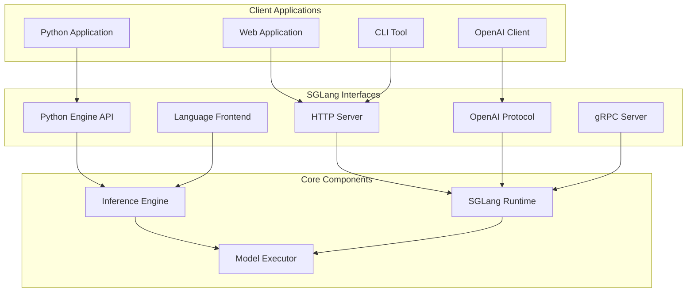

# Programming Interfaces

**Part of**: [Architecture Documentation](index.md)
**Generated**: 2025-11-02
**Source commit**: 358ae35

---

## Interface Overview

SGLang provides multiple programming interfaces to suit different use cases, from direct Python integration to standard HTTP APIs. All interfaces are designed for ease of use while maintaining high performance.



## Python Engine API

The Python API provides direct access to SGLang's inference engine with maximum performance and flexibility.

### Engine Class

**Location**: `python/sglang/engine.py:89-145`

```python
import sglang as sgl

class Engine:
    """Main SGLang inference engine"""

    def __init__(self,
                 model_path: str,
                 tokenizer_path: Optional[str] = None,
                 trust_remote_code: bool = False,
                 mem_fraction_static: float = 0.9,
                 **kwargs):
        """
        Initialize SGLang Engine

        Args:
            model_path: Path to model weights
            tokenizer_path: Path to tokenizer (optional)
            trust_remote_code: Whether to trust remote code
            mem_fraction_static: Static memory fraction
            **kwargs: Additional configuration
        """
        self.model_path = model_path
        self.tokenizer_path = tokenizer_path or model_path
        self.trust_remote_code = trust_remote_code

        # Initialize runtime
        self.runtime = sgl.Runtime(
            model_path=model_path,
            tokenizer_path=tokenizer_path,
            mem_fraction_static=mem_fraction_static,
            **kwargs
        )

    def generate(self,
                 prompts: Union[str, List[str]],
                 sampling_params: Optional[SamplingParams] = None,
                 **kwargs) -> Union[str, List[str]]:
        """
        Generate text from prompts

        Args:
            prompts: Input prompt(s)
            sampling_params: Sampling parameters
            **kwargs: Additional generation parameters

        Returns:
            Generated text(s)
        """
        if isinstance(prompts, str):
            prompts = [prompts]

        # Set default sampling parameters
        if sampling_params is None:
            sampling_params = SamplingParams(
                temperature=0.7,
                top_p=0.95,
                max_new_tokens=1024
            )

        # Process prompts
        results = []
        for prompt in prompts:
            result = self.runtime.generate(prompt, sampling_params, **kwargs)
            results.append(result.text)

        return results[0] if len(results) == 1 else results

    def embed(self, prompts: Union[str, List[str]]) -> Union[List[float], List[List[float]]]:
        """Generate embeddings for prompts"""
        if isinstance(prompts, str):
            prompts = [prompts]

        embeddings = []
        for prompt in prompts:
            embedding = self.runtime.embed(prompt)
            embeddings.append(embedding.tolist())

        return embeddings[0] if len(embeddings) == 1 else embeddings

    def __enter__(self):
        return self

    def __exit__(self, exc_type, exc_val, exc_tb):
        self.runtime.shutdown()
```

### Sampling Parameters

**Location**: `python/sglang/sampling_params.py:45-89`

```python
from typing import Optional, List, Union
from dataclasses import dataclass

@dataclass
class SamplingParams:
    """Parameters for text generation sampling"""

    # Basic sampling
    temperature: float = 0.7
    top_p: float = 0.95
    top_k: int = 40

    # Generation control
    max_new_tokens: int = 1024
    min_new_tokens: int = 0
    stop: Optional[Union[str, List[str]]] = None

    # Penalties
    repetition_penalty: float = 1.0
    frequency_penalty: float = 0.0
    presence_penalty: float = 0.0

    # Advanced options
    logprobs: Optional[int] = None
    use_beam_search: bool = False
    best_of: int = 1

    # Streaming
    stream: bool = False

    def validate(self):
        """Validate sampling parameters"""
        if self.temperature < 0:
            raise ValueError("Temperature must be non-negative")
        if not 0 <= self.top_p <= 1:
            raise ValueError("top_p must be between 0 and 1")
        if self.top_k < 0:
            raise ValueError("top_k must be non-negative")
        if self.max_new_tokens <= 0:
            raise ValueError("max_new_tokens must be positive")
```

### Usage Examples

```python
import sglang as sgl

# Basic text generation
engine = sgl.Engine(model_path="meta-llama/Llama-2-7b-chat-hf")

prompts = [
    "Once upon a time,",
    "The future of AI is",
    "In a world where"
]

results = engine.generate(prompts)
print(results)

# Custom sampling parameters
sampling_params = sgl.SamplingParams(
    temperature=0.8,
    top_p=0.9,
    max_new_tokens=512,
    stop=["\n\n", "END"]
)

results = engine.generate(
    prompts="Write a short story about a robot discovering emotions.",
    sampling_params=sampling_params
)
print(results)

# Embedding generation
embeddings = engine.embed([
    "What is machine learning?",
    "How does neural network work?",
    "Explain deep learning"
])
print(f"Embedding shape: {len(embeddings)}")

# Context manager usage
with sgl.Engine(model_path="microsoft/DialoGPT-medium") as engine:
    response = engine.generate("Hello, how are you?")
    print(response)
```

## HTTP Server and OpenAI API

SGLang provides a fully compatible OpenAI API through its HTTP server, making it a drop-in replacement for OpenAI's services.

### HTTP Server Implementation

**Location**: `python/sglang/srt/entrypoints/http_server.py:123-178`

```python
from fastapi import FastAPI, HTTPException
from fastapi.responses import StreamingResponse
import uvicorn

class SGLangHTTPServer:
    def __init__(self, engine: Engine):
        self.app = FastAPI(title="SGLang Server")
        self.engine = engine
        self.setup_routes()

    def setup_routes(self):
        """Setup API routes"""

        @self.app.post("/v1/chat/completions")
        async def chat_completions(request: ChatCompletionRequest):
            """OpenAI-compatible chat completions endpoint"""
            try:
                # Convert OpenAI format to SGLang format
                sglang_request = self.convert_openai_request(request)

                if request.stream:
                    return StreamingResponse(
                        self.stream_chat_completion(sglang_request),
                        media_type="text/plain"
                    )
                else:
                    result = self.engine.generate(
                        prompts=sglang_request.prompts,
                        sampling_params=sglang_request.sampling_params
                    )
                    return self.format_chat_response(result, request)

            except Exception as e:
                raise HTTPException(status_code=500, detail=str(e))

        @self.app.post("/v1/completions")
        async def completions(request: CompletionRequest):
            """OpenAI-compatible completions endpoint"""
            # Similar implementation for text completion
            pass

        @self.app.post("/v1/embeddings")
        async def embeddings(request: EmbeddingRequest):
            """Generate embeddings for input text"""
            try:
                embeddings = self.engine.embed(request.input)
                return self.format_embeddings_response(embeddings, request)
            except Exception as e:
                raise HTTPException(status_code=500, detail=str(e))

        @self.app.get("/v1/models")
        async def list_models():
            """List available models"""
            return {
                "object": "list",
                "data": [{
                    "id": self.engine.model_path,
                    "object": "model",
                    "created": int(time.time()),
                    "owned_by": "sglang"
                }]
            }
```

### OpenAI API Compatibility

SGLang supports all major OpenAI API endpoints:

| Endpoint | Method | Description | Status |
|----------|--------|-------------|--------|
| `/v1/chat/completions` | POST | Chat completions | ✅ Full Support |
| `/v1/completions` | POST | Text completions | ✅ Full Support |
| `/v1/embeddings` | POST | Text embeddings | ✅ Full Support |
| `/v1/models` | GET | List models | ✅ Full Support |
| `/v1/chat/completions` | POST | Streaming chat | ✅ Full Support |
| `/v1/moderations` | POST | Content moderation | 🚧 Planned |

### Client Integration Examples

```python
import openai

# Configure OpenAI client to use SGLang
client = openai.OpenAI(
    api_key="not-needed",  # SGLang doesn't require API keys
    base_url="http://localhost:30000/v1"
)

# Chat completion
response = client.chat.completions.create(
    model="meta-llama/Llama-2-7b-chat-hf",
    messages=[
        {"role": "system", "content": "You are a helpful assistant."},
        {"role": "user", "content": "Explain quantum computing in simple terms."}
    ],
    temperature=0.7,
    max_tokens=500
)

print(response.choices[0].message.content)

# Streaming chat completion
stream = client.chat.completions.create(
    model="meta-llama/Llama-2-7b-chat-hf",
    messages=[
        {"role": "user", "content": "Write a poem about artificial intelligence."}
    ],
    stream=True
)

for chunk in stream:
    if chunk.choices[0].delta.content is not None:
        print(chunk.choices[0].delta.content, end="")

# Text completion
response = client.completions.create(
    model="meta-llama/Llama-2-7b-hf",
    prompt="The future of artificial intelligence is",
    max_tokens=100
)

print(response.choices[0].text)

# Embeddings
response = client.embeddings.create(
    model="intfloat/e5-large-v2",
    input="Hello, world!"
)

print(f"Embedding dimensions: {len(response.data[0].embedding)}")
```

## gRPC Interface

For high-performance scenarios, SGLang provides a gRPC interface with lower overhead than HTTP:

### gRPC Service Definition

**Location**: `python/sglang/srt/grpc/sglang.proto:23-67`

```protobuf
syntax = "proto3";

package sglang;

service GenerationService {
    rpc Generate(GenerateRequest) returns (GenerateResponse);
    rpc GenerateStream(GenerateRequest) returns (stream GenerateResponse);
    rpc Embed(EmbedRequest) returns (EmbedResponse);
    rpc HealthCheck(HealthRequest) returns (HealthResponse);
}

message GenerateRequest {
    string model = 1;
    repeated string prompts = 2;
    SamplingParams sampling_params = 3;
    bool stream = 4;
}

message GenerateResponse {
    string text = 1;
    repeated TokenInfo token_infos = 2;
    bool finished = 3;
    string finish_reason = 4;
}

message SamplingParams {
    float temperature = 1;
    float top_p = 2;
    int32 top_k = 3;
    int32 max_new_tokens = 4;
    repeated string stop = 5;
    float repetition_penalty = 6;
}

message EmbedRequest {
    string model = 1;
    repeated string inputs = 2;
}

message EmbedResponse {
    repeated EmbeddingData data = 1;
}

message EmbeddingData {
    string object = 1;
    repeated float embedding = 2;
    int32 index = 3;
}
```

### gRPC Server Implementation

**Location**: `python/sglang/srt/entrypoints/grpc_server.py:89-145`

```python
import grpc
from concurrent import futures
import sglang_pb2
import sglang_pb2_grpc

class SGLangGRPCService(sglang_pb2_grpc.GenerationServiceServicer):
    def __init__(self, engine: Engine):
        self.engine = engine

    def Generate(self, request, context):
        """Handle gRPC generate request"""
        try:
            # Convert protobuf to SGLang format
            sampling_params = self.convert_sampling_params(request.sampling_params)

            # Generate response
            results = self.engine.generate(
                prompts=list(request.prompts),
                sampling_params=sampling_params
            )

            # Convert back to protobuf
            return sglang_pb2.GenerateResponse(
                text=results[0] if len(results) == 1 else "",
                finished=True,
                finish_reason="stop"
            )

        except Exception as e:
            context.set_code(grpc.StatusCode.INTERNAL)
            context.set_details(str(e))
            return sglang_pb2.GenerateResponse()

    def GenerateStream(self, request, context):
        """Handle streaming gRPC request"""
        try:
            sampling_params = self.convert_sampling_params(request.sampling_params)

            # Stream generation
            for token in self.engine.generate_stream(
                prompts=list(request.prompts),
                sampling_params=sampling_params
            ):
                response = sglang_pb2.GenerateResponse(
                    text=token.text,
                    token_infos=[self.convert_token_info(token)],
                    finished=token.finished,
                    finish_reason=token.finish_reason
                )
                yield response

        except Exception as e:
            context.set_code(grpc.StatusCode.INTERNAL)
            context.set_details(str(e))

def serve_grpc(engine: Engine, port: int = 50051):
    """Start gRPC server"""
    server = grpc.server(futures.ThreadPoolExecutor(max_workers=10))
    sglang_pb2_grpc.add_GenerationServiceServicer_to_server(
        SGLangGRPCService(engine), server
    )

    server.add_insecure_port(f'[::]:{port}')
    server.start()
    server.wait_for_termination()
```

## Language Frontend (SGLang Lang)

SGLang provides a domain-specific language for complex generative AI programs:

### Language API

**Location**: `python/sglang/lang/api.py:67-123`

```python
import sglang as sgl

@sgl.function
def story_generator():
    """Generate a structured story using SGLang language"""
    sgl.begin_system("You are a creative story writer.")

    genre = sgl.gen("genre", max_tokens=20, stop="\n")
    protagonist = sgl.gen("protagonist", max_tokens=50, stop="\n")
    setting = sgl.gen("setting", max_tokens=100, stop="\n")

    sgl.begin_user(f"Write a {genre} story about {protagonist} in {setting}.")
    story = sgl.gen("story", max_tokens=1000)

    return {
        "genre": genre,
        "protagonist": protagonist,
        "setting": setting,
        "story": story
    }

@sgl.function
def multi_turn_qa(question: str):
    """Multi-turn question answering with reasoning"""
    sgl.begin_system("You are a helpful assistant that explains your reasoning.")

    # First, analyze the question
    sgl.begin_user(f"Question: {question}\n\nFirst, analyze what this question is asking.")
    analysis = sgl.gen("analysis", max_tokens=200)

    # Then, provide step-by-step reasoning
    sgl.begin_user("Now, provide step-by-step reasoning to answer this question.")
    reasoning = sgl.gen("reasoning", max_tokens=400)

    # Finally, give the answer
    sgl.begin_user("Based on your reasoning, provide a concise answer.")
    answer = sgl.gen("answer", max_tokens=200)

    return {
        "analysis": analysis,
        "reasoning": reasoning,
        "answer": answer
    }

# Execute the functions
if __name__ == "__main__":
    # Generate a story
    story_result = story_generator.run()
    print("Generated Story:")
    print(f"Genre: {story_result['genre']}")
    print(f"Protagonist: {story_result['protagonist']}")
    print(f"Setting: {story_result['setting']}")
    print(f"Story: {story_result['story']}")

    # Ask a question
    qa_result = multi_turn_qa.run("Why is the sky blue?")
    print("\nQ&A Result:")
    print(f"Analysis: {qa_result['analysis']}")
    print(f"Reasoning: {qa_result['reasoning']}")
    print(f"Answer: {qa_result['answer']}")
```

### Advanced Language Features

```python
@sgl.function
def rag_pipeline(query: str, context_documents: List[str]):
    """Retrieval-augmented generation pipeline"""

    # Document selection
    sgl.begin_system("You are an expert at selecting relevant documents.")
    sgl.begin_user(f"Query: {query}\n\nSelect the most relevant document:")

    for i, doc in enumerate(context_documents):
        sgl.gen(f"doc_{i}", max_tokens=1, choices=["relevant", "not_relevant"])

    # Context synthesis
    relevant_docs = [doc for i, doc in enumerate(context_documents)
                    if sgl.get_variable(f"doc_{i}") == "relevant"]

    sgl.begin_user(f"Using these relevant documents: {relevant_docs}\n\nSynthesize a comprehensive answer:")
    answer = sgl.gen("answer", max_tokens=500)

    return {"answer": answer, "relevant_docs": relevant_docs}

@sgl.function
def code_generator(task_description: str):
    """Generate code with explanation"""

    sgl.begin_system("You are an expert programmer. Write clean, well-commented code.")

    # Plan the solution
    sgl.begin_user(f"Task: {task_description}\n\nPlan your solution approach:")
    plan = sgl.gen("plan", max_tokens=200)

    # Write the code
    sgl.begin_user("Based on your plan, write the code:")
    code = sgl.gen("code", max_tokens=1000, stop=["```", "\n\n"])

    # Write explanation
    sgl.begin_user("Explain your code:")
    explanation = sgl.gen("explanation", max_tokens=300)

    return {
        "plan": plan,
        "code": code,
        "explanation": explanation
    }
```

## Performance Considerations

### API Performance Comparison

| Interface | Latency (ms) | Throughput (req/s) | Memory Overhead | Best Use Case |
|-----------|--------------|-------------------|-----------------|---------------|
| **Python API** | 5-10 | 1000+ | Low | Direct integration |
| **HTTP API** | 15-25 | 500+ | Medium | Web applications |
| **gRPC API** | 8-15 | 800+ | Low-Medium | High-performance services |
| **Language Frontend** | 10-20 | 400+ | Medium | Complex generative programs |

### Connection Pooling

```python
# Connection pooling for HTTP API
import aiohttp
import asyncio

class SGLangClient:
    def __init__(self, base_url: str, pool_size: int = 10):
        self.base_url = base_url
        self.session = aiohttp.ClientSession(
            connector=aiohttp.TCPConnector(limit=pool_size)
        )

    async def generate(self, prompt: str, **kwargs):
        """Async generation with connection pooling"""
        async with self.session.post(
            f"{self.base_url}/v1/completions",
            json={"prompt": prompt, **kwargs}
        ) as response:
            return await response.json()

    async def close(self):
        await self.session.close()

# Usage
async def main():
    client = SGLangClient("http://localhost:30000")

    tasks = [
        client.generate(f"Prompt {i}", max_tokens=50)
        for i in range(100)
    ]

    results = await asyncio.gather(*tasks)
    await client.close()
```

### Batch Processing

```python
# Batch processing for efficiency
def batch_generate(engine: Engine, prompts: List[str], batch_size: int = 8):
    """Process prompts in batches for better performance"""
    results = []

    for i in range(0, len(prompts), batch_size):
        batch = prompts[i:i + batch_size]
        batch_results = engine.generate(batch)
        results.extend(batch_results if isinstance(batch_results, list) else [batch_results])

    return results

# Usage
prompts = [f"Write about topic {i}" for i in range(100)]
results = batch_generate(engine, prompts, batch_size=16)
```

SGLang's programming interfaces provide flexibility for different use cases while maintaining high performance and ease of use. From direct Python integration to standard web APIs, SGLang offers comprehensive options for integrating LLM capabilities into applications.

[← Back to Index](index.md)