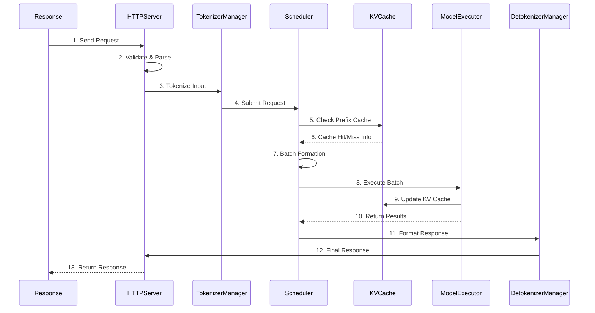
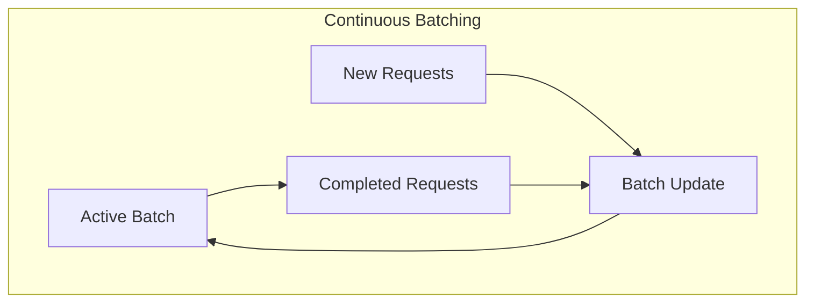
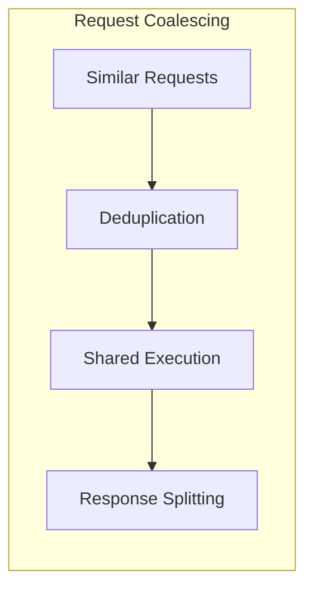

# Request Processing Pipeline

**Part of**: [Architecture Documentation](index.md)
**Generated**: 2025-11-02
**Source commit**: 358ae35

---

## Request Lifecycle Overview

SGLang processes requests through a sophisticated pipeline designed for maximum throughput and minimal latency. The pipeline handles everything from initial request parsing to final response generation, with intelligent caching and batching throughout.



## Request Lifecycle

### 1. Request Reception and Validation

**Location**: `python/sglang/srt/entrypoints/http_server.py:89-123`

The HTTP server receives requests and performs initial validation:

```python
# Request validation and preprocessing
async def handle_request(self, request: Request):
    # Validate request format
    if not self.validate_request(request):
        raise InvalidRequestError("Invalid request format")

    # Extract and validate parameters
    params = self.extract_parameters(request)
    validated_params = self.validate_parameters(params)

    # Route to appropriate handler
    return await self.route_request(validated_params)
```

**Validation Steps**:
- **Format Validation**: JSON schema validation
- **Parameter Validation**: Type checking, range validation
- **Authentication**: API key validation (if enabled)
- **Rate Limiting**: Request rate enforcement
- **Resource Quotas**: Memory and token limits

### 2. Tokenization and Preprocessing

**Location**: `python/sglang/srt/managers/tokenizer_manager.py:67-95`

The TokenizerManager handles text preprocessing and tokenization:

```python
class TokenizerManager:
    def tokenize_request(self, request: RequestData) -> TokenizedRequest:
        # Apply chat templates if needed
        if request.use_chat_template:
            formatted_text = self.apply_chat_template(request)

        # Tokenize text
        tokens = self.tokenizer.encode(
            formatted_text,
            add_special_tokens=request.add_special_tokens
        )

        # Preprocess multimodal inputs
        if request.has_multimodal:
            multimodal_data = self.process_multimodal(request)

        return TokenizedRequest(
            tokens=tokens,
            multimodal_data=multimodal_data,
            metadata=request.metadata
        )
```

**Preprocessing Features**:
- **Chat Templates**: Apply model-specific chat formatting
- **Multimodal Processing**: Handle image, audio, video inputs
- **Special Tokens**: Add BOS, EOS, and other special tokens
- **Token Validation**: Ensure token count limits

### 3. Request Queuing and Scheduling

**Location**: `python/sglang/srt/managers/scheduler.py:134-178`

Requests are queued and scheduled based on priority and readiness:

```python
class Scheduler:
    def add_request(self, request: TokenizedRequest):
        # Calculate request priority
        priority = self.calculate_priority(request)

        # Add to appropriate queue
        self.request_queue.add(request, priority)

        # Trigger scheduling if needed
        if self.should_schedule():
            self.schedule_batch()

    def calculate_priority(self, request: TokenizedRequest) -> int:
        # Consider factors: wait time, user priority, request size
        wait_time = time.time() - request.arrival_time
        user_priority = request.user_priority
        size_penalty = len(request.tokens) / self.max_seq_length

        return wait_time * self.wait_weight + \
               user_priority * self.priority_weight - \
               size_penalty * self.size_weight
```

**Scheduling Criteria**:
- **Wait Time**: Time spent in queue
- **User Priority**: Requester priority level
- **Resource Availability**: Memory and compute constraints
- **Batch Compatibility**: Similar request characteristics

## Batching Strategies

### Dynamic Continuous Batching

SGLang implements dynamic continuous batching that allows requests to be added and removed from batches as they complete:



**Key Features**:
- **Adaptive Sizing**: Batch size adjusts based on load
- **Priority Insertion**: High-priority requests can jump queue
- **Early Termination**: Completed requests exit batch immediately
- **Memory Efficiency**: Optimal GPU memory utilization

### Prefix-Based Batching

Requests with shared prefixes are batched together for maximum cache efficiency:

```python
# From: python/sglang/srt/managers/scheduler.py:234-256
def form_batch_by_prefix(self, requests: List[Request]) -> List[Batch]:
    # Group requests by shared prefixes
    prefix_groups = self.group_by_prefix(requests)

    batches = []
    for prefix, group_requests in prefix_groups.items():
        # Check cache for prefix
        cached_kv = self.kv_cache.get(prefix)

        if cached_kv:
            # Form batch with cached prefix
            batch = self.create_batch_with_cache(group_requests, cached_kv)
        else:
            # Form batch for computation
            batch = self.create_batch_for_computation(group_requests)

        batches.append(batch)

    return batches
```

## Scheduling Policies

### Priority-Based Scheduling

Requests are scheduled based on multiple factors:

| Factor | Weight | Description |
|--------|--------|-------------|
| **Wait Time** | 0.4 | Time spent waiting in queue |
| **User Priority** | 0.3 | User-assigned priority level |
| **Request Size** | 0.2 | Number of tokens to process |
| **Cache Hit Potential** | 0.1 | Likelihood of cache hits |

### Fairness Mechanisms

```python
# Fairness scheduling implementation
def fair_schedule(self, requests: List[Request]) -> List[Request]:
    # Implement weighted fair queuing
    user_shares = self.get_user_shares()
    current_usage = self.get_current_usage()

    scheduled = []
    for request in requests:
        user = request.user_id
        if current_usage[user] < user_shares[user]:
            scheduled.append(request)
            current_usage[user] += request.cost

    return scheduled
```

**Fairness Features**:
- **User Quotas**: Fair resource allocation per user
- **Cost Tracking**: Monitor resource usage per request
- **Adaptive Allocation**: Dynamic quota adjustment
- **Priority Override**: Emergency request handling

## Response Generation

### Streaming Responses

SGLang supports streaming responses for real-time applications:

```python
# From: python/sglang/srt/managers/detokenizer_manager.py:89-123
async def stream_response(self, request: Request, response_queue: Queue):
    async for token_chunk in response_queue:
        # Detokenize chunk
        text_chunk = self.detokenizer.decode(token_chunk.tokens)

        # Format response
        response_chunk = {
            "id": request.id,
            "choices": [{
                "delta": {"content": text_chunk},
                "finish_reason": None
            }]
        }

        # Send to client
        yield response_chunk
```

### Non-Streaming Responses

For batch processing and non-interactive use cases:

```python
def generate_response(self, request: Request, full_tokens: List[int]) -> Response:
    # Detokenize complete response
    full_text = self.detokenizer.decode(full_tokens)

    # Calculate metrics
    usage = self.calculate_usage(request, full_tokens)

    # Format final response
    return Response(
        id=request.id,
        choices=[{
            "text": full_text,
            "finish_reason": self.get_finish_reason(request)
        }],
        usage=usage
    )
```

## Performance Optimizations

### Request Coalescing

Similar requests are coalesced to reduce redundant computation:



### Speculative Execution

SGLang can speculatively execute likely requests:

```python
def speculative_execution(self, queue: RequestQueue):
    # Predict likely next requests
    predicted_requests = self.predict_requests(queue)

    # Pre-warm caches
    for request in predicted_requests:
        self.prewarm_cache(request)

    # Pre-allocate resources
    self.preallocate_resources(predicted_requests)
```

### Memory Management

Intelligent memory management throughout the pipeline:

- **Memory Pooling**: Pre-allocated memory pools
- **Garbage Collection**: Timed cleanup of completed requests
- **Memory Pressure Handling**: Dynamic adjustment of batch sizes
- **Cache Eviction**: Intelligent cache replacement policies

## Error Handling and Recovery

### Request-Level Error Handling

```python
# From: python/sglang/srt/managers/scheduler.py:312-334
def handle_request_error(self, request: Request, error: Exception):
    # Log error
    self.logger.error(f"Request {request.id} failed: {error}")

    # Update metrics
    self.metrics.error_count += 1

    # Notify client if possible
    if request.has_streaming_response:
        self.send_error_response(request, error)

    # Clean up resources
    self.cleanup_request_resources(request)
```

### System-Level Recovery

- **Process Restart**: Automatic restart of failed processes
- **Checkpoint Recovery**: Restore from last known good state
- **Graceful Degradation**: Continue serving with reduced capacity
- **Circuit Breakers**: Prevent cascade failures

The request processing pipeline provides a robust, efficient foundation for handling LLM inference requests at scale while maintaining low latency and high throughput.

[← Back to Index](index.md)