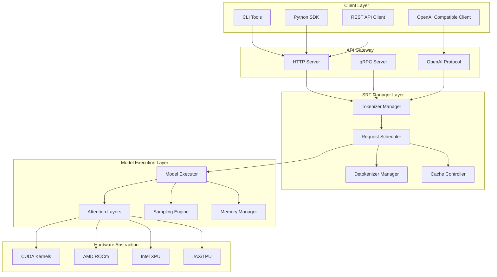
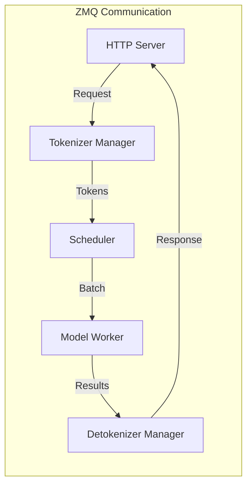
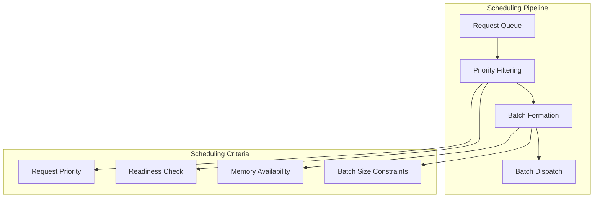
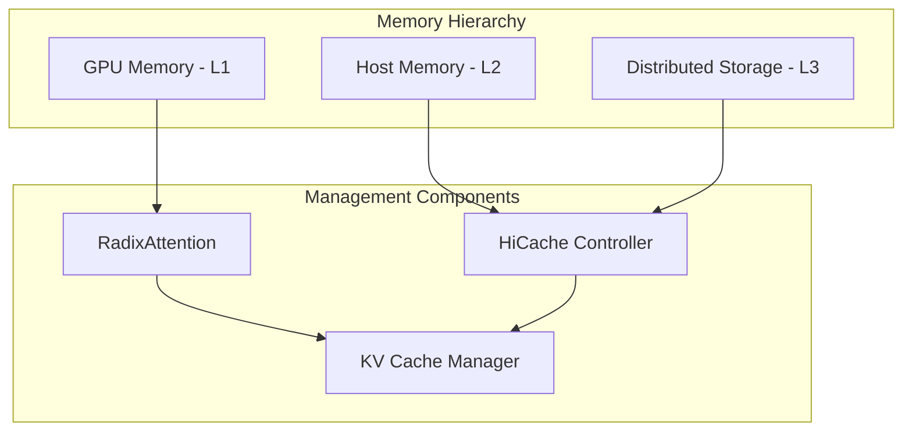
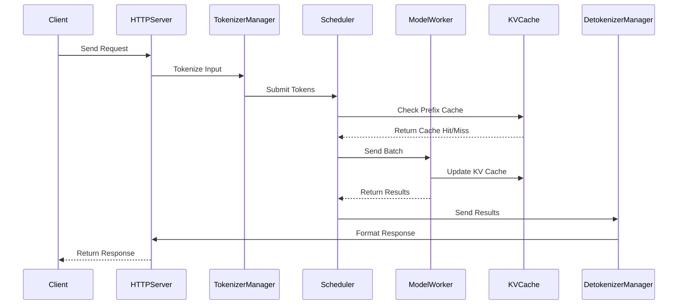

# System Architecture

**Part of**: [Architecture Documentation](index.md)
**Generated**: 2025-11-02
**Source commit**: 358ae35

---

## High-Level Architecture

SGLang employs a sophisticated multi-process architecture designed for high-performance LLM inference. The system is organized into distinct layers with clear separation of concerns:



## Multi-Process Architecture and IPC

### Process Separation

SGLang uses a multi-process architecture where different components run in separate processes for isolation and performance:

| Process | Responsibility | Key Files |
|---------|----------------|-----------|
| **HTTP Server** | API endpoint handling, request routing | `python/sglang/srt/entrypoints/http_server.py` |
| **Tokenizer Manager** | Text tokenization, input preprocessing | `python/sglang/srt/managers/tokenizer_manager.py` |
| **Scheduler** | Request batching, scheduling decisions | `python/sglang/srt/managers/scheduler.py` |
| **Detokenizer Manager** | Output detokenization, response formatting | `python/sglang/srt/managers/detokenizer_manager.py` |
| **Model Workers** | Model execution, GPU computation | `python/sglang/srt/entrypoints/engine.py` |

### Inter-Process Communication (IPC)

SGLang uses **ZeroMQ (ZMQ)** as the primary IPC mechanism for efficient communication between processes:



**Key IPC Features:**
- **Async Messaging**: Non-blocking communication patterns
- **Port Allocation**: Dynamic port assignment via `PortArgs`
- **Message Serialization**: Efficient binary protocol
- **Error Handling**: Robust error propagation across processes

## Request Scheduling and Batching

### Zero-Overhead Scheduler

The scheduler implements a zero-overhead batching system that maximizes GPU utilization:

```python
# From: python/sglang/srt/managers/scheduler.py:123-135
class Scheduler:
    def schedule(self):
        """Schedule requests for next batch with zero overhead"""
        # Get ready requests
        ready_requests = self.get_ready_requests()

        # Form optimal batch
        batch = self.form_batch(ready_requests)

        # Send to model workers
        self.send_batch_to_workers(batch)
```

### Batching Strategies

| Strategy | Description | Implementation |
|----------|-------------|----------------|
| **Continuous Batching** | Dynamic request addition/removal | `python/sglang/srt/managers/scheduler.py` |
| **Priority Batching** | Priority-based request selection | `python/sglang/srt/managers/scheduler.py` |
| **Prefix-Based Batching** | Group by shared prefixes | `python/sglang/srt/mem_cache/radix_cache.py` |

### Scheduling Policies



## Memory Management and HiCache

### Memory Hierarchy

SGLang implements a sophisticated memory management system with multiple tiers:



### RadixAttention System

RadixAttention is SGLang's proprietary prefix caching mechanism:

- **Tree Structure**: Radix tree for efficient prefix lookup
- **Memory Sharing**: Shared prefixes across requests
- **Cache Coherency**: Consistent cache state across processes
- **Eviction Policies**: LRU and frequency-based eviction

**Key Implementation**: `python/sglang/srt/mem_cache/radix_cache.py:45-67`

### HiCache Integration

HiCache extends RadixAttention to multiple memory tiers:

- **GPU Memory**: Fast access for hot data
- **Host Memory**: Intermediate storage for warm data
- **Distributed Storage**: Long-term storage for cold data
- **Prefetching**: Proactive data movement between tiers

## Component Interaction Patterns

### Request Flow Architecture



### Manager Coordination

The core managers coordinate through well-defined interfaces:

| Manager | Key Responsibilities | Interface Methods |
|---------|---------------------|-------------------|
| **TokenizerManager** | Input preprocessing, tokenization | `tokenize()`, `preprocess()` |
| **Scheduler** | Request scheduling, batching | `schedule()`, `form_batch()` |
| **CacheController** | Cache management, memory allocation | `allocate()`, `deallocate()` |
| **DetokenizerManager** | Output postprocessing, response formatting | `detokenize()`, `format_response()` |

### Error Handling and Recovery

SGLang implements robust error handling across all components:

- **Process Isolation**: Process crashes don't affect other components
- **Graceful Degradation**: Fallback mechanisms for component failures
- **Circuit Breakers**: Prevent cascade failures
- **Health Checks**: Continuous component health monitoring

**Implementation**: `python/sglang/srt/utils.py:234-256`

## Performance Characteristics

### Key Architectural Optimizations

1. **Zero-Copy Operations**: Minimize data movement between processes
2. **Async Processing**: Non-blocking I/O throughout the pipeline
3. **Memory Pooling**: Pre-allocated memory pools for performance
4. **Batch Optimization**: Dynamic batch sizing based on load
5. **Cache Locality**: Multi-level caching for reduced latency

### Scalability Patterns

- **Horizontal Scaling**: Multiple worker processes
- **Vertical Scaling**: Multi-GPU utilization
- **Distributed Scaling**: Multi-node deployment
- **Load Balancing**: Intelligent request distribution

The system architecture provides a robust foundation for high-performance LLM serving while maintaining flexibility for different deployment scenarios.

[← Back to Index](index.md)