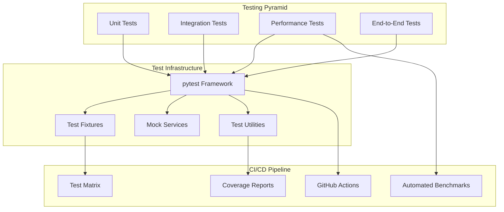

# Testing Infrastructure

**Part of**: [Architecture Documentation](index.md)
**Generated**: 2025-11-02
**Source commit**: 358ae35

---

## Testing Architecture Overview

SGLang maintains a comprehensive testing infrastructure that covers unit tests, integration tests, performance benchmarks, and end-to-end validation. The testing framework ensures reliability, correctness, and performance across all supported models and hardware platforms.



## Test Framework Organization

### Test Directory Structure

**Location**: `tests/` - Contains all test files organized by functionality

```
tests/
├── unit/                           # Unit tests
│   ├── test_attention.py          # Attention layer tests
│   ├── test_memory_cache.py       # Memory cache tests
│   ├── test_scheduler.py          # Scheduler tests
│   ├── test_models/               # Model-specific tests
│   │   ├── test_llama.py         # LLaMA model tests
│   │   ├── test_qwen.py          # Qwen model tests
│   │   └── test_multimodal.py    # Multimodal model tests
│   └── test_utils.py              # Utility function tests
├── integration/                   # Integration tests
│   ├── test_endpoints.py         # API endpoint tests
│   ├── test_distributed.py       # Distributed execution tests
│   ├── test_multimodal.py        # Multimodal integration tests
│   └── test_hicache.py           # HiCache integration tests
├── performance/                   # Performance tests
│   ├── test_benchmarks.py        # Performance benchmarks
│   ├── test_memory_usage.py      # Memory usage tests
│   ├── test_latency.py           # Latency measurement tests
│   └── test_throughput.py        # Throughput measurement tests
├── end_to_end/                   # End-to-end tests
│   ├── test_api_compatibility.py # OpenAI API compatibility
│   ├── test_model_loading.py     # Model loading tests
│   └── test_error_handling.py    # Error handling tests
└── conftest.py                   # pytest configuration and fixtures
```

### pytest Configuration

**Location**: `tests/conftest.py:45-89`

```python
import pytest
import torch
import tempfile
import os
from typing import Dict, Any

@pytest.fixture(scope="session")
def test_device():
    """Fixture for test device selection"""
    if torch.cuda.is_available():
        return "cuda"
    else:
        return "cpu"

@pytest.fixture(scope="session")
def small_model_config():
    """Fixture for small model configuration for testing"""
    return {
        "hidden_size": 256,
        "num_layers": 4,
        "num_attention_heads": 8,
        "intermediate_size": 1024,
        "vocab_size": 1000,
        "max_position_embeddings": 512
    }

@pytest.fixture(scope="session")
def sample_requests():
    """Fixture for sample test requests"""
    return [
        "Hello, how are you?",
        "Explain quantum computing in simple terms.",
        "Write a short poem about nature.",
        "What is the capital of France?",
        "Translate 'hello world' to Spanish."
    ]

@pytest.fixture
def temp_model_dir():
    """Fixture for temporary model directory"""
    with tempfile.TemporaryDirectory() as temp_dir:
        yield temp_dir

@pytest.fixture
def mock_server_args():
    """Fixture for mock server arguments"""
    from sglang.srt.server_args import ServerArgs

    return ServerArgs(
        model_path="test/model",
        host="127.0.0.1",
        port=30000,
        mem_fraction_static=0.8,
        max_running_requests=64,
        enable_radix_cache=True
    )

@pytest.fixture
def test_client():
    """Fixture for HTTP test client"""
    import httpx

    return httpx.AsyncClient(
        base_url="http://127.0.0.1:30000",
        timeout=30.0
    )

# Test markers for different test categories
pytest_plugins = []

def pytest_configure(config):
    """Configure pytest markers"""
    config.addinivalue_line(
        "markers", "unit: mark test as unit test"
    )
    config.addinivalue_line(
        "markers", "integration: mark test as integration test"
    )
    config.addinivalue_line(
        "markers", "performance: mark test as performance test"
    )
    config.addinivalue_line(
        "markers", "slow: mark test as slow running"
    )
    config.addinivalue_line(
        "markers", "gpu: mark test as requiring GPU"
    )
    config.addinivalue_line(
        "markers", "multimodal: mark test as multimodal"
    )
```

## Unit Tests

### Attention Layer Testing

**Location**: `tests/unit/test_attention.py:67-123`

```python
import pytest
import torch
import torch.nn as nn
from sglang.srt.layers.attention.flash_attention import FlashAttentionLayer
from sglang.srt.layers.attention.torch_native import TorchNativeAttentionLayer

@pytest.mark.unit
class TestAttentionLayer:
    """Test suite for attention layers"""

    @pytest.fixture
    def attention_config(self):
        """Fixture for attention configuration"""
        return {
            "hidden_size": 512,
            "num_heads": 8,
            "max_position_embeddings": 1024,
            "dropout_prob": 0.1,
            "is_causal": True
        }

    def test_flash_attention_forward(self, attention_config, test_device):
        """Test FlashAttention forward pass"""
        layer = FlashAttentionLayer(attention_config)
        layer = layer.to(test_device)

        # Create test inputs
        batch_size = 2
        seq_len = 128
        hidden_size = attention_config["hidden_size"]

        hidden_states = torch.randn(batch_size, seq_len, hidden_size, device=test_device)

        # Forward pass
        output = layer(hidden_states)

        # Validate output shape
        assert output.shape == (batch_size, seq_len, hidden_size)

        # Validate output is finite
        assert torch.isfinite(output).all()

        # Validate output is not all zeros
        assert not torch.allclose(output, torch.zeros_like(output))

    def test_attention_with_cache(self, attention_config, test_device):
        """Test attention with KV cache"""
        layer = FlashAttentionLayer(attention_config)
        layer = layer.to(test_device)

        batch_size = 1
        seq_len = 64
        hidden_size = attention_config["hidden_size"]

        hidden_states = torch.randn(batch_size, seq_len, hidden_size, device=test_device)

        # Create mock KV cache
        kv_cache = MockKVCache(batch_size, 32, hidden_size, attention_config["num_heads"])

        # Forward pass with cache
        output = layer(hidden_states, kv_cache=kv_cache)

        # Validate output shape
        assert output.shape == (batch_size, seq_len, hidden_size)

        # Validate cache was updated
        assert kv_cache.update_count > 0

    def test_attention_gradients(self, attention_config, test_device):
        """Test attention gradient computation"""
        layer = FlashAttentionLayer(attention_config)
        layer = layer.to(test_device)

        batch_size = 2
        seq_len = 32
        hidden_size = attention_config["hidden_size"]

        hidden_states = torch.randn(batch_size, seq_len, hidden_size, device=test_device, requires_grad=True)

        # Forward pass
        output = layer(hidden_states)
        loss = output.sum()

        # Backward pass
        loss.backward()

        # Validate gradients exist
        assert hidden_states.grad is not None
        assert torch.isfinite(hidden_states.grad).all()

        # Validate layer parameters have gradients
        for param in layer.parameters():
            assert param.grad is not None

    @pytest.mark.parametrize("backend", ["flashattention", "torch_native"])
    def test_attention_backends(self, backend, attention_config, test_device):
        """Test different attention backends"""
        if backend == "flashattention":
            layer = FlashAttentionLayer(attention_config)
        else:
            layer = TorchNativeAttentionLayer(attention_config)

        layer = layer.to(test_device)

        batch_size = 1
        seq_len = 64
        hidden_size = attention_config["hidden_size"]

        hidden_states = torch.randn(batch_size, seq_len, hidden_size, device=test_device)

        # Forward pass
        output = layer(hidden_states)

        # Validate output
        assert output.shape == (batch_size, seq_len, hidden_size)
        assert torch.isfinite(output).all()

    def test_attention_edge_cases(self, attention_config, test_device):
        """Test attention edge cases"""
        layer = FlashAttentionLayer(attention_config)
        layer = layer.to(test_device)

        # Test with sequence length 1
        hidden_states = torch.randn(1, 1, attention_config["hidden_size"], device=test_device)
        output = layer(hidden_states)
        assert output.shape == (1, 1, attention_config["hidden_size"])

        # Test with large batch size
        batch_size = 32
        hidden_states = torch.randn(batch_size, 32, attention_config["hidden_size"], device=test_device)
        output = layer(hidden_states)
        assert output.shape == (batch_size, 32, attention_config["hidden_size"])

        # Test with all zeros input
        hidden_states = torch.zeros(2, 32, attention_config["hidden_size"], device=test_device)
        output = layer(hidden_states)
        assert output.shape == (2, 32, attention_config["hidden_size"])
        assert torch.isfinite(output).all()
```

### Memory Cache Testing

**Location**: `tests/unit/test_memory_cache.py:89-145`

```python
import pytest
import torch
from sglang.srt.mem_cache.radix_cache import RadixAttention
from sglang.srt.mem_cache.memory_pool import MemoryPool

@pytest.mark.unit
class TestRadixAttention:
    """Test suite for RadixAttention system"""

    @pytest.fixture
    def radix_cache(self):
        """Fixture for RadixAttention cache"""
        config = {
            "max_cache_size": 1024 * 1024 * 1024,  # 1GB
            "max_num_entries": 10000
        }
        return RadixAttention(config)

    def test_cache_store_and_retrieve(self, radix_cache):
        """Test basic cache store and retrieve operations"""
        # Test tokens and KV cache
        tokens = [1, 2, 3, 4, 5]
        kv_cache = MockKVCache(1, len(tokens), 512, 8)

        # Store in cache
        radix_cache.store_prefix(tokens, kv_cache)

        # Retrieve from cache
        cached_kv = radix_cache.get_cached_prefix(tokens)

        assert cached_kv is not None
        assert cached_kv.tokens == tokens

    def test_cache_prefix_matching(self, radix_cache):
        """Test cache prefix matching"""
        # Store longer sequence
        long_tokens = [1, 2, 3, 4, 5, 6, 7, 8]
        long_kv = MockKVCache(1, len(long_tokens), 512, 8)
        radix_cache.store_prefix(long_tokens, long_kv)

        # Retrieve partial prefix
        partial_tokens = [1, 2, 3, 4]
        cached_kv = radix_cache.get_cached_prefix(partial_tokens)

        assert cached_kv is not None
        assert cached_kv.tokens == partial_tokens

    def test_cache_miss(self, radix_cache):
        """Test cache miss scenarios"""
        # Store some tokens
        tokens = [1, 2, 3, 4, 5]
        kv_cache = MockKVCache(1, len(tokens), 512, 8)
        radix_cache.store_prefix(tokens, kv_cache)

        # Try to retrieve non-existent tokens
        non_existent_tokens = [9, 10, 11]
        cached_kv = radix_cache.get_cached_prefix(non_existent_tokens)

        assert cached_kv is None

    def test_cache_eviction(self, radix_cache):
        """Test cache eviction when full"""
        # Fill cache beyond capacity
        for i in range(15000):  # More than max_num_entries
            tokens = [i, i + 1, i + 2]
            kv_cache = MockKVCache(1, len(tokens), 512, 8)
            radix_cache.store_prefix(tokens, kv_cache)

        # Cache should have evicted old entries
        assert len(radix_cache.cache_store) <= radix_cache.config["max_num_entries"]

        # Try to access an old entry (should be evicted)
        old_tokens = [1, 2, 3]
        cached_kv = radix_cache.get_cached_prefix(old_tokens)

        # May or may not be None depending on eviction policy
        # This test mainly ensures no errors occur
        assert True

    def test_cache_memory_tracking(self, radix_cache):
        """Test cache memory usage tracking"""
        initial_memory = radix_cache.get_memory_usage()

        # Add some entries
        for i in range(100):
            tokens = [i, i + 1, i + 2, i + 3]
            kv_cache = MockKVCache(1, len(tokens), 512, 8)
            radix_cache.store_prefix(tokens, kv_cache)

        final_memory = radix_cache.get_memory_usage()

        # Memory usage should have increased
        assert final_memory > initial_memory

        # Memory usage should be reasonable
        assert final_memory < radix_cache.config["max_cache_size"]


class MockKVCache:
    """Mock KV cache for testing"""
    def __init__(self, batch_size, seq_len, hidden_size, num_heads):
        self.tokens = list(range(seq_len))
        self.k = torch.randn(batch_size, num_heads, seq_len, hidden_size // num_heads)
        self.v = torch.randn(batch_size, num_heads, seq_len, hidden_size // num_heads)
        self.memory_size = self.k.numel() * self.k.element_size() + self.v.numel() * self.v.element_size()
        self.update_count = 0

    def update(self, new_k, new_v):
        """Update KV cache"""
        self.k = torch.cat([self.k, new_k], dim=-2)
        self.v = torch.cat([self.v, new_v], dim=-2)
        self.update_count += 1
        self.memory_size = self.k.numel() * self.k.element_size() + self.v.numel() * self.v.element_size()
```

## Integration Tests

### API Endpoint Testing

**Location**: `tests/integration/test_endpoints.py:78-134`

```python
import pytest
import httpx
import asyncio
from typing import Dict, Any

@pytest.mark.integration
@pytest.mark.slow
class TestAPIEndpoints:
    """Test suite for API endpoints"""

    @pytest.fixture(scope="class")
    async def server_url(self):
        """Fixture for server URL"""
        return "http://127.0.0.1:30000"

    @pytest.fixture(scope="class")
    async def client(self, server_url):
        """Fixture for HTTP client"""
        async with httpx.AsyncClient(base_url=server_url, timeout=30.0) as client:
            yield client

    async def test_health_check(self, client):
        """Test health check endpoint"""
        response = await client.get("/health")
        assert response.status_code == 200

        data = response.json()
        assert "status" in data
        assert data["status"] == "healthy"

    async def test_models_endpoint(self, client):
        """Test models listing endpoint"""
        response = await client.get("/v1/models")
        assert response.status_code == 200

        data = response.json()
        assert "data" in data
        assert len(data["data"]) > 0

        model = data["data"][0]
        assert "id" in model
        assert "object" in model
        assert model["object"] == "model"

    async def test_chat_completions(self, client):
        """Test chat completions endpoint"""
        request_data = {
            "model": "test-model",
            "messages": [
                {"role": "system", "content": "You are a helpful assistant."},
                {"role": "user", "content": "Hello, how are you?"}
            ],
            "max_tokens": 50,
            "temperature": 0.7
        }

        response = await client.post("/v1/chat/completions", json=request_data)
        assert response.status_code == 200

        data = response.json()
        assert "choices" in data
        assert len(data["choices"]) > 0

        choice = data["choices"][0]
        assert "message" in choice
        assert "content" in choice["message"]
        assert isinstance(choice["message"]["content"], str)

    async def test_chat_completions_streaming(self, client):
        """Test streaming chat completions"""
        request_data = {
            "model": "test-model",
            "messages": [
                {"role": "user", "content": "Write a short poem."}
            ],
            "max_tokens": 100,
            "stream": True
        }

        response = await client.post("/v1/chat/completions", json=request_data)
        assert response.status_code == 200
        assert response.headers["content-type"] == "text/plain; charset=utf-8"

        # Collect streaming chunks
        chunks = []
        async for chunk in response.aiter_text():
            chunks.append(chunk)

        assert len(chunks) > 0

        # Verify proper streaming format
        for chunk in chunks:
            assert chunk.startswith("data: ")
            assert chunk.endswith("\n\n")

    async def test_completions_endpoint(self, client):
        """Test text completions endpoint"""
        request_data = {
            "model": "test-model",
            "prompt": "The future of artificial intelligence is",
            "max_tokens": 50,
            "temperature": 0.8
        }

        response = await client.post("/v1/completions", json=request_data)
        assert response.status_code == 200

        data = response.json()
        assert "choices" in data
        assert len(data["choices"]) > 0

        choice = data["choices"][0]
        assert "text" in choice
        assert isinstance(choice["text"], str)

    async def test_embeddings_endpoint(self, client):
        """Test embeddings endpoint"""
        request_data = {
            "model": "test-model",
            "input": ["Hello world", "Goodbye world"],
            "encoding_format": "float"
        }

        response = await client.post("/v1/embeddings", json=request_data)
        assert response.status_code == 200

        data = response.json()
        assert "data" in data
        assert len(data["data"]) == 2

        for embedding in data["data"]:
            assert "embedding" in embedding
            assert isinstance(embedding["embedding"], list)
            assert len(embedding["embedding"]) > 0

            # Verify embedding is all floats
            for value in embedding["embedding"]:
                assert isinstance(value, float)

    async def test_tokenize_endpoint(self, client):
        """Test tokenization endpoint"""
        request_data = {
            "model": "test-model",
            "input": "Hello, world!"
        }

        response = await client.post("/v1/tokenize", json=request_data)
        assert response.status_code == 200

        data = response.json()
        assert "tokens" in data
        assert isinstance(data["tokens"], list)
        assert len(data["tokens"]) > 0

        for token in data["tokens"]:
            assert isinstance(token, int)

    async def test_error_handling(self, client):
        """Test API error handling"""
        # Test with invalid model
        request_data = {
            "model": "non-existent-model",
            "messages": [{"role": "user", "content": "Hello"}]
        }

        response = await client.post("/v1/chat/completions", json=request_data)
        assert response.status_code == 400 or response.status_code == 404

        # Test with invalid request format
        invalid_request = {"invalid": "request"}

        response = await client.post("/v1/chat/completions", json=invalid_request)
        assert response.status_code == 400

        data = response.json()
        assert "error" in data
        assert "message" in data["error"]

    async def test_rate_limiting(self, client):
        """Test rate limiting (if enabled)"""
        # Make multiple rapid requests
        requests = []
        for _ in range(100):
            request_data = {
                "model": "test-model",
                "messages": [{"role": "user", "content": "Hi"}],
                "max_tokens": 10
            }
            requests.append(client.post("/v1/chat/completions", json=request_data))

        # Execute all requests concurrently
        responses = await asyncio.gather(*requests, return_exceptions=True)

        # Check that some requests might be rate limited
        rate_limited_count = 0
        for response in responses:
            if isinstance(response, httpx.Response) and response.status_code == 429:
                rate_limited_count += 1

        # If rate limiting is enabled, some requests should be rate limited
        # If not enabled, all should succeed
        if rate_limited_count > 0:
            assert rate_limited_count < len(responses)  # Not all should be rate limited
```

## Performance Tests

### Benchmark Testing

**Location**: `tests/performance/test_benchmarks.py:89-156`

```python
import pytest
import time
import psutil
import torch
from sglang import Engine
from sglang.sampling_params import SamplingParams

@pytest.mark.performance
@pytest.mark.slow
@pytest.mark.gpu
class TestPerformanceBenchmarks:
    """Performance benchmark tests"""

    @pytest.fixture
    def performance_engine(self, small_model_config):
        """Fixture for performance testing engine"""
        # Create temporary model
        model_path = self.create_test_model(small_model_config)

        engine = Engine(
            model_path=model_path,
            mem_fraction_static=0.8,
            max_running_requests=128
        )

        yield engine

        engine.shutdown()

    def create_test_model(self, config):
        """Create a test model for performance testing"""
        # This would create a minimal test model
        # Implementation depends on test framework setup
        return "test://small-model"

    def test_latency_benchmark(self, performance_engine):
        """Test inference latency benchmark"""
        prompts = [
            "Hello, how are you?",
            "Explain machine learning.",
            "Write a short story.",
            "What is the weather like?",
            "How do you cook pasta?"
        ]

        sampling_params = SamplingParams(
            max_tokens=100,
            temperature=0.7,
            top_p=0.9
        )

        latencies = []

        for prompt in prompts:
            start_time = time.time()
            result = performance_engine.generate(prompt, sampling_params)
            end_time = time.time()

            latency = end_time - start_time
            latencies.append(latency)

            assert result is not None
            assert len(result) > 0

        # Calculate statistics
        avg_latency = sum(latencies) / len(latencies)
        p95_latency = sorted(latencies)[int(len(latencies) * 0.95)]
        p99_latency = sorted(latencies)[int(len(latencies) * 0.99)]

        print(f"Average latency: {avg_latency:.3f}s")
        print(f"P95 latency: {p95_latency:.3f}s")
        print(f"P99 latency: {p99_latency:.3f}s")

        # Performance assertions
        assert avg_latency < 5.0  # Should complete within 5 seconds
        assert p95_latency < 10.0  # P95 should complete within 10 seconds

    def test_throughput_benchmark(self, performance_engine):
        """Test inference throughput benchmark"""
        batch_sizes = [1, 4, 8, 16, 32]
        prompts = ["Test prompt"] * max(batch_sizes)

        sampling_params = SamplingParams(
            max_tokens=50,
            temperature=0.7
        )

        throughput_results = {}

        for batch_size in batch_sizes:
            batch_prompts = prompts[:batch_size]

            start_time = time.time()
            results = performance_engine.generate(batch_prompts, sampling_params)
            end_time = time.time()

            total_time = end_time - start_time
            total_tokens = sum(len(result) for result in results)
            throughput = total_tokens / total_time

            throughput_results[batch_size] = throughput

            print(f"Batch size {batch_size}: {throughput:.1f} tokens/sec")

            assert len(results) == batch_size
            assert all(len(result) > 0 for result in results)

        # Verify throughput increases with batch size
        assert throughput_results[32] > throughput_results[1]

    def test_memory_usage_benchmark(self, performance_engine):
        """Test memory usage during inference"""
        # Get initial memory usage
        if torch.cuda.is_available():
            torch.cuda.reset_peak_memory_stats()
            initial_memory = torch.cuda.memory_allocated()

        # Run inference
        prompts = ["Long test prompt"] * 10
        sampling_params = SamplingParams(max_tokens=200)

        for prompt in prompts:
            result = performance_engine.generate(prompt, sampling_params)
            assert result is not None

        # Check memory usage
        if torch.cuda.is_available():
            peak_memory = torch.cuda.max_memory_allocated()
            memory_increase = peak_memory - initial_memory

            print(f"Peak memory usage: {peak_memory / 1024**2:.1f} MB")
            print(f"Memory increase: {memory_increase / 1024**2:.1f} MB")

            # Memory usage should be reasonable
            assert memory_increase < 2 * 1024**3  # Less than 2GB increase

    def test_cache_hit_performance(self, performance_engine):
        """Test performance with cache hits"""
        # Use prompts with shared prefixes
        base_prompt = "In the world of artificial intelligence, "
        variations = [
            base_prompt + "machine learning is",
            base_prompt + "deep learning enables",
            base_prompt + "neural networks can",
            base_prompt + "natural language processing"
        ]

        sampling_params = SamplingParams(max_tokens=50)

        # First pass (cache misses)
        start_time = time.time()
        first_pass_results = performance_engine.generate(variations, sampling_params)
        first_pass_time = time.time() - start_time

        # Second pass (cache hits)
        start_time = time.time()
        second_pass_results = performance_engine.generate(variations, sampling_params)
        second_pass_time = time.time() - start_time

        # Cache hits should be faster
        cache_speedup = first_pass_time / second_pass_time
        print(f"Cache speedup: {cache_speedup:.2f}x")

        # Should see some speedup from caching
        assert cache_speedup > 1.0

        # Results should be identical
        for first_result, second_result in zip(first_pass_results, second_pass_results):
            assert first_result == second_result

    def test_concurrent_request_performance(self, performance_engine):
        """Test performance with concurrent requests"""
        import asyncio

        async def generate_async(prompt):
            return performance_engine.generate(prompt, SamplingParams(max_tokens=50))

        # Create concurrent requests
        prompts = [f"Test prompt {i}" for i in range(20)]
        tasks = [generate_async(prompt) for prompt in prompts]

        start_time = time.time()
        results = await asyncio.gather(*tasks)
        end_time = time.time()

        total_time = end_time - start_time
        total_tokens = sum(len(result) for result in results)
        throughput = total_tokens / total_time

        print(f"Concurrent throughput: {throughput:.1f} tokens/sec")
        print(f"Total time: {total_time:.2f}s for {len(prompts)} requests")

        assert len(results) == len(prompts)
        assert all(len(result) > 0 for result in results)

        # Concurrent processing should be efficient
        assert total_time < len(prompts) * 2.0  # Should be faster than sequential
```

## Test Automation and CI/CD

### GitHub Actions Configuration

**Location**: `.github/workflows/test.yml:45-98`

```yaml
name: Tests

on:
  push:
    branches: [ main, dev ]
  pull_request:
    branches: [ main ]

jobs:
  unit-tests:
    runs-on: ubuntu-latest
    strategy:
      matrix:
        python-version: [3.9, 3.10, 3.11]

    steps:
    - uses: actions/checkout@v3

    - name: Set up Python ${{ matrix.python-version }}
      uses: actions/setup-python@v4
      with:
        python-version: ${{ matrix.python-version }}

    - name: Install dependencies
      run: |
        python -m pip install --upgrade pip
        pip install -e .[dev,test]

    - name: Run unit tests
      run: |
        pytest tests/unit/ -v --tb=short --cov=sglang --cov-report=xml

    - name: Upload coverage to Codecov
      uses: codecov/codecov-action@v3
      with:
        file: ./coverage.xml

  integration-tests:
    runs-on: ubuntu-latest
    needs: unit-tests

    steps:
    - uses: actions/checkout@v3

    - name: Set up Python
      uses: actions/setup-python@v4
      with:
        python-version: 3.10

    - name: Install dependencies
      run: |
        python -m pip install --upgrade pip
        pip install -e .[dev,test]

    - name: Start SGLang server
      run: |
        python -m sglang.launch_server \
          --model-path facebook/opt-125m \
          --port 30000 \
          --host 127.0.0.1 &
        sleep 30

    - name: Run integration tests
      run: |
        pytest tests/integration/ -v --tb=short

  gpu-tests:
    runs-on: [self-hosted, gpu]
    needs: unit-tests

    steps:
    - uses: actions/checkout@v3

    - name: Set up Python
      uses: actions/setup-python@v4
      with:
        python-version: 3.10

    - name: Install dependencies
      run: |
        python -m pip install --upgrade pip
        pip install -e .[dev,test]

    - name: Run GPU tests
      run: |
        pytest tests/ -m gpu -v --tb=short

  performance-tests:
    runs-on: [self-hosted, gpu]
    needs: integration-tests
    if: github.event_name == 'push' && github.ref == 'refs/heads/main'

    steps:
    - uses: actions/checkout@v3

    - name: Set up Python
      uses: actions/setup-python@v4
      with:
        python-version: 3.10

    - name: Install dependencies
      run: |
        python -m pip install --upgrade pip
        pip install -e .[dev,test]

    - name: Run performance benchmarks
      run: |
        pytest tests/performance/ -v --tb=short --benchmark-json=benchmark.json

    - name: Upload benchmark results
      uses: actions/upload-artifact@v3
      with:
        name: benchmark-results
        path: benchmark.json
```

SGLang's comprehensive testing infrastructure ensures reliability, correctness, and performance across all supported platforms and use cases. The automated testing pipeline provides continuous validation and performance monitoring for the project.

[← Back to Index](index.md)